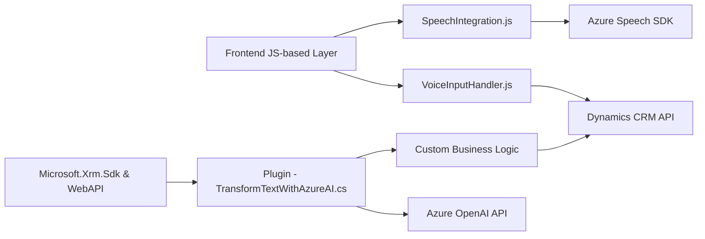

### **Análisis Técnico**

#### **1. Tipo de solución**
La solución presentada está orientada a una integración entre **Microsoft Dynamics CRM** y servicios externos de inteligencia artificial de Azure. El repositorio contiene código para:
- Un **frontend basado en JavaScript**, que opera en un entorno de navegador para interacción con formularios de Dynamics CRM (modificaciones de datos mediante voz).
- Un **plugin backend en C#** para procesar texto utilizando **Azure OpenAI** y servicios API.

En su conjunto, el sistema parece ser una **herramienta integrada**, que combina entrada y procesamiento de voz con acciones automatizadas en sistemas CRM.

#### **2. Tecnologías, frameworks y patrones usados**
**Frontend (JavaScript)**:
- **Azure Speech SDK**: Usado para síntesis de voz y reconocimiento de voz en tiempo real.
- **Microsoft Dynamics CRM API**: Para la manipulación de datos y validación de campos en formularios del CRM.
- **Patrones**:  
  - **Modularidad por funciones**: Cada etapa del flujo de datos y procesamiento de voz está separada en funciones.
  - **Strategy**: Selección entre diferentes estrategias de procesamiento (manual vs IA).
  - **Factory**: Configuración de objetos de Azure Speech SDK (e.g., `SpeechConfig`, `AudioConfig`, `SpeechRecognizer`).
  - **Cliente-Servicio**: Comunicación con servicios externos como Azure Speech SDK mediante métodos de alto nivel.

**Backend (C#)**:
- **Microsoft Dynamics SDK**: Para implementar un plugin que interactúe con los formularios y contexto CRM.
- **Azure OpenAI API**: Usa servicios de GPT para procesar y transformar texto.
- **System.Net.Http** y **Newtonsoft.Json.Linq**: Para realizar solicitudes HTTP y manejar respuestas API.
- **Patrones**:
  - **Plugin Framework**: Interfaz estándar para el desarrollo de plugins en Dynamics CRM.
  - **API Gateway**: Intermediario para interactuar con Azure OpenAI desde Dynamics CRM.

#### **3. Tipo de arquitectura**
La solución sigue un enfoque multicapa:
- **Frontend nueva funcionalidad (entrada de voz y síntesis de texto)**: Proporciona la interfaz **cliente**.
- **Backend como plugin en Dynamics CRM**: Añade lógica server-side para realizar transformaciones avanzadas usando servicios como **Azure OpenAI**.

Por su naturaleza, este sistema es modular pero no microservicios. Los archivos analizados forman parte de un monolito vertical basado en Microsoft Dynamics CRM, extendiendo su funcionalidad a través de capas adicionales (API externas y componentes cliente/servidor).

#### **4. Dependencias o componentes externos**
- **Azure Speech SDK**: Para síntesis y reconocimiento de voz desde el frontend.
- **Azure OpenAI API**: Para transformar texto en el backend.
- **Microsoft Dynamics CRM API**: API estándar de Dynamics para la manipulación de formularios y registros CRM.
- **Newtonsoft.Json** y **System.Text.Json**: Para el manejo de datos JSON dentro del backend en C#.
- **Custom API en CRM**: Proporciona reglas específicas y personalización del texto procesado.

---

### **Mermaid Diagram**

---

### **Descripción de la arquitectura**
- **Frontend**:
  - Funciones de JavaScript permiten a los usuarios interactuar con formularios en Dynamics CRM a través de entrada/salida de voz.
  - Integración mediante SDK facilita la comunicación con servicios de Azure, que se encargan del reconocimiento automático de voz y síntesis de texto.

- **Backend**:
  - Plugin en C# forma parte de la arquitectura estándar de Dynamics CRM y se ejecuta en el servidor.
  - Maneja llamadas específicas al servicio Azure OpenAI para transformar y estructurar texto.
  - Interconexión con APIs personalizadas dentro de Dynamics CRM para ejecutar lógica empresarial específica, como reglas dinámicas de mapeo de campos.

---

### **Conclusión**
El repositorio es parte de un sistema de extensión para Microsoft Dynamics CRM que aprovecha tecnologías avanzadas como Azure Speech SDK y Azure OpenAI. La solución implementa módulos especializados tanto en la capa de cliente como en el servidor, siguiendo arquitecturas multicapa donde el procesamiento del lenguaje y entrada de datos por voz son posibles. Aunque utiliza servicios avanzados de nube, sigue una estructura monolítica centrada en Dynamics CRM.