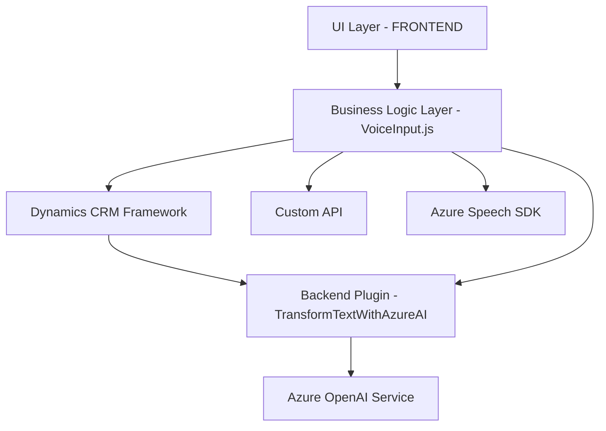

# Análisis del repositorio

A continuación se presenta el análisis detallado del repositorio y su estructura.

---

### **Breve resumen técnico**
Este repositorio parece enfocar su funcionalidad en la integración de Microsoft Dynamics CRM con servicios basados en inteligencia artificial (IA) de Azure, particularmente para el procesamiento de voz y texto. La solución se centra en la lectura y procesamiento de datos utilizando Azure Speech SDK y Azure OpenAI. Su uso principal está orientado a la manipulación de formularios dinámicos en Dynamics CRM y a la interacción con datos mediante servicios externos como APIs personalizadas.

---

### **Descripción de la arquitectura**
El sistema usa una arquitectura **modular basada en n capas**:
1. **Frontend Layer**: Implementado principalmente en JavaScript, interactúa directamente con Microsoft Dynamics CRM con funciones dedicadas para extraer datos de formularios, interpretar entrada de voz, gestionar mapeo de campos y aplicar valores transformados. También realiza solicitudes a servicios externos como APIs y SDKs.
2. **Backend Plugin Layer**: Implementado con C#, contiene un plugin que opera dentro del marco de Dynamics CRM. Este plugin interactúa directamente con Azure OpenAI API, utilizando clases y métodos estáticos para definir la lógica del procesamiento textual y la interfaz HTTP requerida.
3. **External Service Integration Layer**: El sistema depende del SDK de Azure Speech y de Azure OpenAI. También utiliza objetos de Dynamics CRM como `Xrm.WebApi` y `formContext` para interactuar con el entorno CRM.

La arquitectura modular y la especialización de las capas indican un enfoque de diseño **orientado hacia la integración con plataformas externas y servicios en la nube**, usando características propias de Dynamics CRM y de API/SDK inteligentes.

Adicionalmente, se emplean varios elementos de convivencia entre arquitectura **n capas** y **plugins**, adaptados para los sistemas de CRM.

---

### **Tecnologías usadas**
1. **Frontend**:
   - JavaScript: Lenguaje principal para la lógica en el navegador.
   - Azure Speech SDK: Para conversión de texto a voz y reconocimiento.
   - Microsoft Dynamics Framework: Objeto `executionContext` y `formContext` para conectarse con formularios CRM.

2. **Backend**:
   - C#: Para implementar plugins en Dynamics CRM.
   - Microsoft Dynamics Framework `IPlugin`: Para extender comportamiento en CRM.
   - Newtonsoft.Json: Para manipulación de datos JSON más sencilla.

3. **Servicios Externos**:
   - **Azure Speech SDK**: Usado para síntesis y reconocimiento de voz.
   - **Azure OpenAI**: Procesamiento e interpretación de datos textuales con IA.
   - **Custom API**: Posibilidad de interactuar con APIs personalizadas para mapeo avanzado de valores.

---

### **Diagrama Mermaid**
Aquí se presenta el diagrama que describe cómo se interrelacionan los elementos clave del sistema.  

### **Conclusión final**
Este repositorio implementa una solución de software modular destinada a integrar procesos de interacción hablada y textual en un sistema de CRM como Microsoft Dynamics:

1. **Tipo de solución**: Principalmente orientada a backend con integración de frontend. Se puede clasificar como una solución híbrida para CRM extendiendo capacidades mediante voz, IA y APIs externas. También podría interpretarse como parte de una solución de microservicios, dada su dependencia de servicios externos.

2. **Patrones empleados**: Una combinación entre n capas, integración con SDK y APIs externas, con orientación modular y eventos.

3. **Dependencias externas**: Azure Speech SDK, Azure OpenAI API y API personalizada de procesamiento textual.

La modularidad y uso extensivo de servicios externos posicionan la solución como orientada a cloud computing en el contexto de software empresarial.