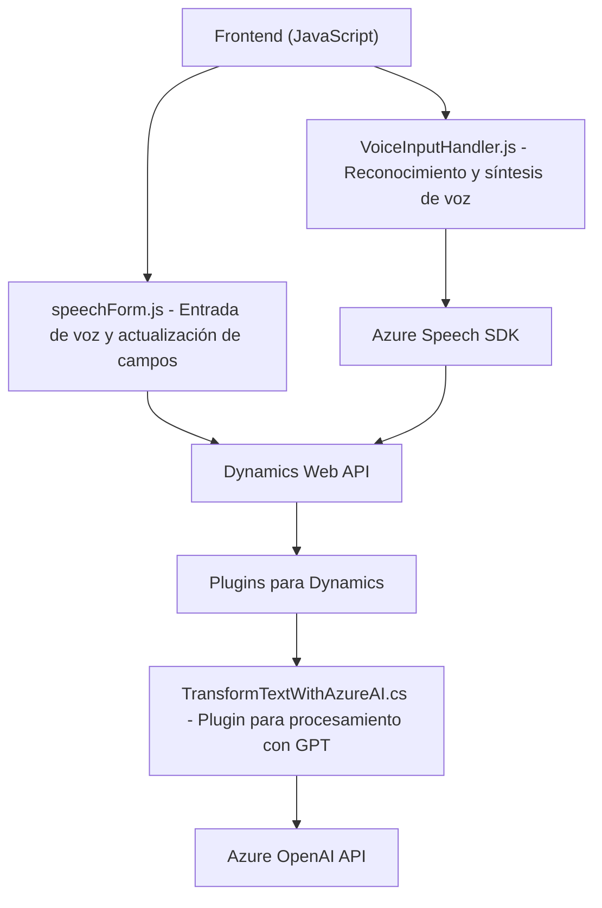

### Breve resumen técnico
Este repositorio parece ser parte de una solución que utiliza el **Azure Speech SDK** y **Azure OpenAI API** para implementar funcionalidades relacionadas con procesamiento de voz y lenguaje natural. Está compuesto principalmente por dos archivos para el frontend (JavaScript) y un plugin desarrollado en C# para Microsoft Dynamics CRM.

---

### Descripción de arquitectura
La solución parece estar basada en una arquitectura **modular y orientada a servicios** (SOA). Aunque el código frontend no parece ser independiente, actúa como una extensión del sistema existente de Microsoft Dynamics CRM. El proceso es claramente parte de una aplicación de múltiples capas, en la que:
1. **Frontend:** Interactúa directamente con el SDK y proporciona la capa de experiencia del usuario para reconocimiento y síntesis de voz.
2. **Backend:** Incluye un plugin definido en `TransformTextWithAzureAI.cs` que se comunica con Dynamics CRM y la Azure OpenAI API para realizar transformaciones avanzadas de texto utilizando inteligencia artificial.

Este sistema tiene características de una arquitectura **n-capas**, en las cuales se separan las responsabilidades en una capa de interfaz de usuario (frontend), una capa de dominio (plugin para CRM), y una capa de integración/outsource (Azure Speech SDK y OpenAI API).

---

### Tecnologías usadas:
1. **Frontend (JavaScript):**
   - **Azure Speech SDK:** Para realizar reconocimiento y síntesis de voz.
   - **Dynamics Web API (`Xrm.WebApi`)**: Interactúa con el backend de Microsoft Dynamics CRM directamente desde el cliente.
   - **HTML DOM Manipulation (JavaScript):** Para acceder y manipular campos del formulario.

2. **Backend (C#):**
   - **Dynamics CRM SDK:** Componentes como `IPlugin` para extender la lógica de negocio del CRM.
   - **Azure OpenAI API (GPT models):** Utilizado para transformar texto ingresado en un objeto JSON siguiendo normas predefinidas.
   - Dependencias auxiliares como `System.Text.Json` para manejar la comunicación y parsing de datos.

3. **Patrones:** 
   - **Evento y escucha:** En el frontend, escucha y reacciona a eventos como el reconocimiento de voz y la carga condicional del SDK.
   - **Adapter Pattern:** Tanto en el frontend como backend, se adaptan las entradas (voz, texto) y salidas (valores normalizados, JSON) entre diferentes componentes (SDK, OpenAI, Dynamics CRM).
   - **Modularización:** El diseño está descompuesto por funciones para tareas concretas: extracción de datos, mapeo de información, y procesamiento de valores.
   - **Cargar componente o librería dinámica:** Azure Speech SDK se carga bajo demanda.

---

### Dependencias o componentes externos:
1. **Microsoft Dynamics CRM:** Tanto el frontend como el plugin interactúan con objetos del contexto del CRM para actualizar o manipular datos.
2. **Azure Speech SDK:** Utilizado en el frontend para reconocimiento y síntesis de voz.
3. **Azure OpenAI API:** Utilizado en el backend `TransformTextWithAzureAI.cs` para la transformación de datos mediante un modelo GPT-4. Requiere configuración con una clave API de cliente.
4. **Microsoft Xrm SDK:** Proporciona acceso a servicios del CRM en el backend.
5. **Dependencias estándar para C#:**
   - `System.Text.Json`: Para manejar JSON y realizar el parsing de datos.
   - `System.Net.Http`: Para realizar llamadas HTTP al servicio de Azure OpenAI.

---

### Diagrama **Mermaid** válido para **GitHub**:
El siguiente diagrama modela la arquitectura de la solución:

---

### Conclusión final:
La solución presentada funciona como una extensión para integrar Microsoft Dynamics CRM con tecnologías avanzadas de Azure (Speech SDK y OpenAI API). Esto añade capacidades de reconocimiento y síntesis de voz, así como procesamiento de texto asistido por IA en una arquitectura orientada a servicios. Aunque el frontend está estrechamente acoplado al contexto del CRM, el uso de bibliotecas externas y plugins demuestra la posibilidad de extender sistemas empresariales utilizando modelos de inteligencia artificial y servicios en la nube.

Las principales recomendaciones incluyen:
- Asegurarse de proteger las claves API usadas.
- Explorar una mayor separación del frontend mediante un diseño más desacoplado.
- Verificar escalabilidad y costos del uso de servicios Azure Speech y OpenAI en producción.