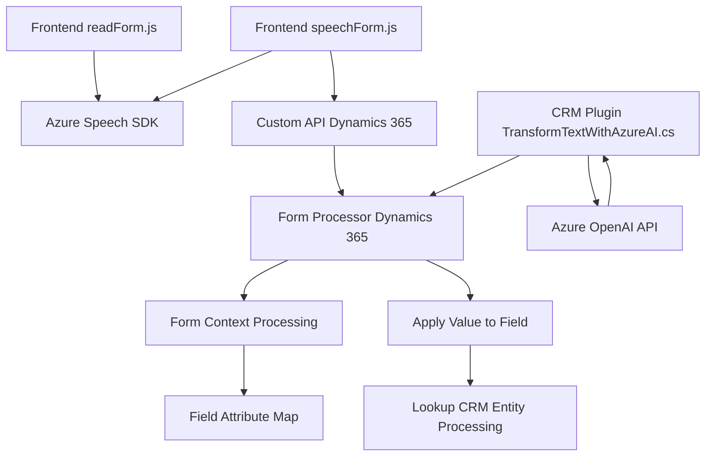

### Breve resumen técnico

El repositorio analiza varios archivos relacionados con la integración de reconocimiento de voz y síntesis de texto con Microsoft Dynamics CRM y Azure Speech SDK. Se compone de dos módulos principales en JavaScript (`readForm.js` y `speechForm.js`), responsables de lectura y escritura de formularios mediante voz, y un módulo .NET C# (`TransformTextWithAzureAI.cs`) que define un plugin para el procesamiento avanzado de texto ingresado mediante Azure OpenAI.

---

### Descripción de arquitectura

La solución proporcionada utiliza una **arquitectura híbrida de capas**:
- Los archivos JavaScript (`readForm.js`, `speechForm.js`) se centran en la lógica de interacción en el cliente con formulaciones web (gestión de vistas, reconocimiento de voz y actualización de formularios). 
- El plugin para CRM (`TransformTextWithAzureAI.cs`) implementa una **arquitectura basada en eventos** mediante el Plugin Pattern y gestiona transformaciones complejas de texto usando servicios externos como Azure OpenAI.
- La solución no adopta una arquitectura de microservicios o hexagonal; en su lugar, se basa en **n capas** con integración directa entre el frontend, el CRM y Azure Speech/OpenAI SDK.

---

### Tecnologías y patrones usados

#### Tecnologías:
1. **Azure Speech SDK**: Reconocimiento de voz y síntesis de texto en archivos JS.
2. **Azure OpenAI API**: Transformación de texto en el plugin de CRM.
3. **Microsoft Dynamics CRM SDK**: Extensión mediante _plugins_.
4. **JavaScript**: Para gestionar lógica y comunicación en Dynamics 365.
5. **C# (.NET)**: Para implementar _plugins_ y lógica de backend.

#### Patrones:
1. **Facade Pattern**:
   - En los JS: Encapsulan procesos complejos (e.g., carga de SDK, reconocimiento de formularios, etc.).
2. **Dependency Injection** (en `TransformTextWithAzureAI.cs`).
3. **Event-driven Programming**: El _plugin_ responde a eventos de negocio.

---

### Dependencias externas o componentes
1. **Azure Speech SDK**:
   - Sintetización de voz en frontend/client-side.
2. **Azure OpenAI API**:
   - Transforma textos en base a reglas específicas con GPT-4.
3. **Dynamics 365**:
   - Framework para extender CRM mediante configuración y plugins.
4. **Web SDK y librerías genéricas**:
   - JavaScript: `Promise` y comunicación entre cliente-servidor.
   - C# `.NET`: `HttpClient` para gestionar API REST, JSON Serialization (System.Text.Json).

---

### Diagrama Mermaid

---

### Conclusión final

La solución presentada integra diversas tecnologías y frameworks para enriquece la interacción entre datos y usuarios mediante voz, sin dejar de integrar funcionalidades robustas dentro de Microsoft Dynamics CRM. Su arquitectura modular y basada en capas permite un manejo eficaz de eventos y dependencias externas, destacándose por la cohesión entre la lógica frontend (gestión de formularios y voz) y el backend (procesamiento avanzado con Azure OpenAI y CRM plugins).