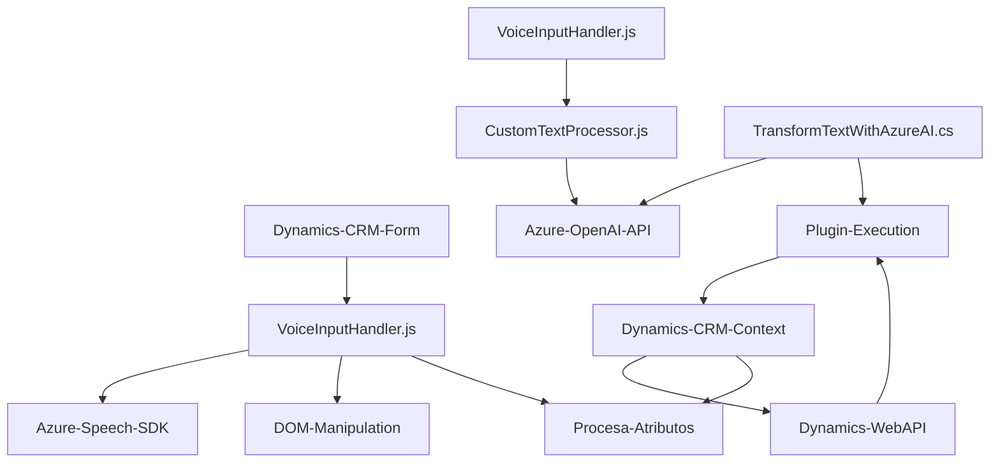

### Breve resumen técnico:
Este repositorio contiene varios archivos principales diseñados para interactuar con formularios de Dynamics CRM utilizando funcionalidades de entrada y salida de voz, procesamiento asistido por inteligencia artificial, y transformación de texto mediante servicios externos de Azure. Los componentes son altamente especializados en el contexto de CRM, utilizando Azure Speech SDK para síntesis y reconocimiento de voz, y Azure OpenAI API para procesamiento del texto.

---

### **Descripción de arquitectura**

#### Tipo de solución:
La solución implementada es una híbrida dirigida a Dynamics CRM:
1. **Frontend:** Funcionalidad cliente escrita en JavaScript que se integra directamente con formularios de CRM para realizar tareas de síntesis y entrada de voz.
2. **Backend:** Extensión del sistema CRM mediante un plugin .NET que interactúa con Azure OpenAI API para lógica de transformación de texto.

#### Diseño arquitectónico:
El diseño general sigue un enfoque modular con interacción centralizada en torno al sistema CRM:
1. En el lado del **frontend**:
   - Los scripts están organizados para la recuperación, síntesis y procesamiento de datos del DOM del CRM.
   - Lógica modular para encapsular diferentes funciones relacionadas con síntesis de voz y reconocimiento de voz.
   - Uso de bibliotecas externas como Azure Speech SDK.

2. En el lado del **backend**:
   - El plugin, programado en C#, actúa como middleware entre Dynamics CRM y una API externa (Azure OpenAI).
   - Implementa el patrón **servicio** para realizar transformaciones de texto con reglas específicas (desacoplamiento lógico).

#### Estilo arquitectónico global:
- **Arquitectura basada en plugins:** El backend utiliza el patrón "plugin" estandarizado de Dynamics CRM para ampliar la funcionalidad existente.
- **Arquitectura de microservicios e integración:** Se basa en servicios clave como Azure Speech SDK y Azure OpenAI API por su capacidad para manejar funcionalidad compleja externa.
- **N capas:** En los scripts de frontend, parece haber presencia de una arquitectura en n capas (capa de interacción, síntesis-recuperación de datos, procesamiento). En el backend, los métodos implementados separan adecuadamente lógica de negocio, integración externa, y manejo de datos.

---

### **Tecnologías usadas**
1. **Lenguajes:**
   - JavaScript (Funciones cliente en el frontend para el CRM).
   - C# (.NET Framework para plugins del CRM).

2. **Frameworks y SDKs:**
   - **Azure Speech SDK:** Para síntesis y reconocimiento de voz.
   - **Dynamics CRM API:** Extensión hacia el ecosistema CRM para la manipulación de datos y atributos de formularios.
   - **Azure OpenAI API:** Para transformación de texto usando inteligencia artificial.

3. **Librerías:**
   - `System.Net.Http.HttpClient`: Para ejecutar solicitudes HTTP al servicio OpenAI.
   - `Newtonsoft.Json`: Manipulación de JSON como datos estructurados en el backend.
   - `System.Text.Json`.

---

### **Componentes externos presentes o posibles:**
1. SDK de Azure Speech (`https://aka.ms/csspeech/jsbrowserpackageraw`) para síntesis y reconocimiento de voz.
2. Azure OpenAI API (llamadas API para procesamiento textual asistido por IA).
3. Integración con el sistema CRM Dynamics (manipulación de formularios mediante Web API).
4. Funcionalidades del navegador para procesamiento DOM y eventos.

---

### **Diagrama Mermaid**

---

### **Conclusión final**
Este repositorio representa un sistema integrado para CRM con enfoque en accesibilidad y usabilidad avanzada mediante entrada y salida de voz, así como procesamiento de datos con inteligencia artificial. Utiliza una combinación de tecnologías modernas, como el SDK de Azure Speech y la Azure OpenAI API, dentro de una arquitectura híbrida modular y extensible. La solución presenta un diseño limpio con patrones reconocidos (callback, factory, y modularización funcional), altamente adaptado para el ecosistema CRM.