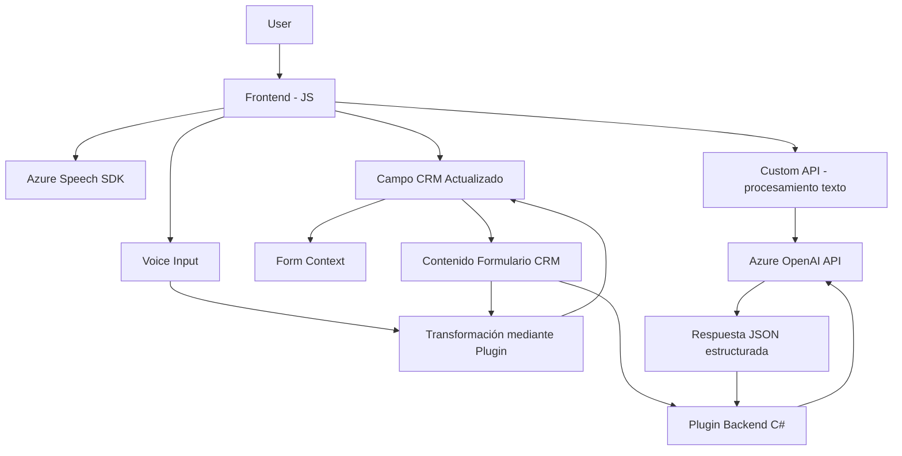

### Resumen técnico
El repositorio contiene una solución dividida en tres áreas principales:
- **Frontend (JavaScript)**: Archivos que implementan funcionalidades relacionadas con reconocimiento e interacción de voz utilizando Azure Speech SDK. Está orientado tanto al reconocimiento de comandos hablados como a la síntesis de texto a voz, diseñado para integrarse con Microsoft Dynamics CRM.
- **Backend (C#)**: Plugin de Dynamics CRM que extiende la funcionalidad mediante la utilización de la API de Azure OpenAI para realizar transformaciones avanzadas del texto.

### Descripción de arquitectura
- **Tipo de solución**: La solución es una combinación de frontend y backend que interactúa con un servicio de datos CRM (Microsoft Dynamics). Incluye elementos de API backend y funcionalidad a nivel cliente.
- **Arquitectura**: 
  - **Frontend** basado en una arquitectura modular y orientado a eventos.
  - **Backend** desarrollado como un plugin para la arquitectura de Dynamics CRM.
  - Generalmente, la solución toma un enfoque estilo **n+capas**, dividiendo presentación (frontend), lógica de negocio (plugins) y servicios externos (Azure Speech SDK, OpenAI API).

### Tecnologías utilizadas
1. **Frontend**:
   - **Frameworks & Libs**: JavaScript nativo, Azure Speech SDK.
   - **Patrones implementados**:
     - Modularidad y encapsulación para funciones específicas.
     - Event-driven programming.
     - Factory Method para crear configuraciones del SDK.
   - **Dependencias externas**:
     - Azure Speech SDK (importado dinámicamente).
     - Custom API para procesamiento de texto.

2. **Backend**:
   - **Lenguaje**: C#.
   - **Frameworks & Libs**:
     - Microsoft.Xrm.Sdk (Dynamics CRM).
     - Newtonsoft.Json / System.Text.Json para procesamiento de JSON.
     - System.Net.Http para solicitudes API.
   - **Servicios externos**:
     - Azure OpenAI.
   - **Patrones utilizados**:
     - Plugin (Dynamics CRM).
     - Microservicio para comunicación con
servicios de Azure OpenAI.

### ¿Qué dependencias o componentes externos podrían estar presentes?
- **Servicios en la nube**: Azure Speech SDK y Azure OpenAI para procesamiento de voz, reconocimiento de texto y generación de respuestas.
- **Dynamic CRM**: Interacciones con formularios de CRM como punto central del repositorio.
- **API personalizada**: Una capa adicional para filtrado o procesado de datos previo/posprocesamiento.

### Diagrama Mermaid (GitHub compatible)

### Conclusión final
Esta solución integra frontend y backend para brindar interacciones avanzadas utilizando reconocimiento y síntesis de voz (Azure Speech SDK) y procesamiento dinámico de texto (Azure OpenAI) en Microsoft Dynamics CRM. Se estructura bajo una arquitectura de capas con dependencias claras hacia servicios en la nube y CRM, siguiendo patrones modernos como modularidad y orientación a eventos. Sugiero revisar la seguridad (por ejemplo, la gestión de credenciales en plugins) y optimizar la separación lógica entre servicios API y controladores para un mantenimiento más eficaz.