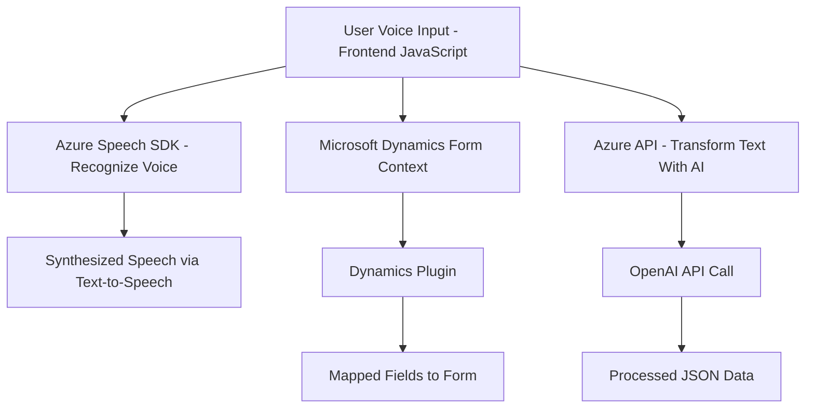

### Breve resumen técnico

El repositorio parece ser parte de una solución que combina front-end en JavaScript y lógica de servidor en C# para integrarse con Microsoft Dynamics CRM. La solución implementa funcionalidades de entrada de voz, síntesis de texto a voz (TTS), y procesamiento de voz con inteligencia artificial mediante servicios de Azure (Speech SDK y OpenAI). Además, incluye un plugin basado en la interfaz `IPlugin` de Dynamics CRM que procesa texto con reglas estrictas y lo transforma en JSON, delegando parte de la lógica a Azure OpenAI.

---

### Descripción de arquitectura

1. **Tipo de solución:** 
   - **Híbrida**: Combina una solución de front-end con funciones diseñadas para interactuar con Microsoft Dynamics 365 y un plugin en la parte del servidor. 

2. **Tecnología y flujo general:**
   - Los archivos `VoiceInputHandler.js` y `SpeechProcessing.js` implementan una capa front-end que interactúa con formularios en Dynamics 365 mediante reconocimiento y síntesis de voz (TTS). Para tareas de inteligencia artificial y registro de datos, interactúan con APIs personalizadas y servicios de Azure (Speech SDK, OpenAI).
   - El archivo back-end en C# (`TransformTextWithAzureAI.cs`) actúa como un plugin en Dynamics CRM. Procesa datos, transforma texto mediante Azure OpenAI y persiste resultados en el contexto de Dynamics CRM.

3. **Patrones de arquitectura:** 
   - **En el front-end:** Modularidad con funciones orientadas a roles específicos. Implementación de patrones como el cargador dinámico de dependencias (Dynamic Loader) para cargar el SDK de Azure Speech solo cuando es necesario.
   - **En el back-end:** Patrón Plugin en Dynamics CRM, que sigue el patrón de repositorio para mapear datos entre atributos y formularios.
   - **Arquitectura global:** Puede configurarse con **microservicios** externos que dependen de servicios de Azure para reconocimiento de voz (Speech SDK) e inteligencia artificial (OpenAI).

4. **Tipo de arquitectura:** 
   - La solución tiene características **multicapas**, donde las principales responsabilidades están distribuidas: 
     - Capa de presentación (front-end en JavaScript).
     - Capa de lógica de negocios (plugin en C# dentro de Dynamics CRM).
     - Servicios externos (Azure Speech SDK y OpenAI).

---

### Tecnologías usadas

1. **Back-end:**
   - C#: Código de servidores implementado como plugin en Dynamics CRM.
   - Microsoft Dynamics CRM SDK (`IPlugin`, `Microsoft.Xrm.Sdk`).
   - Azure OpenAI API para procesamiento de texto con GPT.
   - Dependencias de .NET como `HttpClient` y `Newtonsoft.Json`.

2. **Front-end:**
   - JavaScript para interacción con formularios en Dynamics CRM.
   - Azure Speech SDK para reconocimiento y síntesis de voz (Speech-to-Text y Text-to-Speech).
   - API personalizada (`trial_TransformTextWithAzureAI`) para procesar transcripciones mediante IA.

3. **Servicios externos**
   - Azure Speech SDK: Reconocimiento y síntesis de voz.
   - Azure OpenAI: Transformación de textos a JSON, aplicando reglas de formato.

4. **Patrones:**
   - Dynamic Loader para cargar librerías en JavaScript.
   - Delegación de responsabilidades en módulos definidos.
   - Patrón Plugin para extensibilidad en Microsoft Dynamics CRM.

---

### Diagrama **Mermaid**

---

### Conclusión final

El repositorio incluye una solución que combina procesamiento de voz (speech-to-text y text-to-speech) y transformación de datos mediante inteligencia artificial. Aprovecha servicios externos como Azure Speech SDK y OpenAI para mejorar la interacción con formularios en Dynamics CRM. La integración está organizada como una arquitectura de **n-capas**, con patrones como cargador dinámico en el front-end y el patrón Plugin en el back-end.

Los sistemas son complementarios, y la correcta combinación de servicios externos con lógica en Dynamics CRM crea un entorno extensible y centrado en el usuario.