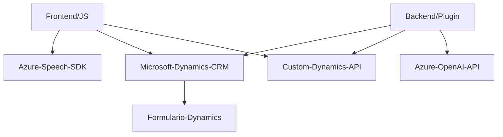

### Breve resumen técnico
El repositorio es una solución híbrida que integra servicios en la nube con una interfaz frontend y componentes backend. Utiliza el **Azure Speech SDK** para habilitar capacidades de entrada/salida de voz en formularios integrados con Dynamics CRM, junto con un plugin de servidor que comunica el CRM con **Azure OpenAI** para fomentar interacciones inteligentes entre datos y comandos proporcionados en texto o voz.

---

### Descripción de arquitectura
La arquitectura sigue un enfoque **modular** con distintas capas: frontend (JS scripts para manejo del SDK y formularios), backend (plugin desarrollado en C#, integrado con Dynamics CRM), y servicios externos. Presenta un diseño de **n capas** con la combinación de patrones como el **observer/event-driven**, **encapsulación**, y **servicios desacoplados** (especialmente en la interacción con Azure OpenAI y Azure Speech SDK). Adicionalmente, se apoya en una "Custom API" alojada en Dynamics CRM como punto de entrada para conversiones basadas en IA.

---

### Tecnologías usadas
1. **Frontend**:
   - **JavaScript**: Lógico y modular, procesamiento de formulario y comunicación con SDK/API.
   - **Azure Speech SDK**: Para entrada de voz y síntesis en texto y viceversa.
   - **Microsoft Dynamics CRM API**: Para lectura/modificación de campos de formularios dinámicos.

2. **Backend**:
   - **C#**: Lenguaje utilizado para el desarrollo del Plugin de Dynamics CRM.
   - **Azure OpenAI API**: Apoyándose en el uso de modelos de AI para transformar datos.
   - **JSON y LINQ**: Para estructuración y manipulación de datos.

3. **Servicios en la nube**:
   - **Azure Speech SDK**: Reconocimiento y síntesis de voz.
   - **Azure OpenAI API**: Generación de texto basado en AI.
   - **Microsoft Dynamics CRM**: Sistema integrado de gestión de clientes.

---

### Tipo de solución
1. **Frontend** (con integración): Responsabilidad de procesar formularios y conectar a servicios externos de reconocimiento/síntesis de voz.
2. **Backend**: Implementación de lógica avanzada usando un plugin con conexión a Dynamics CRM y servicios que manejan el procesamiento de datos y transformación mediante AI.
3. **Custom API**: Intermediario para realizar operaciones de transformación de texto en el sistema CRM.

---

### Posibles dependencias o componentes externos
1. **Azure Speech SDK**: Carga dinámica desde el navegador para reconocimiento y síntesis de voz.
2. **Microsoft Dynamics CRM APIs**: Control del flujo de datos y selección de campos en los formularios CRM.
3. **Azure OpenAI API**: Procesamiento avanzado de texto fuera del sistema, conectada vía key de acceso y HTTP Client.
4. **Custom APIs**: API para integración adicional de inteligencia artificial.
5. **Newtonsoft.JSON**: Manejo de JSON en el backend .NET para parseo y generación de respuestas (Dynamics CRM y Azure OpenAI).

---

### Diagrama Mermaid

---

### Conclusión final
La solución descrita está diseñada con una **arquitectura de n capas**, utilizando capas bien diferenciadas para frontend, API, y backend de servicios. Se apoya fuertemente en una integración basada en servicios externos como Azure Speech SDK y OpenAI para habilitar tareas específicas como reconocimiento y síntesis de voz, o procesamiento de texto mediante IA.

Los patrones principales identificados son **observer/event-driven** y **modularidad con encapsulación**, mientras que el uso de un Plugin para Dynamics CRM demuestra una estrategia eficiente de extensión que sigue la filosofía del ecosistema CRM y del modelo de microservicios en el backend.

A destacar, el uso de dinámicas basadas en voz y IA en esta solución la posiciona como un proyecto innovador, especialmente útil en herramienta de CRM modernas que puedan requerir interacción avanzada y simplificación para el usuario final. La arquitectura podría escalarse fácilmente hacia un modelo más distribuido si se desease descentralizar componentes como el plugin.