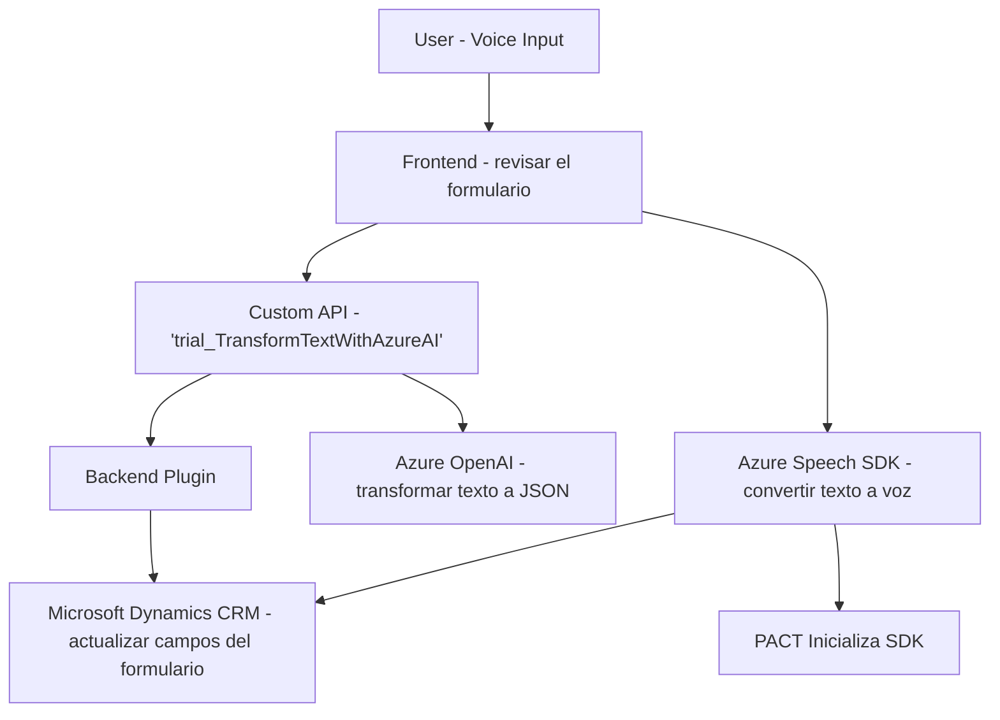

### Breve resumen técnico
El repositorio se basa en la implementación de funcionalidades de accesibilidad e interacción por voz en un entorno de CRM, utilizando principalmente Microsoft Azure Speech SDK y una API personalizada de Azure OpenAI para la transformación de texto. Se incluyen tanto scripts de frontend para manejar datos del formulario como un plugin backend que permite la integración directa con Azure OpenAI dentro de Microsoft Dynamics CRM.

---

### Descripción de arquitectura
La solución utiliza una **arquitectura de integración robusta** con un enfoque modular:
1. **Frontend (JavaScript en el navegador)**: Maneja la extracción de datos desde los formularios CRM, el reconocimiento de voz con Azure Speech SDK y la integración con un API personalizada.
2. **Backend (Plugin para Dynamics CRM)**: Implementa una extensión (plugin) en un ambiente de Microsoft Dynamics utilizando la interfaz IPlugin.
3. **Integración con servicios externos**: Tanto el frontend como el backend interactúan con Azure Services (Speech SDK y OpenAI) para proporcionar capacidades avanzadas. Esto sugiere una arquitectura orientada a servicios que integra componentes heterogéneos.

Por la descripción, hemos clasificado la arquitectura como **n capas**:
- **Capa de presentación**: Interacción con el usuario (mediante formularios del CRM y entrada por voz).
- **Capa de lógica**: Frontend para procesamiento preliminar de datos y plugin backend que implementa reglas de negocio.
- **Capa de servicios**: Invoca a APIs externas (Azure Speech y OpenAI) para servicios especializados.

Además, la arquitectura está diseñada para interoperar con Microsoft Dynamics CRM, adoptando patrones de plugins propios para personalización.

---

### Tecnologías usadas
1. **Frontend**:
   - **Lenguaje**: JavaScript.
   - **Framework/Library**:
     - **Azure Speech SDK**: Utilizado para reconocimiento de voz y síntesis de texto.
   - **Entorno**:
     - Navegador (interacción cliente).
     - Integración con CRM Dynamics Forms.
     
2. **Backend**:
   - **Lenguaje**: C#.
   - **Framework y herramientas**:
     - **Microsoft Dynamics CRM SDK**: Interfaz básica para crear un plugin `IPlugin`.
     - **Azure OpenAI API**: Servicio para realizar transformaciones basadas en IA (estructuración de texto en JSON).
     - **JSON handling frameworks**: `System.Text.Json` y posiblemente `Newtonsoft.Json.Linq` para manejar datos estructurados.
     - **HTTP Client** para requests al API externo de Azure OpenAI.

---

### Diagrama Mermaid válido para GitHub Markdown

---

### Conclusión final
La solución presentada tiene un diseño modular y se centra en el procesamiento de voz y textos mediante servicios en la nube, integrado en una arquitectura n capas. Utiliza tecnologías modernas como el Azure Speech SDK y Azure OpenAI para ofrecer accesibilidad y funcionalidades avanzadas en un entorno Dynamics CRM. La implementación utiliza buenos patrones arquitectónicos, como `Facade` en el frontend para simplificar la integración y el patrón `Plugin Design` en el backend, aprovechando las capacidades nativas de Dynamics. Las dependencias y conexiones están bien manejadas, salvo por algunos imports innecesarios. El diseño podría ampliarse fácilmente para incluir más funciones a medida que demandas empresariales crezcan.