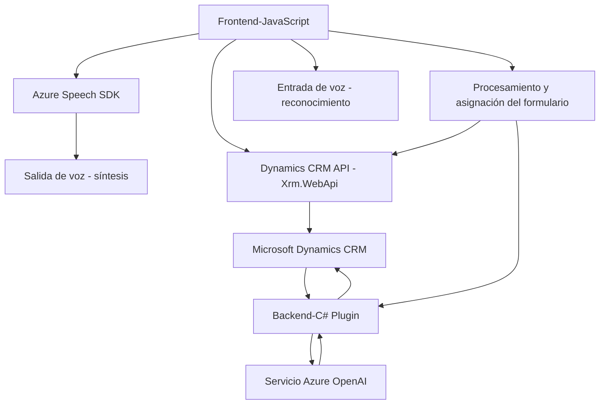

## Breve resumen técnico

Este repositorio implementa una solución híbrida enfocada en extender las capacidades de **Microsoft Dynamics CRM** con funcionalidad avanzada de síntesis y reconocimiento de voz mediante **Azure Speech SDK** y procesamiento inteligente del lenguaje a través de **Azure OpenAI**. La aplicación incluye componentes frontend basados en JavaScript y extensiones backend con plugins en C#. Estas herramientas trabajan en conjunto para leer, procesar, transformar y asignar información en formularios dentro del sistema.

---

## Descripción de arquitectura

La arquitectura del repositorio indica un diseño basado en **n capas**. Cada capa tiene una función específica:
1. **Capa de presentación (frontend)**: Implementada con JavaScript, es responsable de interactuar con el usuario mediante formularios dinámicos del CRM. Usando **Azure Speech SDK**, permite entrada y salida de voz en tiempo real.
2. **Capa de lógica de negocio (backend)**: Utiliza extensiones de **Microsoft Dynamics CRM** en C# mediante plugins y llamadas a APIs, procesando texto con Azure OpenAI y operando sobre datos en el CRM.
3. **Integración**: La solución integra servicios externos (Azure Speech SDK y Azure OpenAI) para ofrecer funcionalidades avanzadas.

---

## Tecnologías usadas

### Frontend
- **Azure Speech SDK**: Para síntesis y reconocimiento de voz.
- **JavaScript**: Lenguaje de scripting en el cliente para manipulación de formularios dinámicos en CRM.
- **Dynamics CRM API (Xrm.WebApi)**: Extensiones del modelo CRM mediante operaciones client-side.

### Backend
- **C#**: Utilizado para el desarrollo de plugins del CRM que procesan texto con OpenAI.
- **Microsoft.Xrm.Sdk**: Librerías para extensiones y operaciones en CRM.
- **Azure OpenAI Service**: Procesamiento inteligente del lenguaje. 

### Patrones arquitectónicos:
- **Lazy Loading** (Frontend): Carga dinámica del Azure Speech SDK solo cuando se utiliza.
- **MVC-like**: El formulario del CRM actúa como el modelo, mientras que las extensiones en JavaScript representan el controlador y/o vista.
- **Plugin Pattern** (Backend): Extensiones de eventos del CRM mediante clases C#.
- **Integración de servicios externos**: Azure Speech y OpenAI integrados mediante REST APIs.

---

## Diagrama Mermaid válido para GitHub

---

## Conclusión final

Este repositorio define una solución extendida para Microsoft Dynamics CRM con capacidades avanzadas de procesamiento de voz y lenguaje, integrando Azure Speech SDK en el frontend y servicios de Azure OpenAI en el backend. La arquitectura basada en **n capas** permite una separación clara entre presentación, lógica de negocio y servicios externos. Los patrones de diseño implementados permiten manejo eficiente de servicios, mientras las dependencias externas proporcionan funcionalidades avanzadas como síntesis/entrada de voz y procesamiento inteligente del lenguaje.