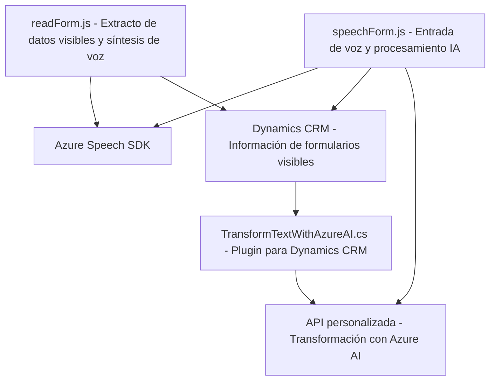

### Breve resumen técnico:

El repositorio parece contener implementaciones relacionadas con el desarrollo de una solución para manejar formularios dentro del contexto de Dynamics CRM. Permite la entrada por voz, la transcripción y procesamiento de datos basándose en el Azure Speech SDK, y utiliza Azure AI para realizar transformaciones en texto. Los componentes están orientados hacia una aplicación empresarial que integra capacidades de voz y inteligencia artificial en la gestión de formularios.

---

### Descripción de arquitectura:

La solución está estructurada como una combinación de **Frontend** y **Backend**, específicamente diseñada para extender la funcionalidad de Microsoft Dynamics CRM. El sistema parece seguir una arquitectura por capas (n-tier), aunque algunos elementos podrían ajustarse al patrón **hexagonal**, dado que interactúa con servicios externos y utiliza patrones de carga dinámica (Azure Speech SDK).

#### Componentes principales en la arquitectura:
1. **Frontend (readForm.js, speechForm.js):**
   - Scripts JavaScript para la interfaz de usuario que interactúan con formularios del Dynamics CRM.
   - Usa un controlador de voz que maneja la transcripción y síntesis de texto y datos para los campos de los formularios visibles.

2. **Backend (TransformTextWithAzureAI plugin):**
   - Un plugin desarrollado en C# que realiza transformaciones en texto usando la API de Azure OpenAI.
   - Opera bajo el modelo **SOA (Service-Oriented Architecture)**.

### Arquitectura:
- **Modular, multicapa:** Cada archivo tiene funcionalidades separadas por responsabilidad (frontend con lógica de formulario/voz y backend con procesamiento de texto).
- **Integración de API:** Comunicaciones activas con servicios externos: Azure Speech SDK y Azure OpenAI.

---

### Tecnologías usadas:

1. **Frameworks/Tecnologías:**
   - **Frontend:** JavaScript.
   - **Backend:** C#, Microsoft Dynamics CRM plugin.
   - **Cloud Services:** Azure Speech SDK, Azure OpenAI.

2. **Patrones:**
   - **Evento-Driven:** La solución responde a eventos como cargas del SDK o transcripciones de voz.
   - **Plugin Pattern:** Extiende Microsoft Dynamics CRM mediante implementación de `IPlugin`.
   - **SOA (Service-Oriented Architecture):** Se apoya en servicios externos (Azure Speech SDK y OpenAI).

---

### Dependencias y componentes externos:
1. **Azure Speech SDK:** Usado para entrada y síntesis de voz mediante funciones como reconocimiento y creación de audio.
2. **Azure OpenAI:** Servicio inteligente para transformar texto en estructuras trabajables.
3. **Microsoft Dynamics Common Data Service:** Contexto principal para formularios que se manipula en el frontend.
4. **Xrm.WebApi:** Integración directa con Dynamics CRM para operaciones de consultas y búsqueda en entidades.
5. **Newtonsoft.Json:** Manipulación de JSON para estructuras complejas como en el plugin.
6. **System.Net.Http:** Realiza peticiones al servicio Azure OpenAI.
7. **Microsoft.Xrm.Sdk:** Integración con Dynamics CRM para obtener datos del servicio de datos.

---

### Diagrama Mermaid:

---

### Conclusión final:

La solución presentada extiende las capacidades de Microsoft Dynamics CRM para integrar entrada y salida de voz, síntesis de texto en audio y transformación de datos mediante inteligencia artificial. Está basada en una arquitectura **modular multicapa**, separando responsabilidades entre frontend y backend. El diseño hace uso de servicios en la nube, como **Azure Speech SDK** y **Azure OpenAI**, para procesar información bajo un enfoque **evento-driven** e integrado con APIs externas. Es una excelente solución para mejorar la interacción con los datos dentro de formularios empresariales a través de estas tecnologías avanzadas.