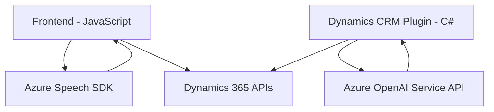

### Breve resumen técnico

El repositorio contiene tres módulos principales divididos en dos archivos JavaScript (para el frontend) y un archivo C# (para backend/Plugins). La solución permite trabajar con formularios y datos visibles en Dynamics 365, utilizando como componentes clave el reconocimiento y síntesis de voz por voz con **Azure Speech SDK** y transformación de texto con **Azure OpenAI**. Basado en lo que se describe, parece ser una **arquitectura de componentes integrados** que mezcla frontend, APIs de Dynamics 365 y servicios externos para proporcionar automatización y capacidades avanzadas de accesibilidad.

---

### Descripción de arquitectura

La arquitectura combina tres niveles claros:
1. **Frontend - Voice Interaction:** Implementado con JavaScript para capturar datos visibles en formularios, procesarlos mediante comandos de voz y sintetizar resultados auditivos.
   - Enfoque modular y asistido por SDK con carga dinámica.
   - Patrón orientado a asistencia de formularios.

2. **Backend - Plugin Dynamics CRM:** Implementado mediante un plugin estándar de Dynamics CRM (`TransformTextWithAzureAI`). Utiliza el SDK de Dynamics para obtener datos, transformar texto con Azure OpenAI, y devolver objetos JSON formateados como respuesta.
   - Orientado a servicios con integración en el pipeline de Dynamics.

3. **Dependencias externas:** Servicios dedicados, como **Azure Speech SDK** para voz y **Azure OpenAI Service API** para procesamiento de texto.

Patrones como **SOA (Service-Oriented Architecture)** son evidentes en las llamadas a SDKs y APIs externas. Además, en el frontend se observan buenas prácticas de modularidad y principios SOLID. La solución opera bajo un **estilo de arquitecturas n-capas**, al separar claramente las responsabilidades de frontend, plugin, y dependencias externas.

---

### Tecnologías usadas

1. **Frontend:**
   - **JavaScript ES6:** Principal lenguaje del frontend.
   - **Azure Speech SDK:** Para reconocimiento y síntesis de voz.
   - **APIs de Dynamics 365:** Con funciones como `Xrm.WebApi`.

2. **Backend:**
   - **C#:** Lenguaje en el plugin.
   - **Microsoft Dynamics CRM SDK** (IPlugin): Para integrar funcionalidad personalizada en Dynamics CRM.
   - **Azure OpenAI Service API:** Procesamiento avanzado de lenguaje natural.

3. **Patrones implementados:**
   - **Modularidad:** Funciones de responsabilidades únicas y reutilizables en el frontend.
   - **SRP (Responsabilidad única):** Cada componente realiza un propósito claro.
   - **Pipeline con SOA:** Plugins integrados y dependencias externas para validación y procesamiento.

---

### Diagrama Mermaid válido para GitHub

---

### Conclusión final

La solución presentada es una aplicación modular con enfoque en accesibilidad y procesamiento inteligente de datos en formularios. La combinación de **Frontend en JavaScript con Azure Speech SDK** y **Plugins en Dynamics CRM**, junto con la integración de **Azure OpenAI Service**, destaca un diseño enfocado en automatización y uso de servicios especializados. La arquitectura es de **n-capas con integración SOA**, y utiliza servicios externos estratégicamente para manejar voz y transformaciones avanzadas de datos, maximizando la interoperabilidad entre los componentes.