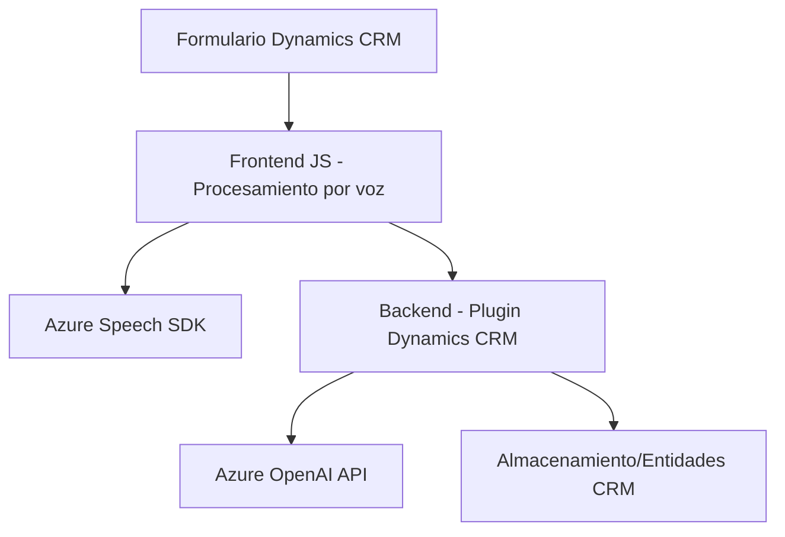

### Breve resumen técnico

El sistema descrito en los archivos del repositorio implementa una solución basada en **integración entre una API externa de Azure Speech y Dynamics CRM**, dividida en tres principales componentes principales: un **frontend JavaScript**, una **capa intermedia de procesamiento por voz** en cliente, y un **backend plugin** para transformar datos estructurados. La funcionalidad principal facilita la interacción por voz con formularios, convirtiendo inputs de voz en datos estructurados que se procesan y almacenan en el contexto de un CRM.

---

### Descripción de arquitectura

La arquitectura sigue un enfoque de **n capas** combinando elementos del estilo **cliente-servidor**. Es modular, con cada capa realizando tareas específicas:
1. **Frontend:** Para la interacción del usuario con el formulario (captura y síntesis de voz).
2. **Capa intermedia cliente:** Procesa inputs (grabación/transcripción) y realiza llamadas a servicios externos (Azure Speech SDK).
3. **Backend (plugin):** Implementa transformaciones avanzadas con Azure OpenAI y establece el resultado en entidades CRM.

La solución está diseñada para ser extensible y descentralizada, ya que utiliza diversos servicios en la nube (Azure).

---

### Tecnologías usadas

1. **Frontend:**
   - JavaScript (manejo de DOM y lógica del formulario).
   - Azure Speech SDK: Para síntesis y reconocimiento de voz.
   - API personalizada de Dynamics CRM: Para operaciones relacionadas con campos y mapeos.

2. **Backend:**
   - `Microsoft.Xrm.Sdk` (Dynamics CRM SDK).
   - Azure OpenAI API (procesamiento IA).
   - `Newtonsoft.Json` y `System.Text.Json` (serialización JSON).
   - `System.Net.Http` (peticiones HTTP).

### Patrones y estilos arquitectónicos:
- **Service-oriented Architecture (SOA):** Uso de servicios externos (Azure Speech y OpenAI).
- **Modularización:** Código dividido en módulos funcionales independientes.
- **Plugin pattern:** En el backend (plugin de Dynamics CRM).
- **Callbacks:** Para manejar la carga de SDK en el cliente.
- **Adaptador:** Conversión de datos formularios en texto transcribible y sintético.

---

### Diagrama Mermaid

---

### Conclusión final

La solución proporcionada implementa una integración avanzada entre Dynamics CRM y servicios en la nube de Azure. Combina tanto elementos de procesamiento en cliente como lógica en backend. Utiliza tecnologías modernas (Speech SDK, OpenAI) y está diseñada para soportar una interacción natural (por voz) con formularios, así como almacenamiento estructurado de datos en un CRM. Aunque modular y bien segmentada, dependencias externas como Azure aumentan el acoplamiento operativo, haciéndola ideal para contextos donde estas soluciones específicas ya están disponibles.