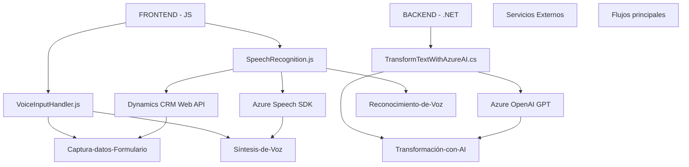

### Breve resumen técnico:

Esta solución se enfoca en la interacción avanzada entre usuarios y formularios de Microsoft Dynamics CRM a través de voz y texto. Los principales componentes del sistema incorporan funcionalidades de captura y síntesis de voz, reconocimiento de voz, procesamiento de datos de formularios y transformación mediante inteligencia artificial. La solución está compuesta por un **frontend en JavaScript** que usa el **Azure Speech SDK** y realiza llamadas a una **API en .NET**, que aprovecha **Azure OpenAI GPT** para procesar y generar datos estructurados.

---

### Descripción de arquitectura:

La arquitectura de este sistema tiene un enfoque **n-capas**, con una capa de presentación (frontend en JavaScript), una capa lógica de negocio en el backend con **plugins en .NET para Dynamics CRM** y diversas integraciones con servicios externos como **Azure Speech SDK** y **Azure OpenAI API**.

#### Flujos principales:
1. El **frontend** (archivos JavaScript) permite:
   - Capturar y procesar datos visibles desde formularios dinámicos dentro de Dynamics CRM.
   - Utilizar reconocimiento de voz para llenar formularios automáticamente con datos transcritos.
   - Usar síntesis de voz para leer datos del formulario.
   - Llamar a una API para transformar texto en tiempo real con inteligencia artificial (Azure OpenAI).

2. El **backend** (archivo .NET "TransformTextWithAzureAI" en Plugins) realiza estas tareas:
   - Integra el servicio Azure OpenAI GPT para transformar texto según normas específicas.
   - Genera JSON estructurado y lo retorna al frontend.

---

### Tecnologías usadas:

1. **Frontend (JavaScript):**
   - **Vanilla JavaScript**: Utilizado para lógica de captura y manipulación de datos.
   - **Azure Speech SDK**: Para reconocimiento y síntesis de voz.
   - **Microsoft Dynamics CRM Web API**: Para operaciones dinámicas como la asignación de valores en formularios.

2. **Backend (TransformTextWithAzureAI.cs):**
   - **Microsoft Dynamics CRM**: Plataforma para formularios y datos relacionales.
   - **Azure OpenAI GPT**: Modelo de inteligencia artificial para transformar texto.
   - **Newtonsoft.Json**, **System.Net.Http**: Para manejo JSON y llamados HTTP en el backend.

---

### Dependencias o componentes externos:

1. **Frontend:**
   - **Azure Speech SDK**: Para la funcionalidad de audio (reconocimiento/síntesis de voz).
   - **Dynamics CRM Web APIs**: Para operaciones con formularios y asignación de datos.

2. **Backend:**
   - **Azure OpenAI API**: Para transformar texto con GPT a partir de reglas específicas.
   - **Plugins de Dynamics CRM**: Framework de extensión para lógica empresarial en Dynamics 365.
   - **Paquetes de NuGet** como Newtonsoft.Json para manipulación de JSON.

---

### Diagrama Mermaid válido para GitHub:

---

### Conclusión final:

La solución es una **aplicación altamente enfocada en la interacción avanzada de usuarios con formularios**, utilizando tecnologías modernas como **reconocimiento de voz, síntesis de voz y generación de texto con inteligencia artificial (GPT)**. La arquitectura sigue un enfoque **n-capas**, diseñado para aprovechar herramientas como **Dynamics CRM**, **Azure Speech SDK**, y **Azure OpenAI**. Esto la hace ideal para entornos empresariales que integren accesibilidad, procesamiento de datos dinámicos y automatización impulsada por inteligencia artificial.