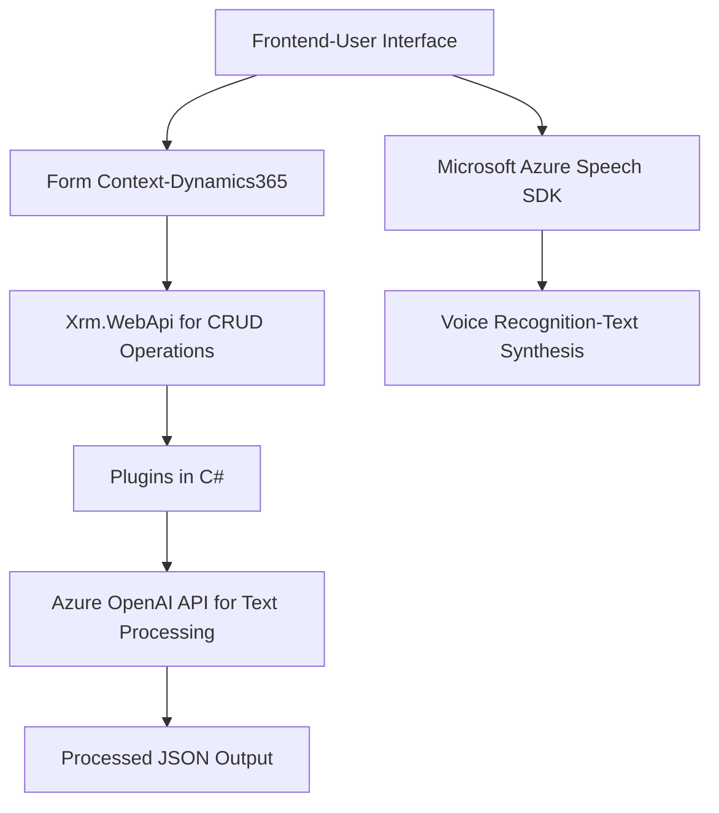

### Breve Resumen Técnico

El repositorio incluye componentes orientados hacia la creación de una solución que integra funcionalidades de reconocimiento de voz, síntesis de texto a voz, y procesamiento basado en IA. Los archivos trabajan sobre una arquitectura cliente-servidor con interacción entre un frontend que maneja formularios y un backend que integra Microsoft Dynamics 365 (a través de plugins) y Azure OpenAI para transformación y análisis de datos.

---

### Descripción de la Arquitectura

La arquitectura parece ser **n capas** o una variante híbrida basada en integraciones cliente-servidor. Los elementos se distribuyen de la siguiente forma:
1. **Frontend**: JavaScript manejando formularios mediante Dynamics 365 `Xrm.WebApi` y utilizando el SDK de Azure Speech para reconocimiento y síntesis de voz.
2. **Backend**: Plugins escritos en C# (Microsoft Dynamics 365 SDK) que invocan APIs de OpenAI Azure para procesamiento de texto.
3. **Servicios Externos**: Interacciones con Azure Speech SDK y Azure OpenAI API para tareas externas (reconocimiento de voz y transformación de texto).

La integración dinámica del SDK de Azure Speech y la arquitectura basada en SDK y llamadas de API externas refleja un diseño modular, extensible y orientado servicios. Sin embargo, existe una dependencia importante hacia los servicios de Azure, que condiciona la solución de manera directa.

---

### Tecnologías Usadas

1. **Frontend:**
   - JavaScript para el manejo y procesamiento de formularios.
   - API web interna de Dynamics 365 (`Xrm.WebApi`).
   - Azure Speech SDK para síntesis y reconocimiento de voz.

2. **Backend:**
   - C# en el framework Microsoft Dynamics CRM SDK.
   - Azure OpenAI API para transformación de texto.
   - System.Net.Http para comunicación con servicios externos.
   - Newtonsoft.Json y System.Text.Json para manejo de datos JSON.

3. **Servicios Externos:**
   - Azure Speech SDK (`https://aka.ms/csspeech/jsbrowserpackageraw`) y Azure OpenAI API.

---

### Dependencias y Componentes Externos

1. **Azure Speech SDK para el frontend**:
   - Reconocimiento y síntesis de voz directamente desde el navegador.

2. **Azure OpenAI API**:
   - Proporciona transformaciones de texto inteligentes y personalizadas.

3. **Dynamics 365 API (Xrm.WebApi)**:
   - Interacción directa entre formularios del frontend y los atributos del sistema CRM (backend).

4. **Microsoft Dynamics Plugin Framework**:
   - Permite la extensión de Dynamics CRM mediante plugins personalizados ejecutados en eventos.

---

### Diagrama **Mermaid**

---

### Conclusión Final

Este repositorio muestra una solución bien estructurada y modular enfocada en integrar capacidades avanzadas de reconocimiento de voz y procesamiento de datos con tecnologías de Azure (Speech SDK y OpenAI). La combinación de frontend dinámico en JavaScript con un backend personalizado en C# refleja una arquitectura cliente-servidor basada en servicios con patrones como la separación de responsabilidad (lógica de frontend y procesamiento backend).

Aunque ofrece escalabilidad, depende altamente de servicios externos (Azure), lo cual podría implicar costos y limitaciones operativas en caso de interrupciones en dichos servicios. Sin embargo, la arquitectura está preparada para interactuar eficientemente con los servicios de Dynamics 365 y Azure.