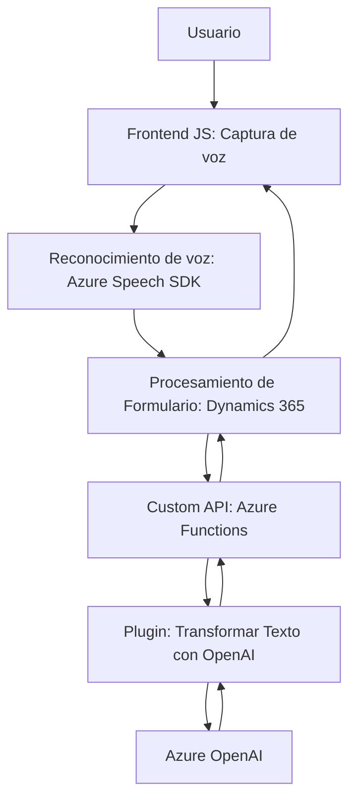

### Breve resumen técnico:

El repositorio contiene artefactos de una solución que conecta funciones frontend para interactuar con usuarios mediante voz, un backend de Dynamics CRM para gestionar y almacenar datos en formularios, y un plugin para integrar servicios de Azure OpenAI para procesamiento avanzado de texto. Las diferentes componentes trabajan en conjunto para proporcionar una experiencia de usuario orientada a voz.

---

### Descripción de arquitectura:

La solución tiene una **arquitectura modular basada en capas** ajustada a una **modelo cliente-servicio**. Consta de las siguientes partes:
1. **Frontend con JS**: Implementa lógica de entrada y salida de voz mediante el Azure Speech SDK y APIs de Dynamics CRM para remplazar o actualizar información en formularios. Maneja el contexto del formulario y la interacción directa del usuario.
2. **Integración a servicios externos (Backend)**: Utiliza un **plugin** en Dynamics CRM que conecta al servicio Azure OpenAI usando una API REST de Azure (OpenAI Completion API) desde las funciones internas de Dynamics CRM. Aquí ocurre la transformación del texto y el manejo de estructuras JSON para aplicaciones avanzadas.
   
Por lo tanto, la arquitectura completa se puede clasificar como un híbrido entre **n capas** y **orientación a servicios**.

---

### Tecnologías usadas:

1. **Frontend**:
   - **JavaScript**: Implementa la lógica de frontend.
   - **Azure Speech SDK**: Para interacción de voz (síntesis y reconocimiento).
   - **Dynamics CRM API (`Xrm.WebApi`)**: Manejo del contexto y elementos de formularios en Dynamics.

2. **Backend/CRM Plugin (C#)**:
   - **Microsoft Dynamics CRM SDK**: Implementación de una arquitectura basada en plugins.
   - **Azure OpenAI API**: Integración para transformar lenguaje natural en datos estructurados.
   - **.NET Framework/C#**: Lenguaje base para el diseño e implementación del plugin.

3. **Infraestructura y servicios externos**:
   - **Azure Services**: Speech SDK y OpenAI.
   - **Dynamic loading**: Carga de scripts en tiempo de ejecución (`ensureSpeechSDKLoaded`).

---

### Diagrama Mermaid:

Representación de la comunicación entre componentes de la solución.

---

### Conclusión final:

La solución implementada se centra en la integración entre servicios de voz (Azure Speech SDK), interacción directa con formularios dinámicos utilizando Dynamics CRM, y procesamiento avanzado de texto basado en inteligencia artificial (Azure OpenAI). La arquitectura refleja los principios de modularidad, cohesión en las capas de software, y orientación a servicios para aprovechar APIs externas como elementos de valor agregado.

Las principales fortalezas son:
- Capacidad para procesar datos "en caliente" desde voz a texto, con mapeo contextual de datos/formularios.
- Integración robusta con servicios externos (Azure Speech SDK y OpenAI).
- Escalabilidad asegurada mediante componentes separados y comunicados vía APIs.

Sin embargo, sería recomendable reforzar el manejo de errores y excepciones, así como realizar optimizaciones para la seguridad de los accesos a datos sensibles como claves de API.