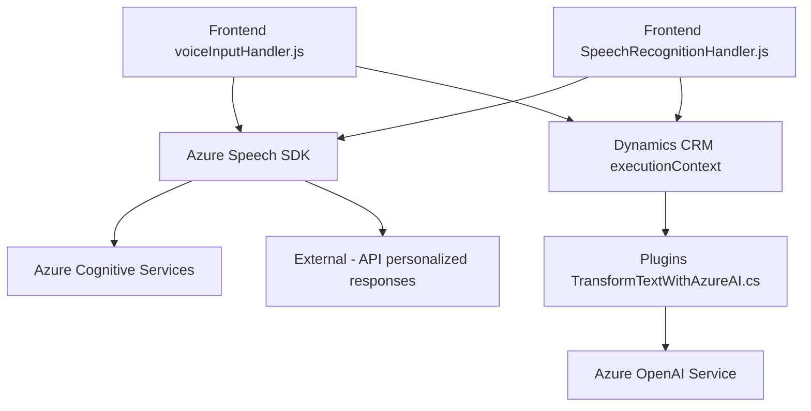

### Breve resumen técnico
El repositorio está orientado a proporcionar funcionalidades avanzadas en el contexto de una aplicación CRM, utilizando reconocimiento de voz (speech-to-text), síntesis de voz (text-to-speech), y procesamiento avanzado de texto con inteligencia artificial. Utiliza integraciones con **Azure Cognitive Services** y **Dynamics 365 CRM**, modularizando funcionalidades específicas en archivos y clases independientes. El patrón arquitectónico evidencia una solución multicapa con fuerte integración a servicios de API externos.

---

### Descripción de arquitectura
El sistema opera como un conjunto de módulos funcionales que interactúan entre sí:
1. **Frontend (voz y texto)**: Proporciona interfaces basadas en HTML y JavaScript, con funciones que manipulan contextos de formularios y conectan dichos datos con servicios externos (Azure Speech SDK).
2. **Plugins (procesamiento de texto)**: Implementados como extensiones para Microsoft Dynamics CRM. El diseño de este módulo utiliza un paradigma de arquitectura desacoplada en el contexto de Plugins.
3. **API externa (Azure AI)**: Comunicación con **Azure Speech SDK** y **Azure OpenAI** para la síntesis, reconocimiento de voz, y transformaciones inteligentes de texto (usando reglas predefinidas o procesamiento de IA).

El diseño tiene características propias de una arquitectura **n-capas**, donde se separan las capas de presentación, lógica de negocio y de servicios externos. Adicionalmente, por la integración directa con servicios en la nube, evidencia un enfoque **API Gateway** externo para consumir servicios de inteligencia artificial.

---

### Tecnologías usadas
#### En el frontend:
- **HTML/JavaScript**: Para la creación de interfaces y manipulación de la estructura del DOM.
- **Azure Speech SDK**: Para la síntesis y el reconocimiento de voz (procesos directamente integrados al frontend).
- **Dynamic 365 CRM API (`executionContext`)**: Para captura y manipulación dinámica de formularios en la interfaz web.

#### En los plugins:
- **Microsoft Dynamics CRM SDK**: Estructura básica para la construcción de plugins.
- **C#**: Lenguaje principal utilizado para la implementación de los plugins de Dynamics CRM.
- **Azure OpenAI Service API**: Para transformación de texto utilizando machine learning.
- **Newtonsoft.Json y System.Text.Json**: Para manejo de datos estructurados en formato JSON.
- **System.Net.Http**: Para ejecutar solicitudes HTTP hacia APIs externas.

---

### Diagrama Mermaid

---

### Conclusión final
Este repositorio representa una solución que combina múltiples tecnologías y servicios cloud para proporcionar una interfaz rica en interacción con usuario (mediante voz y texto), destinada a aplicaciones centradas en la gestión de datos estructurados, como las de un CRM. La arquitectura está alineada con un diseño **multicapa**, empleando servicios externos como parte del flujo de datos y lógica del negocio. Aunque modular y funcional, debe asegurar prácticas de seguridad en cuanto al manejo de secretos y credenciales utilizados para interactuar con las APIs externas como Azure.