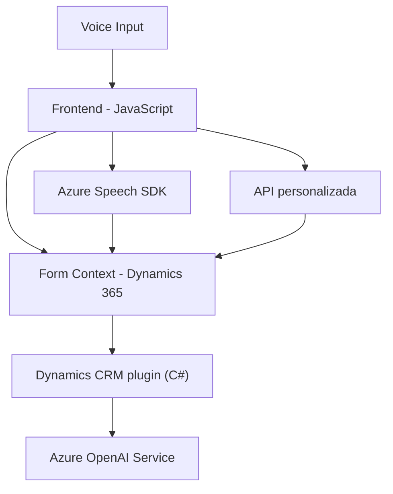

### Breve resumen técnico
El repositorio parece ser una solución integrada que implementa varias funciones relacionadas con formularios, reconocimiento de voz, síntesis de texto a voz y transformación de texto usando servicios de Azure. La solución incluye un frontend en JavaScript y un plugin desarrollado para Dynamics CRM especializado en interacción con Azure OpenAI.

---

### Descripción de arquitectura
La solución sigue una arquitectura híbrida de múltiples capas:
1. **Capas presentes**:
   - **Frontend (JavaScript)**: Manejo de interacción directa con el usuario (formulario, voz/speech).
   - **Servicios Azure**: Uso de Azure Speech SDK y Azure OpenAI para análisis y transformación de datos.
   - **Plugin (backend)**: Implementación de lógica empresarial y procesamiento dentro de Dynamics CRM. Además, interactúa con Azure OpenAI mediante una API REST.

2. **Patrones arquitectónicos**:
   - **Service-Oriented Architecture (SOA)**: Los servicios de Azure (Speech SDK y OpenAI) son puntos centrales para la solución, delegando procesamiento complejo fuera de la aplicación.
   - **Integración de SDKs de terceros y APIs externas**: Tanto el frontend como el backend interactúan con SDKs específicos.
   - **Plugin Pattern**: En Dynamics CRM se usa el patrón estándar para extensibilidad con `IPlugin`.
   - **Responsabilidad única/modularización**: Los módulos JavaScript y la clase C# están separadas con funciones específicas, siguiendo los principios SOLID.

---

### Tecnologías usadas
1. **Frontend**:
   - **Lenguaje principal**: JavaScript (ES6).
   - **Frameworks/librerías**:
     - Azure Speech SDK (`https://aka.ms/csspeech/jsbrowserpackageraw`).
   - **Integraciones**:
     - Formularios dinámicos de Dynamics 365 CRM.
   - **Patrones utilizados**:
     - Modularización y callbacks.

2. **Backend (Plugins)**:
   - **Lenguaje principal**: C# (.NET Framework/Standard).
   - **Framework**: Dynamics CRM SDK (`IPlugin`).
   - **Dependencias externas**:
     - Azure OpenAI API.
     - Librerías como `System.Net.Http` y `Newtonsoft.Json`.

3. **Servicios Externos**:
   - **Azure OpenAI Services** (REST API).
   - **Azure Speech SDK** para procesamiento de voz y síntesis.

---

### Diagrama Mermaid válido para GitHub

**Explicación del diagrama**:
- **Frontend (A)** interactúa con los usuarios mediante el formulario y voz (F), además de hacer llamadas al SDK de Azure Speech (B) y APIs personalizadas (G).
- El **contexto del formulario (E)** es un vínculo entre el frontend y el plugin.
- El **Plugin (C)** transforma datos mediante la lógica de negocio y delega el procesamiento avanzado al servicio externo Azure OpenAI (D).

---

### Conclusión final
La solución es una implementación bien modularizada que combina frontend (JavaScript), backend (C#), y servicios externos (Azure Speech SDK y Azure OpenAI). Está diseñada para extender Dynamics CRM con funcionalidades de reconocimiento de voz y procesamiento avanzado, favoreciendo accesibilidad y automatización. La elección de tecnologías como Azure y el uso de SDKs dinámicos demuestra una integración limpia y un enfoque hacia el uso de arquitecturas orientadas a servicios.