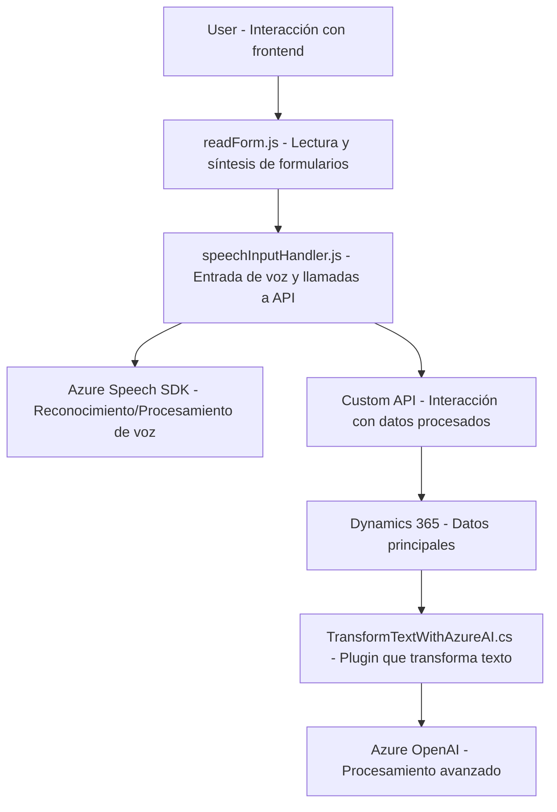

### **Resumen técnico**
La solución del repositorio parece estar diseñada para la integración entre el frontend de Dynamics 365 y servicios de inteligencia artificial y procesamiento de voz (Azure Speech SDK y Azure OpenAI). Los archivos presentados colaboran para realizar tareas específicas: una parte del software se orienta a la interacción del usuario mediante lectura y entrada de voz, mientras que otra se dedica a transformar texto usando procesamiento de IA.

---

### **Descripción de la arquitectura**
La arquitectura se basa en una integración de **microservicios y APIs externas** mantenida sobre una estructura modular que comunica los componentes del frontend (lo que incluye la interfaz y la captura de datos dinámicos) con servicios externos y un entorno centralizado (Microsoft Dynamics 365 CRM). 
1. **Frontend:** Maneja interacción de usuario y dependencias como el SDK de Azure Speech y un mapeo de datos dinámico hacia un sistema centralizado.
2. **Plugins en backend (Dynamics 365):** Extienden funcionalidad en el CRM al operar con Azure OpenAI de manera programática.

La solución muestra características de una arquitectura de **n capas**:
- **Capa presentación:** Manejo de formularios y vistas (FRONTEND/JS).
- **Capa de negocio:** Lógica condensada en las funciones de manipulación de datos transcritos/aplicación en campos y la lógica de plugins en backend (Plugins/TransformTextWithAzureAI.cs).
- **Capa de servicios:** Integración y consumo de servicios externos (Azure Speech SDK y Azure OpenAI).

También posee relación **hexagonal** en cómo las dependencias externas (APIs personalizadas y servicios) pueden ser reemplazables sin influir significativamente en los componentes internos del código.

---

### **Tecnologías usadas**
1. **Frontend:**
   - **JavaScript:** Para lógica dinámica en el manejo de formularios y datos.
   - **Azure Speech SDK:** Compatible con navegador.
   - **Dynamics 365 APIs:** Para operaciones en CRM y procesamiento de datos del contexto del formulario.

2. **Backend:**
   - **C#:** Desarrollo de plugins para Dynamics CRM.
   - **Azure OpenAI:** Procesamiento avanzado de texto mediante GPT.
   - **Newtonsoft.Json:** Gestión y manipulación de JSON.
   - **System.Net.Http:** Consumo de servicios REST.
   - **Dynamics SDK:** For APIs y extensiones específicas del entorno CRM.

---

### **Componentes externos que podrían estar presentes**
- **Azure Speech SDK:** Procesamiento de síntesis y reconocimiento de voz.
- **Azure OpenAI:** Procesamientos avanzados de texto (GPT API).
- **Dynamics 365 CRM:** Contexto central del sistema, donde se almacenan formularios, atributos y registros.
- **Custom APIs:** Permite la comunicación entre el sistema y servicios específicos para transformaciones personalizadas.

---

### **Diagrama Mermaid**

---

### **Conclusión final**
La solución combina integraciones con servicios externos (Azure Speech SDK y OpenAI) y un sistema backend robusto (Dynamics 365). Promueve modularidad mediante funciones específicas orientadas a tareas como lectura, procesamiento y aplicación de valores generados (voz a texto, transformación avanzada). Aunque funcional, podría beneficiarse de una configuración externa más segura (p.ej., Key Vault para las credenciales) y mayores estándares en el manejo de errores para garantizar robustez ante fallos de servicios externos. La arquitectura planteada es adaptable, escalable y destacada en sistemas empresariales.