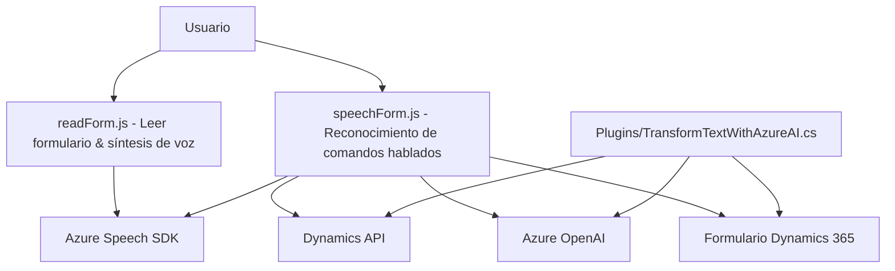

### Análisis técnico del repositorio

#### Breve resumen técnico:
El repositorio está compuesto por tres archivos principales orientados a la integración de funcionalidades avanzadas para formularios de Dynamics 365 usando tecnologías de Microsoft, como Azure Speech SDK y Azure OpenAI. El propósito general es mejorar la interacción con los usuarios mediante comandos de voz y transformación de texto, ofreciendo accesibilidad y automatización avanzada para formularios de Dynamics.

---

### Descripción de la arquitectura
La solución está basada en una arquitectura híbrida entre **n-capas** y **cliente-servidor**. El frontend interactúa directamente con Dynamics 365 mediante JavaScript, mientras que en el backend se implementan plugins compatibles con Dynamics que emplean Azure OpenAI para la transformación de datos. 

Esta arquitectura comprende:
1. **Frontend (JavaScript)**: Se utiliza para la interacción del usuario con el formulario, incluyendo entrada de voz, reconocimiento de texto y síntesis de voz.
2. **Backend (C#)**: Plugins de Dynamics 365 que se conectan a servicios externos (Azure OpenAI) para proporcionar funciones avanzadas de procesamiento de texto.

Adicionalmente, se aplica una variante del patrón de **estructura modular**, donde cada archivo maneja responsabilidades específicas y desacopladas:

- **FRONTEND/JS/readForm.js** y **speechForm.js**: Manejan la comunicación directa con el usuario y formularios de Dynamics.
- **Plugins/TransformTextWithAzureAI.cs**: Proporciona capacidades avanzadas con procesamiento de texto mediante llamada al servicio de Azure OpenAI desde Dynamics.

---

### Tecnologías usadas
1. **Frontend:**
   - **Azure Speech SDK**: Manejo de reconocimiento y síntesis de voz en formularios.
   - **JavaScript**: Lenguaje principal del frontend.
   - **Dynamics 365 Web API**: Para interactuar directamente con datos dentro de Dynamics.

2. **Backend:**
   - **C# (ASP.NET core)**: Lenguaje del plugin del CRM.
   - **Dynamics SDK (`Microsoft.Xrm.Sdk`)**: Marco estándar para interacción con Microsoft Dynamics CRM.
   - **Azure OpenAI Service**: Llamadas HTTP para procesamiento avanzado de lenguaje y generación de contenido.
   - **Newtonsoft.Json**: Manipulación de datos JSON.

---

### Dependencias o componentes externos
1. **Azure Speech SDK**: Biblioteca para manejar habla en el navegador (síntesis de voz y reconocimiento de habla).
2. **Azure OpenAI Service**: Usado en el backend para transformación inteligente de texto.
3. **Dynamics API (`Xrm.WebApi`)**: Manejo de datos almacenados en Dynamics 365.
4. **Newtonsoft.Json & System.Text.Json**: Librerías para la serialización y manipulación de datos JSON.
5. **HTTP Client (`System.Net.Http`)**: Para realizar peticiones REST de manera eficiente.

---

### Diagrama Mermaid válido para GitHub

---

### Conclusión Final
Este repositorio evidencia una solución completa basada en una arquitectura híbrida cliente-servidor/n-capas, perfectamente alineada con entornos de Dynamics 365. Utiliza tecnologías modernas como Azure Speech SDK y Azure OpenAI para enriquecer la usabilidad y funcionalidad de los formularios. La buena práctica en modularidad y uso de integraciones externas refuerza su diseño. Sin embargo, hay un fuerte acoplamiento con los servicios de Azure y Dynamics 365, lo cual hace difícil reutilizarlo fuera de estos contextos empresariales específicos.