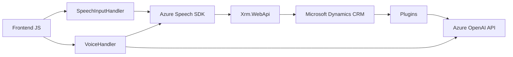

### Breve Resumen Técnico
El repositorio contiene una solución relacionada con la entrada y salida de datos mediante reconocimiento y síntesis de voz, que se integra con formularios dinámicos en un sistema basado en **Microsoft Dynamics CRM**. Utiliza servicios de **Azure Speech SDK**, **Azure OpenAI**, y la API de Dynamics CRM (`Xrm.WebApi`) para manipular datos, ejecutar transformaciones con IA y realizar síntesis de voz y reconocimiento de voz.

---

### Descripción de Arquitectura
#### Tipo de Solución
La solución es una combinación de **frontend interactivo** (funcionalidades relacionadas con comportamiento de formularios y entrada/salida de voz) y componentes backend basados en plugins personalizados para un sistema CRM. Puede considerarse como un ecosistema que mezcla un frontend especializado y una integración a microservicios en una arquitectura **cliente-servidor**.

#### Arquitectura General
La arquitectura gira en torno a la integración de servicios en la nube (Azure Speech SDK y Azure OpenAI API) y los eventos de plugins en **Microsoft Dynamics CRM**. No es un sistema de microservicios completo, pero presenta un diseño **modular** (con funciones segregadas para responsabilidades específicas) y elementos de patrones como **Facade** y la **arquitectura de plugin** típica de Dynamics CRM.

---

### Tecnologías Usadas
1. **Frontend**:
   - Lenguaje: **JavaScript**
   - Framework/SDK: **Azure Speech SDK**
   - Arquitectura JS: Modularidad basada en funciones para encapsulación y reutilización del código.
   - Estilo Asíncrono: Manejo de promesas y callbacks para integración con SDKs.
   - Dependencia del navegador para manipulación del DOM y carga dinámica del SDK.

2. **Backend (Plugins en Dynamics CRM)**:
   - Lenguaje: **C#**
   - Framework: **Microsoft Dynamics CRM Framework** 
   - Dependencias: 
     - `Microsoft.Xrm.Sdk` para interacción con el contexto de los formularios.
     - `Newtonsoft.Json` / `System.Text.Json` para operaciones con JSON.
     - `System.Net.Http` para realizar solicitudes HTTP (OpenAI API).
     - **Azure OpenAI API** para procesamiento textual con GPT.

---

### Diagrama Mermaid

---

### Conclusión Final
La solución está diseñada como una integración entre un frontend dinámico basado en JavaScript y los plugins en Microsoft Dynamics CRM configurados sobre C#. La aplicación usa servicios gestionados en la nube para procesar entrada de datos mediante reconocimiento y síntesis de voz. Se destaca un enfoque modular, basado en eventos y programación asíncrona, adaptado para enriquecer una plataforma CRM empresarial preexistente.

Se identifica el uso de servicios de Azure como el **Speech SDK** y **OpenAI**, que potencian las capacidades de entrada y salida de voz, y transformación inteligente de datos. Aunque el diseño es funcional y adecuado para sistemas CRM, sería prudente mejorar la gestión de configuraciones sensibles, como la clave API, que está escrita en el código.