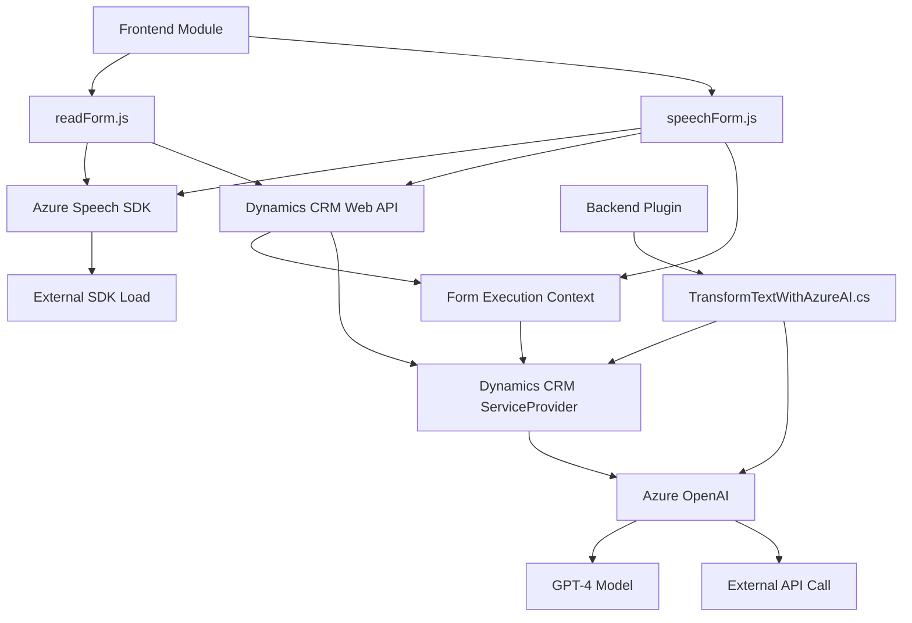

### Resumen técnico:
El repositorio contiene diferentes piezas de una solución que parece estar diseñada para interactuar con formularios y datos dentro de un entorno CRM, específicamente Dynamics 365. Utiliza servicios de Microsoft como Azure Speech SDK y Azure OpenAI para mejorar la experiencia de usuario con capacidades de voz, IA y transformación de texto.

---

### Descripción de arquitectura:
1. **Arquitectura de N Capas**:
   - El repositorio refleja una solución estructurada en capas: capa de presentación (los scripts para interacción con el frontend y voz) y una capa de negocios (plugin para Dynamics CRM). 
   - Se integra con APIs externas y SDKs en la capa de servicios.

2. **Integración con terceros**:
   - Los scripts JavaScript dependen de SDKs y APIs (Azure) y conectan directamente con los formularios visibles en Dynamics 365 CRM.
   - El plugin .NET actúa como intermediario entre la plataforma de Dynamics y Azure OpenAI.

3. **Uso de patrones**:
   - **Service SDK Integration**: Módulos y plugins están diseñados para trabajar con SDKs y APIs de terceros, delegando responsabilidades y siendo extensibles.
   - **Dynamic Mapping**: Se emplea para mapear campos de los formularios basados en etiquetas visibles.
   - **Plugin extensible**: El archivo C# utiliza el patrón de plugin que sigue las prácticas recomendadas de Dynamics CRM.

---

### Tecnologías usadas:
1. **Frontend (JavaScript)**:
   - Uso de SDK: Azure Speech SDK para reconocimiento de voz y síntesis.
   - Interacción dinámica y eventos: Manejo asíncrono con `Promises` y callbacks.
   - Integración directa con Dynamics CRM y la capa visible del formulario (`executionContext`, `formContext`).

2. **Backend/Plugin (.NET)**:
   - Plataforma .NET con C#, utilizando la interfaz `IPlugin`.
   - Integración con Azure OpenAI para procesamiento de texto usando modelos GPT-4.
   - Manipulación de JSON con `Newtonsoft.Json` y `System.Text.Json`.

3. **Frameworks y servicios**:
   - Microsoft Dynamics CRM.
   - Azure Speech SDK.
   - Azure OpenAI Service.

---

### Diagrama Mermaid **100 % compatible con GitHub Markdown**:

---

### Conclusión final:
La solución está diseñada para ser extensible y modular con una arquitectura de N Capas, destinada al manejo de datos de formularios en un sistema CRM mediante interacción con servicios de voz y procesamiento IA en Azure. Los scripts JavaScript añaden capacidades de entrada por voz y mapeo a formularios, mientras que el plugin C# extiende funcionalidad en Dynamics CRM con procesamiento avanzado de texto. Está altamente acoplada a tecnologías de Microsoft como Dynamics 365, Azure Speech SDK y Azure OpenAI, lo que la hace ideal para entornos corporativos que adoptan el ecosistema de Microsoft.