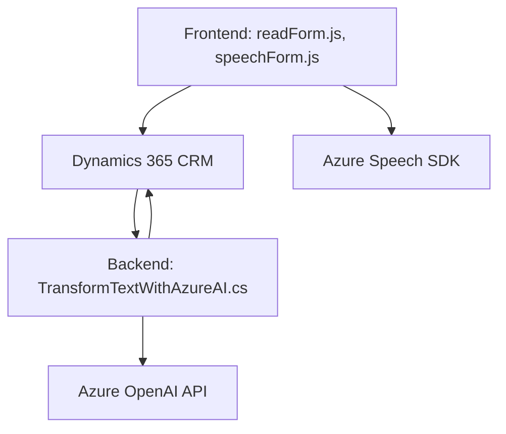

### Breve resumen técnico:
El repositorio contiene código que implementa integración avanzada entre Dynamics 365 y servicios de Microsoft Azure, lo que permite manejar formularios y datos por medio de interacción de voz y procesamiento avanzado de texto mediante Azure Speech SDK y Azure OpenAI API. Hay una combinación de frontend (JavaScript para gestión de formularios y voz) y backend (C# Plugin para AI).

---

### Descripción de arquitectura:
La solución utiliza una arquitectura **n capas**, donde:
- **Frontend:** Código JavaScript procesa datos visibles del formulario y gestiona interacción por voz y síntesis de texto mediante Azure Speech SDK.
- **Backend:** Plugins desarrollados en C# se integran como extensiones de Dynamics 365; estos utilizan Azure OpenAI para transformar texto en objetos JSON estructurados.
Esta arquitectura combina componentes de Dynamics CRM (como web APIs) con servicios externos en la nube (Azure Speech SDK y Azure OpenAI), siguiendo un patrón de integración de servicios (SoA).

---

### Tecnologías usadas:
1. **Frontend:**
   - Lenguaje: JavaScript.
   - Dependencias:
     - Azure Speech SDK.
     - Dynamics 365 Form API (`executionContext`, `formContext`, etc.).
2. **Backend:**
    - Lenguaje: C#.
    - Dynamics 365 SDK para la implementación del plugin.
    - Azure OpenAI API para procesamiento de texto mediante inteligencia artificial.
    - Librerías: Newtonsoft.Json, System.Net.Http, System.Text.Json.
  
### Patrones:
- **Event-driven:** Ejecución basada en eventos tanto en el frontend (callbacks por eventos de voz) como en el backend (listeners en Dynamics).
- **Factory Pattern:** En el frontend, el Azure Speech SDK y sus configuraciones son creados dinámicamente mediante fábricas (`SpeechConfig`, `AudioConfig`).
- **Modular design:** Organización del código en funciones y clases con responsabilidades claras para la modularidad y reutilización.
- **SoA (Service-oriented Architecture):** Significativa dependencia en servicios externos (Azure).

---

### Diagrama Mermaid (válido para GitHub):

---

### Conclusión final:
Esta solución integra un sistema de síntesis y reconocimiento de voz con funcionalidades de dinamismo en formularios de Dynamics 365, habilitando interacción por comandos de voz y transformación textual avanzada usando IA. La combinación de front-end basado en JavaScript con APIs de Dynamics y back-end basado en plugins para Azure OpenAI sigue una nítida arquitectura **n capas**, orientada a servicios. Además, aprovecha patrones como event-driven programming y modular design para mantener el código manejable y extensible.