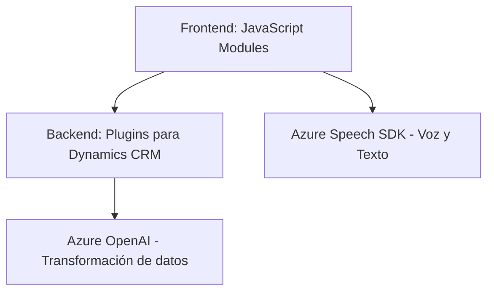

### Breve Resumen Técnico:

Este repositorio contiene una solución que implementa funcionalidades relacionadas con la interacción y procesamiento de datos de formularios utilizando reconocimiento de voz y síntesis de audio con **Azure Speech SDK**. Además, incluye integración con **Azure OpenAI** para transformar texto en JSON estructurado según normas definidas. Está orientado a proporcionar capacidades mejoradas en Dynamics 365 mediante el uso de plugins y manejo avanzado de formularios.

---

### Descripción de Arquitectura:

La arquitectura de este repositorio es un **sistema de integración basado en capas y servicios externos**, donde cada capa tiene responsabilidades específicas:

1. **Frontend (JavaScript):**
   - Gestiona la interacción del usuario a través del navegador.
   - Implementa lógica para sintetizar texto en voz y capturar entradas de voz.
   - Utiliza patrones de modularidad y funciones auxiliares para estructurar el código.

2. **Backend/Plugins (C# para Dynamics CRM):**
   - Proporciona capacidades extendidas al sistema CRM mediante plugins personalizados.
   - Interactúa con **Azure OpenAI** para generación de datos estructurados, como JSON, desde texto proporcionado.

3. **Servicios Externos:**
   - Azure Speech SDK: Para reconocimiento de voz y síntesis de audio.
   - Azure OpenAI: Para procesamiento avanzado de datos y transformación de texto.

---

### Tecnologías Usadas:

1. **Frontend:**
   - **JavaScript**: Lenguaje principal para implementar la lógica del cliente.
   - **Azure Speech SDK**: Para reconocimiento de voz y síntesis de texto a audio.
   - **Xrm.WebApi (Dynamics 365)**: Para interactuar con los formularios y datos de CRM.

2. **Plugins Backend:**
   - **C#**: Lenguaje utilizado en los plugins.
   - **Microsoft Dynamics SDK**: Extensiones para interactuar con el CRM.
   - **Azure OpenAI Service**: Para la transformación avanzada de datos mediante IA.

3. **Dependencias Externas:**
   - System.Net.Http: Solicitudes a APIs externas.
   - System.Text.Json y Newtonsoft.Json: Manejo y manipulación de datos JSON.

---

### Diagrama Mermaid:

---

### Conclusión Final:

El repositorio implementa una solución integral basada en la interacción entre formularios de Dynamics CRM y tecnologías de IA y reconocimiento de voz en Azure. Estas funcionalidades aprovechan varios patrones de arquitectura como modularidad, integración con servicios externos, y extensibilidad mediante plugins. Esto permite una experiencia avanzada en la captura, procesamiento y presentación de datos, mejorando el flujo de trabajo en CRM Dynamics. El diagrama representa claramente cómo los componentes interactúan.