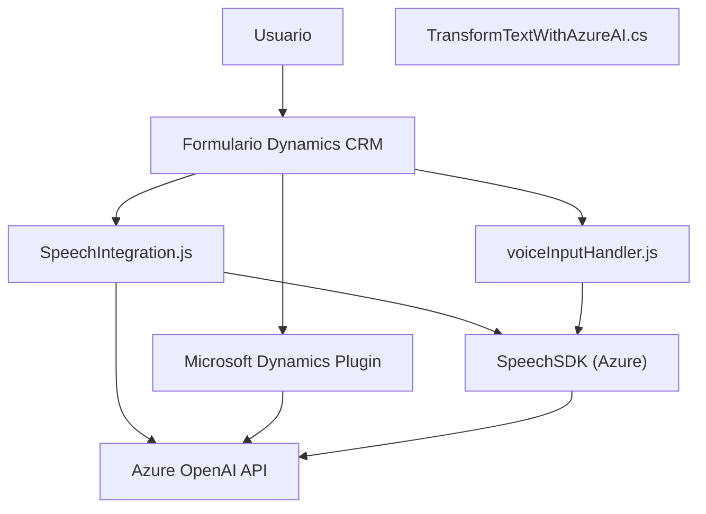

### Breve Resumen Técnico
El repositorio reúne tres componentes principales (front-end JavaScript, plugin en C#, y código auxiliar), integrados para el manejo de voz y texto en formularios de Dynamics CRM mediante el empleo de servicios de Azure (Azure Speech SDK y Azure OpenAI). La solución permite interacción avanzada con formularios utilizando características como síntesis de voz, reconocimiento de voz y procesamiento con IA.

---

### Descripción de Arquitectura
La arquitectura es híbrida, combinando un enfoque **n capas** y elementos de **hexagonal**:
1. **Capa de presentación**: Archivos JavaScript en el directorio `FRONTEND/JS` operan como el front-end que interactúa directamente con el usuario en Dynamics CRM.
2. **Capa de negocio**: El plugin en el archivo `Plugins/TransformTextWithAzureAI.cs` maneja lógica específica para la transformación de texto con un servicio de IA.
3. **Capa de integración/infraestructura**: Interactúa con servicios externos como Azure Speech SDK y Azure OpenAI para realizar tareas avanzadas de síntesis y análisis de texto.

---

### Tecnologías Usadas
1. **Front-end**: JavaScript, integrado con Dynamics CRM.
2. **Back-end o lógica empresarial**:
    - Lenguaje: C#.
    - Framework: SDK de Dynamics CRM, Microsoft .NET Framework.
    - Dynamics CRM (XRM).
3. **Servicios cloud**:
    - **Azure Speech SDK**: Utilizado para la síntesis de voz y reconocimiento de voz.
    - **Azure OpenAI Service (GPT)**: Para análisis y transformación de texto en formato estructurado JSON.
4. **Desarrollo de Plugins**: Uso del patrón Plugin estándar de Dynamics CRM.
5. **Integración dinámica con SDKs y APIs externas**: Carga dinámica de SDKs directamente desde URL.

---

### Dependencias y Componentes Externos
1. **Azure Speech SDK**: Gestiona la síntesis y reconocimiento de voz.
2. **Azure OpenAI API**: Transformación de texto en estructuras de JSON con IA.
3. **Dynamics CRM Web API**: Utilizada para acceder y actualizar campos en formularios CRM.
4. **API personalizada en Dynamics CRM**: Procesa transcripciones de reconocimiento de voz mediante una IA avanzada.

---

### Diagrama Mermaid válido para GitHub

---

### Conclusión Final
La solución es una integración avanzada de servicios externos basada en una arquitectura híbrida, principalmente de n capas con aspectos hexagonales. La inclusión del Azure Speech SDK y el procesamiento de texto por medio de Azure OpenAI aceleran la incorporación de capacidades de voz y análisis de lenguaje avanzado en la gestión de formularios de Dynamics CRM. Sin embargo, se detecta cierto acoplamiento en la gestión de dependencias (como `window.SpeechSDK`), que puede plantear un área de mejora al usar patrones como **Dependency Injection** o más robustos proxies.