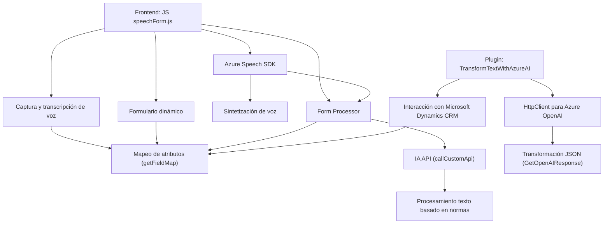

## Breve resumen técnico
El repositorio contiene distintos componentes de un sistema que utilizan tecnologías de voz, inteligencia artificial y servicios de Azure para interactuar con formularios y mejorar la experiencia del usuario en sistemas CRM (presumiblemente Dynamics CRM). Los componentes incluyen:
1. Lógica de frontend (JavaScript) para síntesis y reconocimiento de voz mediante Azure Speech SDK.
2. Un plugin en .NET que interactúa con datos del CRM y realiza transformaciones JSON mediante Azure OpenAI.

---

## Descripción de arquitectura
La solución se basa en una **arquitectura modular** con integración de servicios. El frontend está diseñado en capas, con funciones organizadas en módulos para:
1. Captura y procesamiento de datos con voz.
2. Mapeo y actualización dinámica de formularios CRM.
3. Comunicación con APIs externas para inteligencia artificial (Azure Speech SDK y OpenAI).

La integración con el backend (Microsoft Dynamics CRM) utiliza la **extensión mediante plugins**, donde la lógica para transformación de texto se ejecuta como un componente adicional al contexto del CRM.

---

## Tecnologías usadas
1. **Frontend**:
   - **JavaScript**: Lógica asincrónica para manejar voz y formularios.
   - **Azure Speech SDK**: Sintetización y reconocimiento de voz.
   - **DOM API**: Para manipular elementos y cargar recursos dinámicamente.

2. **Backend/plugin**:
   - **C# y .NET Framework**: Plugin personalizado para Microsoft Dynamics CRM.
   - **HttpClient**: Integración con servicios externos.
   - **Azure OpenAI**: Utilización de IA para procesar texto.

3. **Servicios externos**:
   - **Microsoft Azure Speech SDK**: Funciones de voz (sintetización y reconocimiento).
   - **Azure OpenAI API**: Transformación avanzada de texto a objetos JSON.

---

## Diagrama Mermaid válido para GitHub

---

## Conclusión final
La arquitectura es modular con responsabilidad definida para combinar múltiples tecnologías: frontend para interacción con usuarios mediante voz e inteligencia artificial, y un backend asociado a Dynamics CRM para transformación de datos y acciones empresariales. Se utiliza el patrón **modular funcional** en el cliente y **Plugin Architecture** en el servidor. La solución parece orientada a habilitar sistemas CRM inteligentes con capacidades mejoradas de entrada y procesamiento de datos, ideal para experiencias orientadas a la automatización o interacción enriquecida.