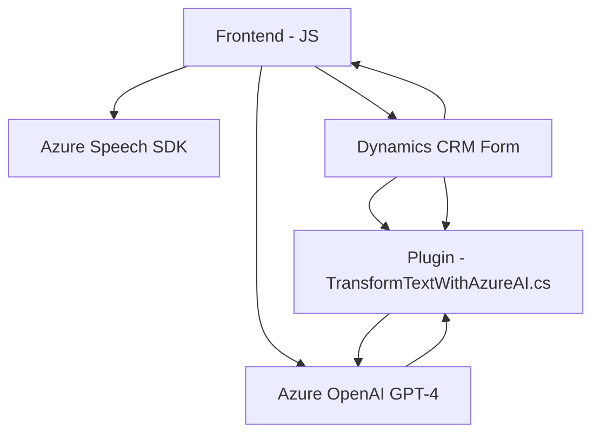

# Breve resumen técnico

El repositorio describe un conjunto de archivos que forman parte de una compleja solución que integra funcionalidades de reconocimiento de voz, síntesis de texto en voz y procesamiento de datos mediante APIs externas. Específicamente:

1. **JS Files (Frontend/JS):** Proveen interacciones entre el usuario y los formularios, con capacidades de reconocimiento de voz y síntesis de voz usando Microsoft Azure Speech SDK.
2. **.NET Plugin File (TransformTextWithAzureAI.cs):** Implementa un plugin de Dynamics 365 que utiliza el modelo GPT basado en Azure OpenAI para procesar y transformar texto.

Esta solución es parte de un sistema que probablemente se utiliza en entornos empresariales como soporte para la gestión de información en CRM integrado con capacidades de IA.

---

# Descripción de arquitectura
La solución sigue una **arquitectura modular de n capas**, donde los componentes están organizados en capas con roles claros. Los módulos de frontend (JavaScript) interactúan directamente con el usuario y el contexto del formulario, mientras que el backend (.NET) procesa las operaciones más complejas como la interacción con APIs externas (Azure AI).

Además, la solución parece seguir principios de **integración con microservicios** al interactuar con servicios externos como Azure Speech SDK y Azure OpenAI Service.

---

# Tecnologías usadas
1. **Frontend:**
   - **JavaScript**: Lenguaje utilizado en la manipulación de formularios y síntesis/reconocimiento de voz.
   - **Microsoft Azure Speech SDK**: Para el reconocimiento y síntesis de voz.
   - **Dynamics CRM JS API**: Para interactuar con formularios y datos de CRM.

2. **Backend:**
   - **Microsoft Dynamics 365 CRM Plugin Framework**: Extensión del sistema CRM mediante una clase que implementa `IPlugin`.
   - **C#/.NET**: Para desarrollo de plugins.
   - **Azure OpenAI Service**: Servicios de procesamiento de lenguaje natural (GPT).
   - **System.Net.Http**: Para realizar consultas REST hacia APIs externas.
   - **System.Text.Json**: Utilizado para trabajar con la manipulación de JSON en el Plugin.

3. **Patrones de diseño:**
   - **Facede Pattern** en el frontend, utilizando funciones ejecutoras como `startVoiceInput` para simplificar el flujo de acciones.
   - **Encapsulación** en el backend para separar lógica de negocio y lógica relacionada con el consumo de APIs externas.
   - **Plugin-based architecture** para extender las capacidades de Dynamics CRM.

---

# Diagrama Mermaid válido para GitHub:

---

# Conclusión Final
Este repositorio describe una solución híbrida (frontend y backend) para integrar funcionalidades avanzadas de síntesis de voz, reconocimiento de voz y procesamiento de texto con un sistema CRM basado en Microsoft Dynamics 365. 

### Características:
1. **Modularidad:** El sistema muestra un alto nivel de organización; cada archivo está diseñado para cumplir con funciones específicas y desacopladas.
2. **Cloud-First:** Se apuesta por la utilización de servicios cloud como Azure AI y Azure Speech SDK para proporcionar servicios escalables de IA y voz.
3. **Patrón de n capas:** Los módulos se interconectan a través de múltiples capas entre el frontend, CRM y backend, mientras interactúan con servicios externos.
4. **Potencial mejora:** Algunas dependencias no utilizadas en el plugin deben ser revisadas y eliminadas. Además, las credenciales de la API deben ser protegidas adecuadamente para evitar vulnerabilidades.

El diseño es eficiente y exhibe buenas prácticas de desarrollo orientadas hacia la integración con plataformas como Dynamics 365. Sin embargo, se debe mejorar la gestión de configuración y seguridad.