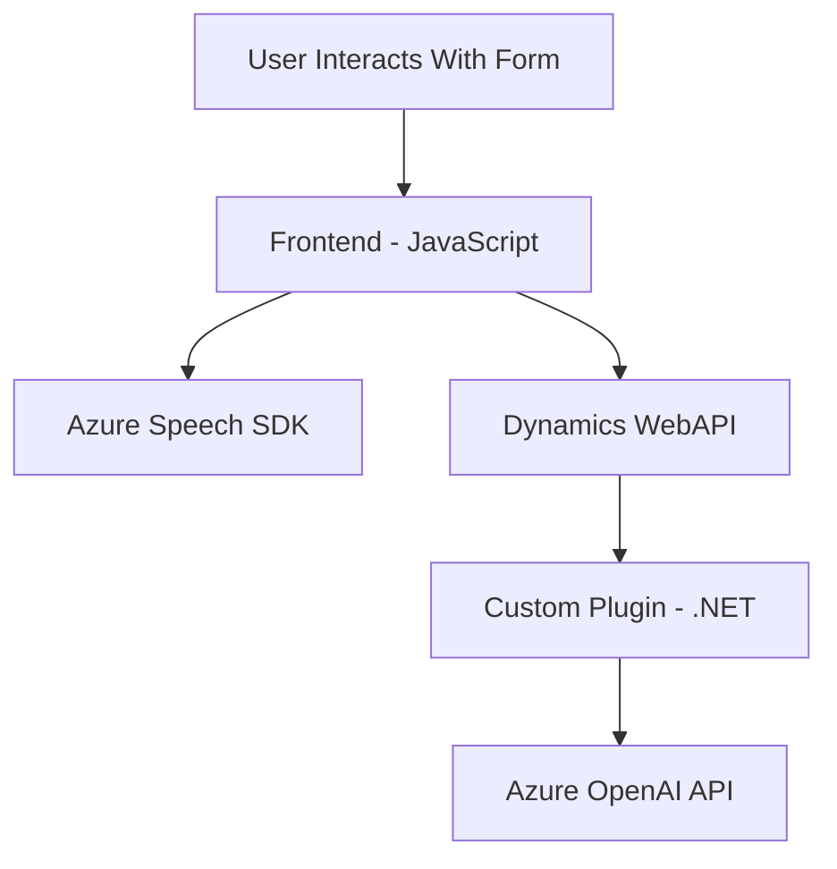

### Breve resumen técnico
El repositorio analiza la interacción entre un frontend en JavaScript para procesamiento de formularios y entrada/salida de voz con Azure Speech SDK, un backend en .NET para manipulación de texto mediante Azure OpenAI API en Microsoft Dynamics CRM, utilizando plugins personalizados. 

### Descripción de arquitectura
La solución está segmentada en tres partes:
1. **Frontend Web**: Procesa formularios y aplica síntesis de voz o entrada de voz/transcripción, integrándose con Azure Speech y Dynamics WebAPI.
2. **Backend Plugin**: Un plugin .NET conectado a Dynamics CRM que utiliza Azure OpenAI para transformar y manejar texto.
3. **APIs en Azure**: Servicios externos como Azure Speech SDK para texto/voz y Azure OpenAI para procesamiento de IA.

La arquitectura general sigue el enfoque *n-capas*:
- **Capa de presentación (frontend)**: Proporciona interacción y visualización al usuario.
- **Capa de lógica empresarial (backend)**: Maneja operaciones de IA y transformación como plugins dentro de Dynamics CRM.
- **Capa de servicios (APIs de Azure)**: Encapsula funcionalidades de texto a voz y procesamiento de texto en Azure.

### Tecnologías usadas
1. **Frontend**:
   - JavaScript.
   - Azure Speech SDK para texto a voz y viceversa.
   - Dynamics WebAPI para interacción con el backend.
2. **Backend**:
   - .NET Framework/SDK para plugins en Dynamics CRM.
   - HTTP y JSON (libraries de .NET y Newtonsoft, etc.) para comunicación con Azure OpenAI.
3. **Servicios externos**:
   - Azure Speech SDK (https://aka.ms/csspeech/jsbrowserpackageraw).
   - Azure OpenAI para transformación de contenido.

### Mermaid Diagram

### Conclusión final
La solución combina un frontend diseñado en JavaScript con componentes asistidos por Azure Speech SDK para entrada y salida por voz y un backend integrado como plugin de Dynamics CRM, basado en .NET para procesamiento de texto con Azure OpenAI. La arquitectura es bien modular y orientada a servicios, lo que permite escalabilidad y claridad en el flujo de datos y operaciones. Sin embargo, existen áreas de mejora como el manejo de errores en servicios externos y la gestión de claves de API de manera más segura.