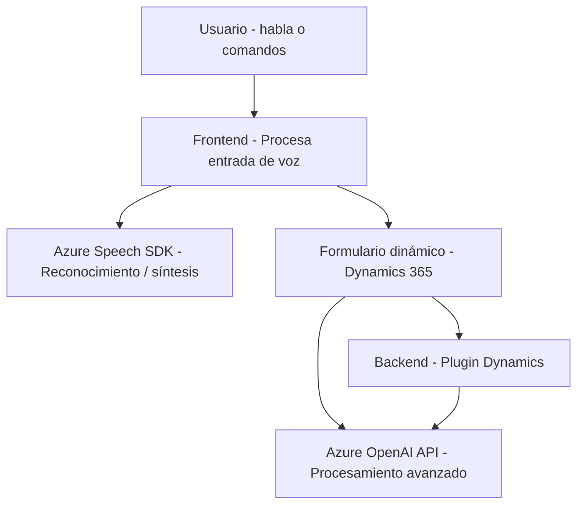

### Resumen Técnico
Este repositorio contiene varios archivos con funcionalidades específicas vinculadas a plataformas de interacción mediante voz e inteligencia artificial. Está orientado hacia la integración de APIs y SDKs para trabajar en un sistema de gestión de relaciones con clientes (CRM), específicamente Dynamics 365.

Los archivos principales implementan:
1. **Integración con Microsoft Azure Speech SDK**: Para reconocimiento de voz, síntesis de voz y generación de comandos hablados que interactúan con formularios dinámicos.
2. **Plugin de transformación con Azure OpenAI**: Automatiza la transformación de texto según reglas de formato, utilizando la API de Azure OpenAI para tareas de procesamiento más complejas.

---

### Descripción de Arquitectura
El repositorio muestra una arquitectura **modular** que mezcla características propias de la **n capas** y patrones de **integración con servicios externos**. A continuación, los puntos más relevantes:
- En el frontend (archivos de JavaScript), se observa un enfoque de modularidad en la estructura, donde cada archivo encapsula procesos específicos (sintetización de datos y reconocimiento con voz).
- En el backend (`TransformTextWithAzureAI.cs`), se implementa un **patrón de Plugin** dentro del contexto de Dynamics CRM, lo que permite la extensibilidad y reutilización con los principios de **desacoplamiento de responsabilidades**.

El repositorio es una solución semi-distribuida que facilita eventos entre el frontend, el procesamiento de datos en el servidor (Dynamics CRM) y el uso de servicios externos (Azure Speech SDK y Azure OpenAI).

**Arquitectura General**:  
- El frontend sigue patrones que combinan modularidad y manejo de dependencias externas dinámicamente.  
- El backend utiliza un plugin para comunicarse con Dynamics CRM, delegando tareas específicas en APIs externas (Azure Speech y OpenAI).  
- Sin embargo, el repositorio no representa microservicios, ya que no hay distribución entre instancias separadas (es una solución centralizada basada en módulos). 

---

### Tecnologías Usadas
1. **Frontend**:
   - **JavaScript** para lógica de procesamiento.
   - **Azure Speech SDK**: Integración para reconocimiento y síntesis de voz.
   - **Dynamics 365 (formContext, XRM.WebApi)**: Manipulación de formularios dinámicos en CRM.
   - **Cargadores dinámicos de dependencias externas**.

2. **Backend**:
   - **C#** como lenguaje de programación para el plugin.
   - **Microsoft Dynamics CRM SDK**: Contexto del plugin basado en la interfaz `IPlugin`.
   - **Azure OpenAI API**: Procesamiento de texto con inteligencia artificial.
   - Librerías modernas como `Newtonsoft.Json`, `System.Net.Http`.

---

### Diagrama Mermaid

---

### Conclusión Final
El repositorio aborda la integración entre reconocimiento/síntesis de voz, CRM, y procesamiento de texto con inteligencia artificial. Utiliza una arquitectura modular para el frontend y un patrón de plugin en el backend, logrando una colaboración eficiente con servicios de Azure (Speech SDK y OpenAI).

Aunque no es una arquitectura distribuida como microservicios, sigue patrones de n-capas de integración y desacoplamiento para maximizar la reutilización de código. Esto es ideal para soluciones que buscan enriquecer la experiencia en sistemas CRM con tecnologías modernas como voz e IA.