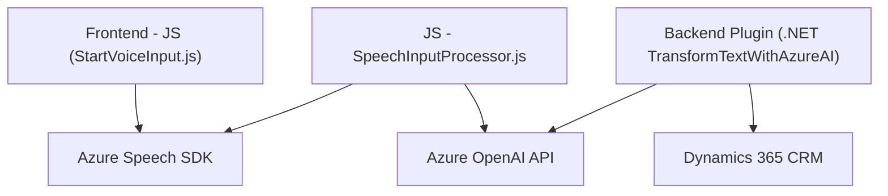

### Breve resumen técnico:
Los archivos indicados pertenecen a un sistema cuyo propósito es integrar procesamiento de voz y texto en un entorno de Dynamics 365. Utilizan tecnologías como Azure Speech SDK y Azure OpenAI para ejecutar síntesis de voz, reconocimiento vocal y transformaciones de texto basado en inteligencia artificial. Del contexto y estructura del repositorio citada, parece ser una solución orientada a la interacción dinámica con formularios y datos en un sistema CRM.

---

### Descripción de arquitectura:
1. **Tipo de solución**: La solución parece ser híbrida, con componentes frontend y backend trabajando juntos:
   - **Frontend**: Para interacción dinámica mediante voz y formulación de datos en navegadores.
   - **Backend**: Componentes como los plugins de Dynamics 365 manejan procesamiento y transformación textual empleando servicios de IA.

2. **Arquitectura general**:
   - **N capas**: Separación evidente entre el frontend (JavaScript) y las capas backend (Plugins de Dynamics 365). La arquitectura utiliza principios de desacoplamiento para mantener modularidad y separación de responsabilidades.
   - **Integración con servicios externos**: Uso de Azure Speech SDK y OpenAI para delegar tareas de reconocimiento de voz y procesamiento de texto.
   - **Eventos y plugins en Dynamics 365**: Plugin desarrollado en .NET que responde a disparadores del sistema CRM.

---

### Tecnologías usadas:
- **Frontend**:
  - **JavaScript**: Para implementación de funcionalidades de interacción visual y dinámica.
  - **Azure Speech SDK**: Para síntesis de voz y reconocimiento de entrada/salida de datos en formularios.
  
- **Backend**:
  - **C# Plugin para Dynamics 365**: Diseñado para extender la lógica de negocio del CRM y ejecutar transformaciones textuales.
  - **Azure OpenAI**: Realiza procesamiento avanzado y transformación estructurada de datos textuales.
  - **Microsoft.Xrm.SDK**: Para el manejo de contexto dentro de Dynamics CRM.
  - **Newtonsoft.Json**: Procesamiento de JSON estructurado en backend.

---

### Diagrama Mermaid:
El diagrama representa la interacción entre los componentes internos y externos del sistema.

---

### Conclusión final:
Esta solución combina componentes frontend y backend basados en tecnologías de Microsoft y Azure para mejorar la interacción usuario-sistema mediante voz e inteligencia artificial en un entorno CRM. La arquitectura emplea n capas con integración de servicios API externos para delegar tareas especializadas, como reconocimiento de voz y procesamiento de texto avanzado. Esto garantiza modularidad y escalabilidad, permitiendo futuras extensiones con facilidad.