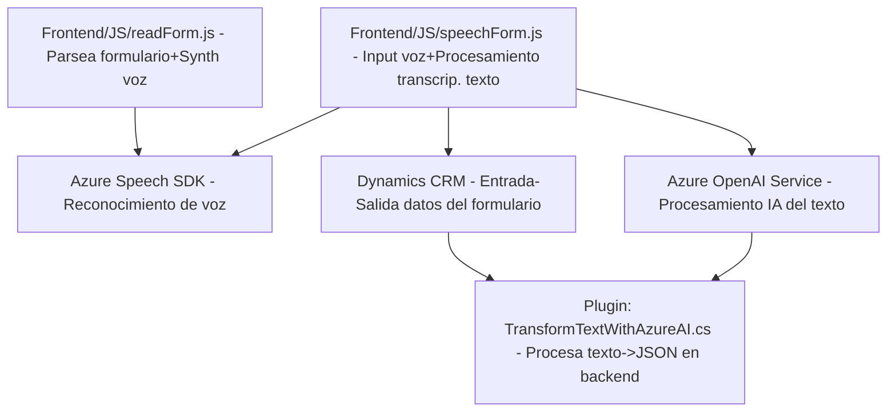

### Resumen técnico:
Este repositorio representa una solución híbrida que incluye diferentes componentes destinados al procesamiento de datos desde interfaces web (frontend), entrada de voz (Azure Speech SDK) y transcripción/transformación de texto de alto nivel con inteligencia artificial (Azure OpenAI). Combina diferentes responsabilidades que abarcan múltiples capas de arquitectura, desde el manejo del cliente (frontend) hasta la integración con un backend a través de APIs y sistemas como Dynamics CRM.

---

### Descripción de arquitectura:
La solución se distribuye en varias capas:
1. **Frontend (JS/Browser)**: 
   - Scripts que interactúan directamente con el usuario y el formulario.
   - Manejo de la lógica relacionada con speech-to-text y text-to-speech.
2. **Backend plugins (Dynamics CRM)**:
   - Plugins personalizados para manipular datos del CRM según lógica empresarial específica.
   - Usan librerías como Azure OpenAI para transformar datos y realizar cálculos avanzados.
3. **Servicios Externos**:
   - Integración con servicios de Azure como Speech SDK y OpenAI para interactuar con capacidades específicas (modelos de lenguaje, transcripción, síntesis de voz).

La arquitectura está diseñada principalmente como una solución **cliente/servidor** (integraciones vía API) con componentes distribuidos entre dos responsabilidades principales (frontend y backend). Cada parte del sistema está enfocada en una serie de tareas específicas:
- Frontend: captura de datos, procesamiento y actualización del formulario.
- Backend CRM Plugin: transformación de datos más avanzada y generación de resultados estructurados mediante APIs de Azure OpenAI.

---

### Tecnologías usadas:
1. **Frontend**:
   - **JavaScript**: Para manipulación del DOM, formularios y lógica de input/output.
   - **Azure Speech SDK**: Tecnología para reconocimiento y síntesis de voz.
   - **Dynamics Xrm.WebApi**: Llamadas API al sistema de CRM para manejo de entidades y atributos.

2. **Backend plugins**:
   - **Microsoft Dynamics SDK**: Interacción con el modelo de datos y servicios de Dynamics CRM.
   - **Azure OpenAI**: Transformación avanzada de texto a JSON estructurados mediante modelos de lenguaje como GPT.
   - **JSON libraries**: Uso de Newtonsoft.Json y System.Text.Json para manipulación de respuesta JSON del servicio de Azure.
   - **HTTP libraries**: Comunicación con servicios REST de Azure.

3. **Patrones:**
   - **Modular**: Código segmentado en funciones y métodos independientes.
   - **Repository Pattern**: Estructura de interacción con datos del CRM dentro de los plugins.
   - **Cliente-Servidor**: El frontend y plugins interactúan vía API con sistemas externos (Azure y Dynamics).

---

### Diagrama Mermaid válido para GitHub:

---

### Conclusión final:
La solución presentada en el repositorio es una arquitectura **cliente-servidor multicapa** con integración a módulos externos de servicios empresariales (Dynamics CRM y Azure). El **frontend** gestiona la interacción con el usuario para el procesamiento de formularios y entrada de voz, mientras que el **backend** emplea plugins especializados para realizar operaciones más complejas con datos y transformar texto mediante inteligencia artificial de Azure. 

El diseño del código muestra una implementación modular centrada en las responsabilidades específicas, como el manejo de APIs y la integración con CRM, utilizando patrones como cliente/servidor y el patrón repositorio. Esta solución es adecuada para escenarios de automatización de procesos empresariales que involucran tecnologías avanzadas como reconocimiento de voz y modelos predictivos.