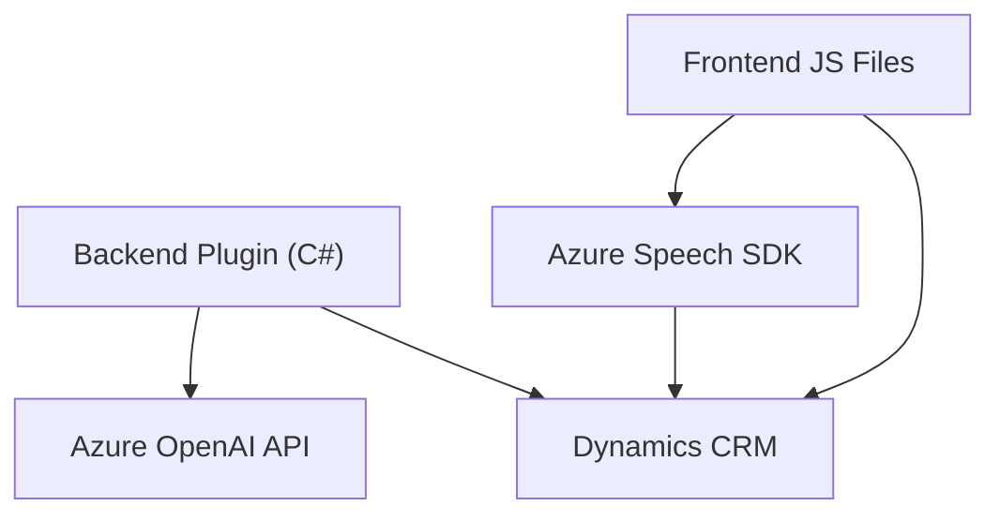

### **Breve resumen técnico**

El repositorio parece ser un solución centrada en CRM (Customer Relationship Management) que integra capacidades de speech-to-text, text-to-speech y procesamiento de texto mediante Azure Speech SDK y Azure OpenAI. Está optimizada para trabajar con formularios y datos visibles dentro de un sistema CRM, que probablemente sea Dynamics CRM. Además, incluye componentes de frontend en JavaScript y backend plugins en C# para extender funcionalidades.

---

### **Descripción de arquitectura**

#### **Estructura general**
La arquitectura del repositorio sigue un enfoque **orientado a servicios** (SOA). Divide las responsabilidades en varios componentes:
1. **Frontend/JavaScript:** Funciones para procesar datos del formulario, sintetizar texto y manejar los servicios de entrada de voz.
2. **Backend/Plugin en C#:** Plugins que interactúan con Dynamics CRM y delegan solicitudes a servicios como Azure OpenAI para procesar texto.
3. **Integración con microservicios externos:** Uso del Azure Speech SDK y del Azure OpenAI API para características avanzadas como síntesis y transformación de texto.

#### **Patrones de arquitectura**
- **Modular:** Cada componente está diseñado como unidades independientes que realizan tareas específicas.
- **Service Gateway:** El encapsulamiento de llamadas a Azure Speech SDK y Azure OpenAI API se realiza en funciones o métodos para simplificar la integración con servicios externos.
- **SOA:** Los diferentes módulos se integran perfectamente en el ecosistema de Dynamics CRM.
- **N-capas:** La separación entre frontend, backend y servicios externos enfatiza una arquitectura de múltiples capas.

---

### **Tecnologías usadas**
1. **Frontend:**
   - **JavaScript**: Para funciones de voz, procesamiento de datos y llamada a APIs.
   - **Azure Speech SDK**: Utilizado para síntesis y reconocimiento de voz.
   - `Xrm.WebApi.online.execute` de Dynamics CRM: Para integraciones con el backend CRM.
   
2. **Backend:**
   - **C#:** Para desarrollo de plugins en Dynamics CRM.
   - **Microsoft.Xrm.Sdk y System.Net.Http:** Comunicación y manipulación de datos en Dynamics CRM, así como solicitudes HTTP.
   - **Azure OpenAI API:** Para procesamiento avanzado de texto mediante las capacidades de lenguaje natural de OpenAI.

3. **Patrones tecnológicos:**
   - Promesas y Asincronía en JavaScript.
   - Manejo de JSON mediante System.Text.Json y Newtonsoft.Json.
   - HTTP requests para dictar integración con servicios externos.

---

### **Diagrama Mermaid**

---

### **Conclusión final**

El repositorio describe una **solución robusta integrada con Dynamics CRM** que usa tecnologías de voz y comprensión de lenguaje natural para ampliar las capacidades de la gestión de datos y formularios CRM. El uso de **Azure Speech SDK** proporciona capacidades de síntesis y entrada de voz, mientras que el backend en C# permite la delegación de tareas hacia el servicio **Azure OpenAI API** para procesamiento complejo de texto.

La arquitectura modular y orientada a servicios asegura flexibilidad, extensibilidad y mantiene una separación clara de responsabilidades. Este diseño es óptimo para escenarios donde se procesan datos dinámicos en CRM y se desea integrar con tecnologías de IA avanzadas.