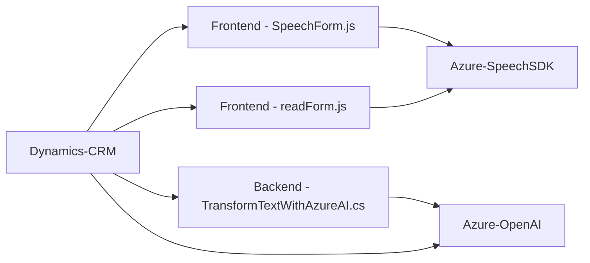

### Breve resumen técnico
El repositorio contiene una solución orientada a la interacción por voz y procesamiento de texto en formularios, aprovechando servicios externos como **Azure Speech SDK** y **Azure OpenAI**. Diseñado para entornos como *Dynamics 365 CRM*, permite tanto la lectura de contenidos en formularios como la transcripción y transformación de texto con capacidades de inteligencia artificial. La arquitectura del conjunto refleja principios de modularidad, integración con microservicios y separación de responsabilidades entre frontend y backend.

---

### Descripción de arquitectura
La solución muestra señales de **arquitectura modular basada en n capas**, donde cada capa tiene una separación clara:
1. **Frontend:** Maneja el uso y la interfaz de usuario a través del procesamiento de formularios y entrada/salida de voz.
2. **Backend (Plugins):** Procesa lógica de negocio avanzada con integración a servicios como Azure OpenAI.
3. **Microservicios externos:** Delegan tareas críticas como síntesis de voz o transformación textual a APIs de Azure Speech y Azure OpenAI.

La comunicación entre estas capas sucede a través de APIs y eventos específicos del entorno Dynamics CRM.

---

### Tecnologías usadas
1. **Frontend (JavaScript):**
   - **Azure Speech SDK**: Para síntesis y reconocimiento de voz.
   - Dinámicas basadas en *DOM* y contexto de formulario proporcionado por Dynamics.
   - Acceso a APIs dinámicas usando métodos como `Xrm.WebApi`.

2. **Backend (.NET/C#):**
   - **Microsoft Dynamics SDK**: Para crear plugins que interactúan con formularios y datos en Dynamics CRM.
   - **System.Net.Http**: Para integración con Azure OpenAI.
   - **Newtonsoft.Json y System.Text.Json**: Procesamiento de JSON para API externa.

3. **Microservicios externos:**
   - **Azure Speech SDK**: Síntesis y reconocimiento de voz.
   - **Azure OpenAI API (GPT-4)**: Para transformación avanzada de texto.

4. **Diseño y patrones usados:**
   - **Patrón de inicialización dinámica**: Usado en los scripts para carga condicional de SDK (Speech SDK).
   - **Adapter Pattern**: Usado en los plugins y frontend para realizar mapeo entre atributos dinámicos de formularios y claves internas.
   - **Plugin Pattern**: Backend implementado en la forma de plugins especiales de Dynamics CRM.
   - **Service-Oriented Architecture** (SOA): Servicios como Azure OpenAI o Speech SDK realizan la lógica principal fuera del sistema.

---

### Diagrama Mermaid válido para GitHub
Diagrama simplificado que representa relaciones entre componentes de la solución:

También puedes interpretar el diagrama como:
1. Frontend interactúa con Dynamics CRM.
2. Input de usuario (voz y formulario) se dirige hacia APIs externas (Azure).
3. Backend se encarga de la lógica avanzada mediante los plugins.
4. APIs externas (Azure OpenAI y Speech SDK) manejan gran parte del procesamiento.

---

### Conclusión final
La solución es una integración de frontend y backend enfocado en aplicaciones basadas en *Dynamics CRM*, que mejora la experiencia del usuario en un contexto de formularios interactivos con capacidades de voz y procesamiento inteligente basado en IA. Usa una arquitectura de **n capas** combinada con **SOA**, lo que fomenta modularidad, reutilización e integración con microservicios externos.

Esta solución es ideal para entornos empresariales que necesiten interacción accesible o capacidades avanzadas de procesamiento y generación de texto. Sin embargo, es recomendable seguir mejoras en seguridad, como el manejo seguro de claves API y métodos para evitar dependencia excesiva en SDK externos cargados dinámicamente.