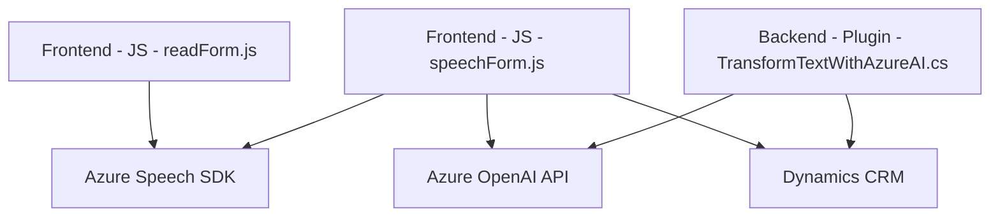

### Breve resumen técnico
El repositorio implementa una solución compuesta por módulos frontend, backend y plugins, enfocada en la integración con tecnologías cognitivas de Azure. Cada componente tiene funciones específicas, desde la gestión y reconocimiento de voz en formularios hasta la transformación de texto mediante Azure OpenAI. La solución parece ser parte de un sistema de gestión empresarial (Dynamics CRM).

---

### Descripción de arquitectura
La arquitectura general se organiza en diferentes capas funcionales:
1. **Frontend (JavaScript):** Maneja la interacción con usuarios y la integración directa con Azure Speech SDK para captura y síntesis de voz. Estos módulos convierten la entrada de texto y voz en datos estructurados que pueden consultarse o almacenarse.
2. **Plugins (C# - Backend):** Utiliza un plugin de Dynamics CRM para ampliar su funcionalidad, empleando servicios de Azure OpenAI para transformación avanzada de texto.
3. **Servicios Externos (Azure Cognitive Services y Dynamics APIs):** Los módulos frontend y backend dependen de servicios de Azure (Speech SDK, OpenAI) y entidades y APIs proporcionadas por Dynamics CRM.

La arquitectura parece estar basada en el patrón **n-capas**, donde:
- **Presentación:** Frontend (JS) para interacción con usuarios.
- **Lógica:** Código backend (C#, Dynamics plugins) para procesamiento avanzado.
- **Datos:** Almacenamiento y acceso mediante APIs y estructuras de Dynamics CRM.

---

### Tecnologías usadas
1. **Frontend:**
   - **JavaScript:** Principal lenguaje para módulos de interacción.
   - **Azure Speech SDK:** Para reconocimiento y síntesis de voz.
   - **Dynamics SDK (Xrm.WebApi):** Para interactuar con entidades CRM desde el cliente.

2. **Backend Plugin:**
   - **C#:** Lenguaje para implementar plugins de Dynamics CRM.
   - **Microsoft Dynamics Framework (Microsoft.Xrm.Sdk):** Para extender el comportamiento del CRM.
   - **Azure OpenAI API:** Proporciona servicios de inteligencia avanzada para transformar texto.
   - **Newtonsoft.Json:** Manipulación de datos JSON.

3. **Arquitectura frontend-backend:** Comunicación cliente-servidor mediante eventos y solicitudes HTTP (JSON).

---

### Dependencias o componentes externos
- **Azure Cognitive Services:**
  - Speech SDK (sintetizador y reconocimiento de voz).
  - OpenAI API para procesamiento del texto.
- **Dynamics CRM Framework:**
  - SDK interno de Microsoft para CRM.
  - APIs y entidades (e.g., `systemuser`, `contact`, `account`).
- **Bibliotecas en backend:**
  - `Newtonsoft.Json.Linq` y `System.Net.Http` para manipulación JSON y solicitudes HTTP.

---

### Diagrama Mermaid

---

### Conclusión final
La solución presentada combina capacidades frontend y backend con una dependencia significativa en servicios externos de Azure. Utiliza una arquitectura basada en capas con integración modular, facilitando la extensibilidad y la colaboración entre sistemas de inteligencia artificial (Azure Cognitive Services) y gestión empresarial (Dynamics CRM). Es especialmente útil en entornos donde se requiere procesamiento de voz y datos dinámicos para mejorar la experiencia del usuario y automatizar tareas empresariales.