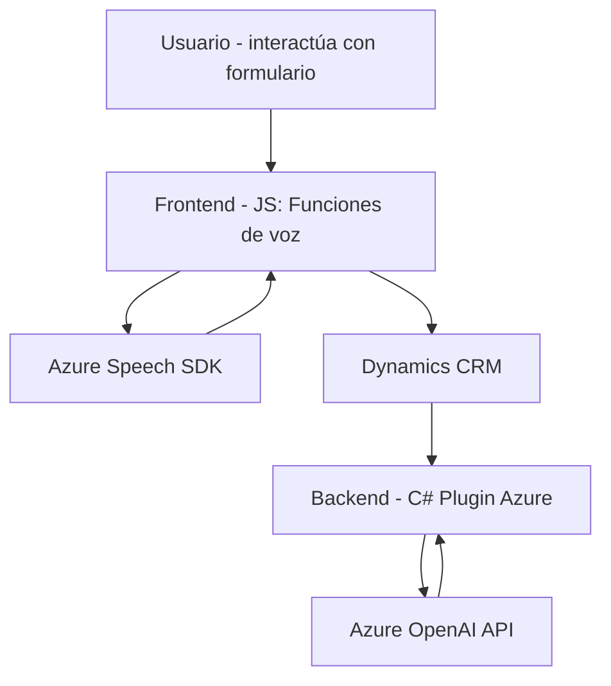

### Breve resumen técnico

Este repositorio implementa una solución basada principalmente en tres componentes:
1. Funcionalidades para lectura, síntesis de voz y reconocimiento de voz en formularios mediante **Azure Speech SDK** y JavaScript (`readForm.js`, `speechForm.js`).
2. Un plugin para **Dynamics CRM**, usando C#, que conecta con **Azure OpenAI** para transformar texto en JSON (`TransformTextWithAzureAI.cs`).
3. Dependencias claves con servicios externos (Azure Speech, OpenAI) para inteligencia artificial aplicada a formulaciones avanzadas de texto y voz.

---

### Descripción de arquitectura

La solución presenta una **arquitectura híbrida**, con los siguientes elementos clave:
1. **Frontend modular**: Dividido entre habilidades de síntesis de voz (reproducción de voz), análisis de reconocimiento de voz y manipulación DOM en formularios.
2. **Backend orientado a plugins**: Plugin dinámico implementado como un componente discreto en Dynamics CRM, englobado en una arquitectura **n-capas** (se utiliza IPlugin para integrar en las capas de negocio/persistencia del CRM).
3. **Dependencia en servicios externos**:
   - **Azure Cognitive Services** (Speech SDK): Para síntesis y reconocimiento de voz directamente desde la interfaz.
   - **Azure OpenAI**: Para transformación avanzada de texto en el backend.

Estas interacciones sugieren un diseño enfocado en **integraciones con APIs externas** y modularidad para simplificar la implementación, manteniendo separación de responsabilidades funcionales.

---

### Tecnologías usadas

1. **Frontend**:
   - Lenguaje: JavaScript.
   - Frameworks/Librerías:
     - **Azure Speech SDK**: Para síntesis y reconocimiento de voz.
     - Manipulación DOM nativa.
   - Patrones:
     - Modularidad basada en funciones (`getFieldMap`, `speakText`, etc.).
     - Integración basada en servicios (Azure Speech SDK).

2. **Backend**:
   - Lenguaje: C#.
   - Frameworks/Librerías:
     - Dynamics CRM SDK (formato plugin bajo `IPlugin`).
     - **Azure OpenAI** con interacción API REST.
     - Serialización JSON (librerías `System.Text.Json` y `Newtonsoft.Json.Linq`).
   - Patrones:
     - **Plugin-based architecture** para customization en Dynamics CRM.
     - **SOA (Service-Oriented Architecture)** basado en APIs de Azure.

3. **Infraestructura**:
   - Servicios de nube:
     - **Azure Cognitive Services** para Speech SDK.
     - **Azure OpenAI GPT API** para transformación de texto.

---

### Diagrama Mermaid válido para GitHub

---

### Conclusión final

Este repositorio abarca una **solución integrada frontend/backend** con servicios avanzados en la nube para síntesis de voz y transformación de texto. La arquitectura se caracteriza por la **modularidad** y **orientación a servicios**, optimizada para funcionar dentro de un entorno corporativo (Dynamics CRM). Los componentes están vinculados eficazmente mediante APIs de Microsoft Azure, lo cual facilita el uso de capacidades de inteligencia artificial (Speech SDK y OpenAI) sin tener que implementar la lógica compleja en local.

Además, el uso de prácticas modernas como frontends ligeros con patrones directos para funciones específicas y plugins bien definidos refuerza la capacidad de esta solución para operar bajo condiciones de alta carga en escenarios empresariales. Sin embargo, es clave prestar atención a la gestión de `apiKeys` y la seguridad en las conexiones para evitar vulnerabilidades en el sistema.