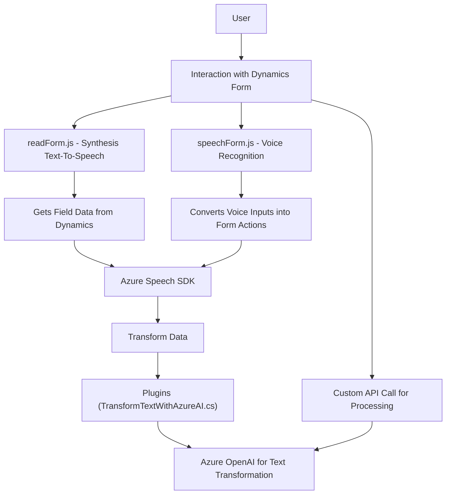

## Breve Resumen Técnico
El repositorio integra funcionalidades que combinan procesamiento de texto, síntesis y reconocimiento de voz, así como transformación mediante IA, utilizando servicios externos como **Azure Speech SDK** y **Azure OpenAI**. Las implementaciones están orientadas a la manipulación de datos en formularios de **Dynamics 365 CRM** y extensiones de lógica personalizada a través de plugins.

## Descripción de Arquitectura
1. **Tipo de solución:** 
   Basado en los archivos analizados:
   - Los archivos de frontend (`readForm.js`, `speechForm.js`) implementan lógica de cliente que interactúa con formularios de Dynamics 365 CRM.
   - El archivo de plugin `TransformTextWithAzureAI.cs` actúa como una extensión de servidor implementada en **C#** a través de la interfaz `IPlugin` de Dynamics CRM.

   Este repositorio combina una solución híbrida de frontend y backend utilizando una arquitectura **Cliente-Servidor** centralizada en **Dynamics CRM**, con integración de servicios externos (Azure Speech y Azure OpenAI).

2. **Tipo de arquitectura:**
   - **Frontend:** Diseño modular basado en capas, con lógica dividida en funciones altamente reutilizables y responsables de tareas específicas. 
   - **Back-end (plugin)**: Segue el patrón **plugin-based architecture** típico de Microsoft Dynamics CRM, ejecutando "event hooks" con lógica personalizada.
   - El uso de servicios externos introduce el **patrón de arquitectura de microservicios**, específicamente en la integración con Azure APIs.

3. **Dependencias externas:**
   - **Azure Speech SDK:** Proporciona funcionalidades para síntesis y reconocimiento de voz.
   - **Azure OpenAI:** Realiza transformación de texto según reglas predefinidas.
   - **Microsoft Dynamics CRM SDK:** Uso de contextos del formulario para acceder y manipular atributos de campos.
   - **Custom APIs:** Llamadas HTTP realizadas desde Dynamics CRM al servicio API de IA personalizada.
   - **Otros paquetes:** Uso de librerías como `System.Net.Http`, `Newtonsoft.Json` y `System.Text.Json` para comunicación externa y manejo de datos estructurados en el plugin de C#.

## Tecnologías y Frameworks Usados
- **Frontend:** 
  - Lenguaje: JavaScript.
  - Framework: Dynamics CRM Frontend SDK.
  - API externa: Azure Speech SDK.
- **Backend:** 
  - Lenguaje: C#.
  - Framework: .NET Framework.
  - SDK: Dynamics CRM (IOrganizationService, IPlugin).
  - API externa: Azure OpenAI.

## Diagrama Mermaid

## Conclusión Final
El repositorio implementa una solución de **Cliente-Servidor**, donde el frontend interactúa con formularios de Dynamics CRM para la síntesis y reconocimiento de voz utilizando el **Azure Speech SDK**, mientras que el backend extiende funcionalidades mediante plugins de Dynamics conectados a **Azure OpenAI**. La arquitectura modular y extensible facilita la ejecución de lógica personalizada y la integración de servicios externos. Aunque la estructura es robusta, las referencias a claves estáticas deben ser adaptadas para adoptar prácticas más seguras.