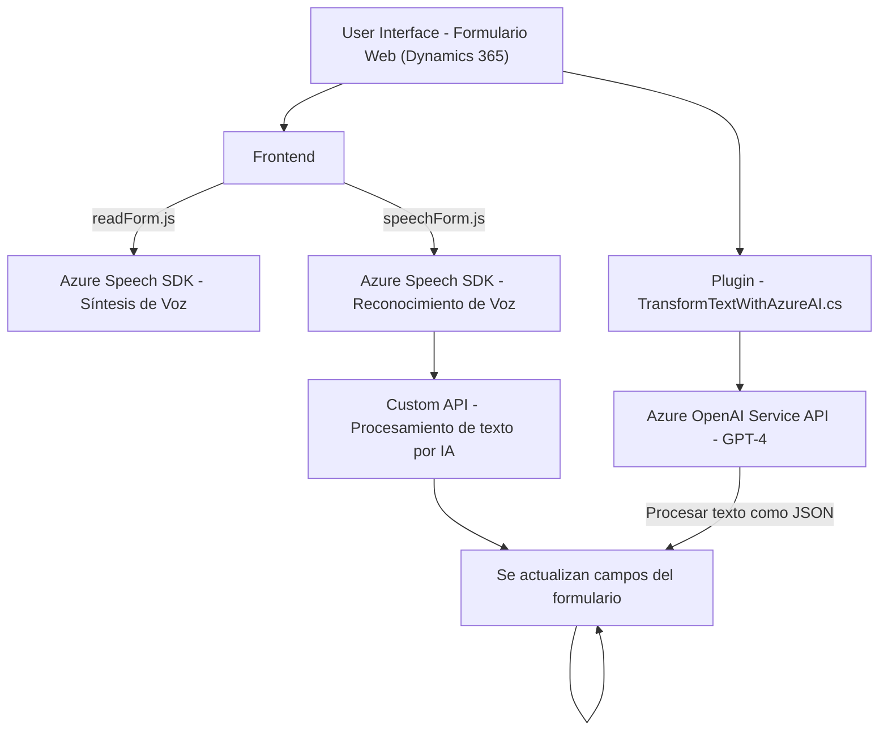

## Informe Analítico: Estructura del Repositorio y Código Proporcionado

### **1. Breve resumen técnico**
La solución consta de tres archivos dentro de un sistema que parece estar orientado a la integración con formularios de Microsoft Dynamics 365 CRM. Utiliza el Azure Speech SDK para la entrada y síntesis de voz, así como Azure OpenAI Service para la transformación y procesamiento inteligente de texto. La solución tiene componentes que interactúan directamente con un CRM y servicios en la nube, habilitando capacidades avanzadas de voz e inteligencia artificial.

---

### **2. Descripción de arquitectura**
La arquitectura del código es **modular** y **basada en eventos**, orientada a la integración con un ecosistema de Microsoft Dynamics 365. Consta de diferentes capas y funcionalidades:
- **Frontend JS (ReadForm.js, SpeechForm.js)**:
  1. Implementa funcionalidades para la síntesis de voz y reconocimiento de voz usando Azure Speech SDK.
  2. Procesa datos de formularios contextuales de Dynamics 365.
  3. Llamadas a APIs externas (por ejemplo, Azure OpenAI Service y Custom APIs).

- **Backend C# (TransformTextWithAzureAI.cs)**:
  1. Un plugin orientado a eventos que extiende las capacidades de Dynamics CRM.
  2. Consume el servicio Azure OpenAI para transformar datos en texto estructurado o JSON.

**Arquitectura:**
- **API-driven system**: Depende de llamadas a Azure Speech SDK y OpenAI para síntesis y procesamiento de voz vía REST API.
- **Acoplamiento externo**: Interacción con Microsoft Dynamics 365 CRM como núcleo del sistema.
- **Estructura Multicapa**:
  - **Frontend**: Procesamiento de datos del formulario y voz en tiempo real.
  - **Integration/API**: Comunicación con servicios externos (Azure Speech SDK y OpenAI Service).
  - **Backend**: Plugin que se ejecuta en el contexto del sistema CRM y realiza transformaciones específicas empleando inteligencia artificial.

---

### **3. Tecnologías, frameworks y patrones usados**
#### **Tecnologías:**
- **Microsoft Dynamics 365 CRM**: Como plataforma principal para formularios e integración.
- **Azure Speech SDK**: Para el reconocimiento de voz y síntesis de texto.
- **Azure OpenAI Service (GPT Models)**: Para la transformación avanzada de datos.
- **JavaScript** (Frontend): Para manejo de formularios y voz.
- **C# (.NET Framework/Dynamics SDK)** (Backend): Implementación del plugin que interactúa con Dynamics CRM.

#### **Frameworks y librerías:**
- `Microsoft Dynamics SDK` (C#): Extiende la funcionalidad CRM mediante eventos y acciones específicas (`IPlugin`).
- `Newtonsoft.Json`, `System.Text.Json` (C#): Para manejo de JSON.
- `System.Net.Http` (C#): Para consumir servicios REST como el de Azure OpenAI.
- Azure-specific libraries (`SpeechSDK`, etc.) para integración con APIs.

#### **Patrones de programación y arquitectura:**
1. **Patrón de Plugins (Dynamics CRM)**: Ejecuta lógica de negocios en respuesta a eventos de CRM.
2. **Event-driven programming**: Garantiza interacción dinámica y ejecución según contextos específicos.
3. **Modular Architecture**: Funciones separadas por responsabilidad (sintesis de voz, procesamiento de formularios, transformación de datos).
4. **API-oriented design**: Centralización de lógica avanzada en servicios externos (Azure Speech y OpenAI).

---

### **4. Dependencias y componentes externos**
#### **Dependencias internas:**
- Lógica de detección de voz y procesamiento de texto en JavaScript (SpeechSDK).
- Plugin `TransformTextWithAzureAI` para la extensión dinámica de funciones sobre CRM (Dynamics SDK).

#### **Dependencias externas:**
1. **Azure Speech SDK**: Usado por los scripts de frontend para reconocimiento y síntesis de voz.
2. **Azure OpenAI Service (GPT-4)**: Llamado por el plugin C# para transformación avanzada de texto.
3. **Dynamics CRM API**:
   - Custom APIs para manipulación de datos en el contexto del formulario (E.g., `Xrm.WebApi`).
4. **System Libraries (C#)**:
   - `System.Net.Http`: Para manejo de solicitudes REST.
   - `Newtonsoft.Json.Linq`: Para estructuras JSON dinámicas.
   - `System.Text.Json`.

---

### **5. Diagrama Mermaid**

---

### **6. Conclusión Final**
El sistema está diseñado como un **complemento modular** que amplía la funcionalidad de Microsoft Dynamics 365 CRM mediante interacción con servicios avanzados como Azure Speech SDK y Azure OpenAI Service. La solución está orientada a mejorar la accesibilidad y automatización de formularios mediante entrada/salida de voz, reconocimiento, y procesamiento de texto por IA.

**Fortalezas:**
- Modularidad y separación de responsabilidades.
- Alta reutilización de servicios externos basados en Azure para síntesis y procesamiento de texto.
- Cumplimiento de patrones estándar para Dynamics CRM y la carga dinámica de APIs.

**Desafíos:**
- Dependencia significativa de Azure e infraestructura externa, lo que puede impactar en costos y rendimiento en casos de carga elevada.
- Seguridad: Necesidad de asegurar la privacidad de los datos procesados (por ejemplo, formularios y transcripciones).