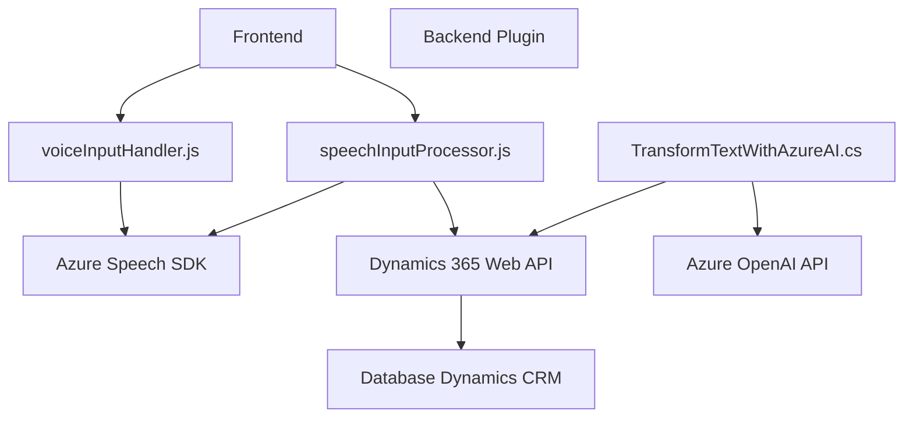

## Breve resumen técnico:
El análisis incluye tres archivos provenientes de un repositorio que implementa funcionalidades para trabajar con formularios, entrada/salida de voz y transformación de texto estructurado dentro de un sistema conectado a Dynamics 365 CRM. Utiliza servicios de nube de Azure y sigue principios de arquitectura orientada a servicios y modularización.

---

## Descripción de arquitectura:
1. **Tipo de solución:** Esta es una solución híbrida que integra múltiples componentes:
   - **Frontend:** A través de archivos JavaScript que manejan interacción con formularios y entradas/salidas por voz.
   - **Backend:** Mediante el uso de un plugin `.NET` conectado directamente a Dynamics CRM y Azure OpenAI.
   - **Servicios externos:** Integración directa con el **Azure Speech SDK** y API personalizada.

2. **Arquitectura:** 
   - Predominantemente **n-capas** debido a la separación entre frontend, backend y servicios API externos. 
   - En el componente backend que usa Dynamics CRM, se sigue un **Plugin architecture** muy común y acoplado a la estructura estándar del ecosistema de Dynamics CRM.
   - Desacoplamiento modular es evidente en los scripts y en la clase `.NET`, adaptando el principio **SRP (Single Responsibility Principle)**.

---

## Tecnologías, frameworks y patrones usados:
1. **Tecnologías:**
   - **Frontend:** JavaScript.
   - **Backend:** C#/.NET (Microsoft Dynamics CRM SDK).
   - **Cloud Services:** Azure OpenAI API, Azure Speech SDK.
   - **API personalizada:** Dynamics 365 Web API.

2. **Frameworks y Librerías:**
   - Microsoft Dynamics CRM SDK.
   - Speech SDK de Azure para reconocimiento/síntesis de voz.
   - Newtonsoft.Json y System.Text.Json para manejo de JSON en .NET.

3. **Patrones usados:**
   - **Factory Pattern:** Para inicializar configuraciones del cliente de síntesis/reconocimiento de voz utilizando `Azure SDK`.
   - **Event-Driven Architecture:** Gestión dinámica de servicios (como la carga del SDK).
   - **Facade Pattern:** Interacción con Dynamics CRM y APIs está encapsulada en interfaces y funciones específicas.
   - **Plugin Execution Pipeline:** Para la forma en que el plugin `TransformTextWithAzureAI` interactúa con Dynamics CRM.
   - **Asynchronous Programming:** El uso de promesas en JavaScript para manejar llamadas API simultáneas, así como el uso de asyn/await en el plugin.

---

## Dependencias o componentes externos:
1. **Azure Speech SDK:** Para síntesis y reconocimiento de audio en los scripts frontend.
2. **Azure OpenAI API:** Para transformar texto con inteligencia artificial en el plugin `.NET`.
3. **Dynamics 365 Web API:** Para interacción directa con formularios y entidades del CRM.
4. **Newtonsoft.Json / System.Text.Json:** Para procesamiento JSON en el backend.
5. **Browser environment APIs:** (`window.onload`, etc.) para cargar el SDK en el contexto del navegador.
6. **HTTP Client:** Usado en el plugin para consumir los servicios de Azure OpenAI.

---

## Diagrama Mermaid:

---

## Conclusión final:
La solución observa un enfoque híbrido con componentes de frontend y backend acoplados al ecosistema Dynamics 365. Utiliza APIs externas como Azure Cognitive Services para ampliar capacidades avanzadas. La arquitectura implementada es predominantemente **n capas**, aunque muestra características de integración modular y desacoplamiento. Mejora la interoperabilidad del sistema mediante la incorporación de SDKs para entrada/salida de voz y procesos de IA. Es una solución escalable, pero el código presenta áreas para mejorar la robustez del manejo de seguridad (como evitar la entrada directa de claves API) y podría optimizarse unificando algunos patrones redundantes.