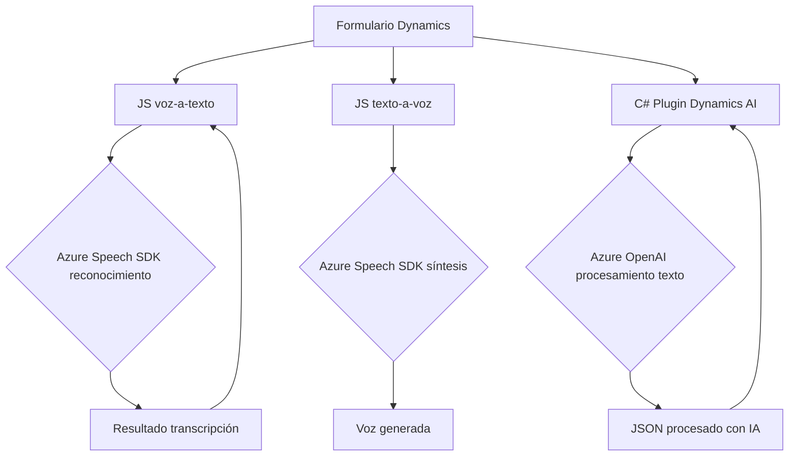

### Resumen Técnico

Este repositorio en GitHub presenta una solución diseñada para integrar servicios de Azure (Speech Service y OpenAI) con Microsoft Dynamics CRM. La solución comprende tres componentes principales: dos archivos JavaScript para la manipulación de datos en formularios y reconocimiento/procesamiento de comandos de voz, y un plugin en C# que utiliza un servicio de inteligencia artificial para transformar texto en estructuras JSON según reglas predeterminadas. 

---

### Descripción de Arquitectura

La arquitectura de la solución mostrada sigue un enfoque **híbrido** basado en patrones de integración de sistemas externos y diseño modular. La solución tiene los siguientes elementos:
- **Frontend en JavaScript (voz a texto y texto a voz)** interactuando directamente con los usuarios y formularios de Dynamics CRM.
- **Backend basado en plugins de Dynamics CRM** desarrollados en C# para ejecutar la lógica de negocio avanzada.
- **Integración con servicios externos**, como Azure Speech SDK para reconocimiento de voz y síntesis, y Azure OpenAI para transformación de texto usando capacidades AI.

La estructura se puede considerar como una combinación de una arquitectura n-capas, donde el frontend y backend están ambos conectados a servicios externos, y la arquitectura hexagonal para la aplicación del plugin mediante adaptadores y puertos, gracias a su capacidad de interactuar tanto con APIs internas del CRM como externas.

---

### Tecnologías Usadas

1. **JavaScript (Frontend)**:
   - Utilización del DOM para manipulación de estructura HTML en formularios de CRM (Dynamics).
   - Integración con **Azure Speech SDK** para reconocimiento de voz y síntesis de texto a voz.
   - Modularización funcional con separación clara de responsabilidades (e.g., extracción de datos del formulario, síntesis de texto, procesamiento de datos).

2. **C# (Backend)**:
   - Implementación de **Microsoft Dynamics CRM plugin** (`IPlugin`).
   - Comunicación con **Azure OpenAI API** utilizando HTTP requests.
   - Manipulación de datos JSON mediante `System.Text.Json` y `Newtonsoft.Json.Linq`.

3. **Servicios externos**:
   - **Azure Speech Service** para manejo de voz.
   - **Azure OpenAI API** para transformar texto en estructuras JSON basadas en IA.

---

### Diagrama Mermaid

---

### Conclusión Final

Este repositorio muestra una solución altamente especializada para extender funcionalidades de Microsoft Dynamics CRM mediante inteligencia artificial y servicios de voz de Azure. Utiliza patrones de modularización y diseño orientado a la integración para permitir la manipulación de datos tanto en el frontend como en el backend, complementado con capacidades de voz y procesamiento de texto avanzado. La arquitectura es una combinación de enfoques n-capas e integración de servicios externos, lo que la hace efectiva para escenarios relacionados con CRM y automatización.