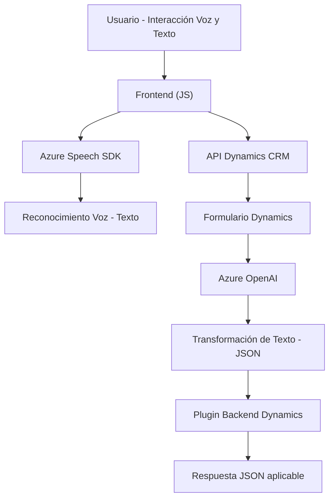

# Breve Resumen Técnico

El conjunto de archivos analizado corresponde a una integración entre tecnología web (frontend mediante JavaScript y Dynamics CRM), API externa (Azure Speech SDK, Azure OpenAI) y lógica empresarial implementada en plugins de Microsoft Dynamics CRM. La solución procesará datos de formularios, reconociendo voz e implementando transformaciones con inteligencia artificial para aplicarlos en entornos CRM. 

---

# Descripción de Arquitectura

### Tipo de Solución: 
Se trata de una integración **híbrida API Frontend-Backend** orientada a facilitar la interacción de usuarios con el entorno Microsoft Dynamics CRM. Implementa un canal de entrada y procesamiento basado en voz y texto.

### Arquitectura:
La arquitectura que abarca esta solución puede ser considerada **n capas**:
1. **Capa de presentación**: `FRONTEND/JS` que opera directamente en el navegador integrándose con el Azure Speech SDK y formulando solicitudes HTTP.
2. **Capa de lógica empresarial y transformación**: implementada en el plugin `TransformTextWithAzureAI.cs`, el cual opera en el backend de Dynamics para transformaciones y almacenamiento de datos utilizando Azure OpenAI.
3. **Servicios externos**: Comunicaciones REST dependientes de servicios cloud como Speech SDK y servicios de AI.

Además, el enfoque modular y de integración refleja principios del diseño **hexagonal**:
- **Adaptadores** para integrar SDK externos como Azure Speech y APIs REST.
- Interfaz desacoplada para manejar datos dentro del formulario CRM y adaptarlos a formatos esperados.

---

# Tecnologías Usadas

1. **Frontend**:
   - **JavaScript**.
   - **Azure Speech SDK**: Para reconocimiento y síntesis de voz.
   - API integrada con Dynamics CRM (`formContext`, `executionContext`).

2. **Backend**:
   - **Microsoft Dynamics Plugins**:
     - Lógica empresarial (Microsoft.Xrm.Sdk).
     - Serialización JSON (Newtonsoft.Json y System.Text.Json).
     - integración de REST APIs (HttpClient).

3. **Servicios Externos**:
   - **Azure OpenAI**: Para transformación de texto con IA y generación de estructuras JSON específicas.
   - **Dynamics CRM Web API**: Manipulación de atributos y campos del entorno CRM.

4. **Patrones**:
   - **Modularidad**: Funciones independientes en frontend.
   - **Adapter Pattern**: Para traducir datos entre SDK, formularios y APIs externas.
   - **Fachada**: Encapsulación REST en método estático (backend).
   - **Carga dinámica de dependencias**: SDK de Azure cargado dinámicamente.
   - **Plugin Pattern**: Extensiones para Dynamics CRM.

---

# Diagramas Mermaid

A continuación, se presenta un modelo **Mermaid** que describe la interacción de las capas, dependencias y componentes principales:

---

# Conclusión Final

Esta solución muestra una arquitectura **híbrida orientada a capas**, altamente modular, capaz de integrar datos en tiempo real desde un entorno web hacia una estructura empresarial como Microsoft Dynamics CRM, utilizando inteligencia artificial como catalizador. La implementación en n capas asegura escalabilidad y flexibilidad, mientras que el uso de Azure AI y Speech SDK agrega capacidades avanzadas para interacción humano-computadora.