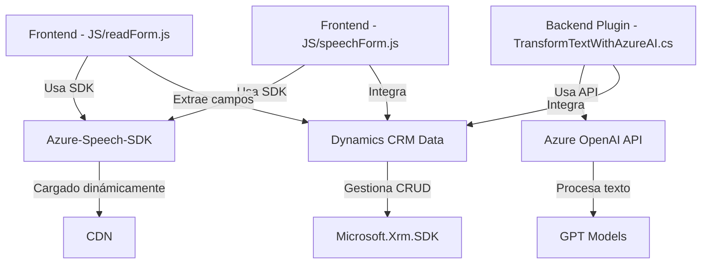

### Breve resumen técnico
El repositorio parece ser parte de una solución destinada a mejorar la accesibilidad y las capacidades de interacción con formularios dentro de sistemas CRM, presumiblemente Dynamics 365. Los archivos están organizados con un claro enfoque modular y responsables de dos características principales:
1. Procesamiento de voz para sintetizar y reproducir información de formularios (usando Azure Speech SDK).
2. Reconocimiento de comandos de voz, integración y transformación de información mediante Azure OpenAI y Dynamics CRM.

### Descripción de arquitectura
La solución implementa una **arquitectura de n capas** (al combinar frontend, lógica de plugin CRM y servicios en la nube). Aunque no es un microservicio independiente, opera con lógica desacoplada gracias a la utilización de SDK y servicios externos.
1. **Frontend – JS:** Maneja la interacción del usuario, la captura de datos y la integración event-driven mediante Azure Speech SDK.
2. **Backend – Plugins:** Procesa los datos interactuando directamente con Dynamics CRM y Azure OpenAI.
3. **Servicios externos:** SDK de Azure Speech y APIs de Azure OpenAI proveen capacidades avanzadas de accesibilidad y procesamiento de texto.

### Tecnologías usadas
1. **Frontend:** JavaScript, Azure Speech SDK, Event-driven programming, modular architecture.
2. **Backend:** C# (.NET Framework), Microsoft Dynamics CRM SDK, Newtonsoft JSON library, System.Net.Http for API integration.
3. **Nube:** Azure Speech SDK, Azure OpenAI API (GPT models).

### Dependencias o componentes externos
- **Azure Speech SDK:** Dinámicamente cargado en el navegador para sintetizar voz o reconocer comandos.
- **Azure OpenAI API:** Utilizada para transformar texto según reglas específicas.
- **Microsoft Dynamics CRM SDK:** Interacción directa con los datos del CRM.
- **Newtonsoft.Json/JObject:** Manipulación de estructuras JSON en el lado del plugin.
- **System.Net.Http:** Para llamadas a APIs externas desde el plugin.

### Diagrama Mermaid

### Conclusión
La solución es una implementación que combina accesibilidad avanzada y generación dinámica de contenido utilizando capacidades como la síntesis de voz (Azure Speech SDK) y procesamiento de texto (Azure OpenAI). Se implementa sobre la arquitectura de **n capas** e integra servicios externos que apoyan funciones especializadas. Aunque tiene un enfoque modular y algunas características de orientación a microservicios, sigue siendo dependiente del entorno Dynamics CRM. La solución exhibe buenas prácticas de modularidad y reutilización de código.