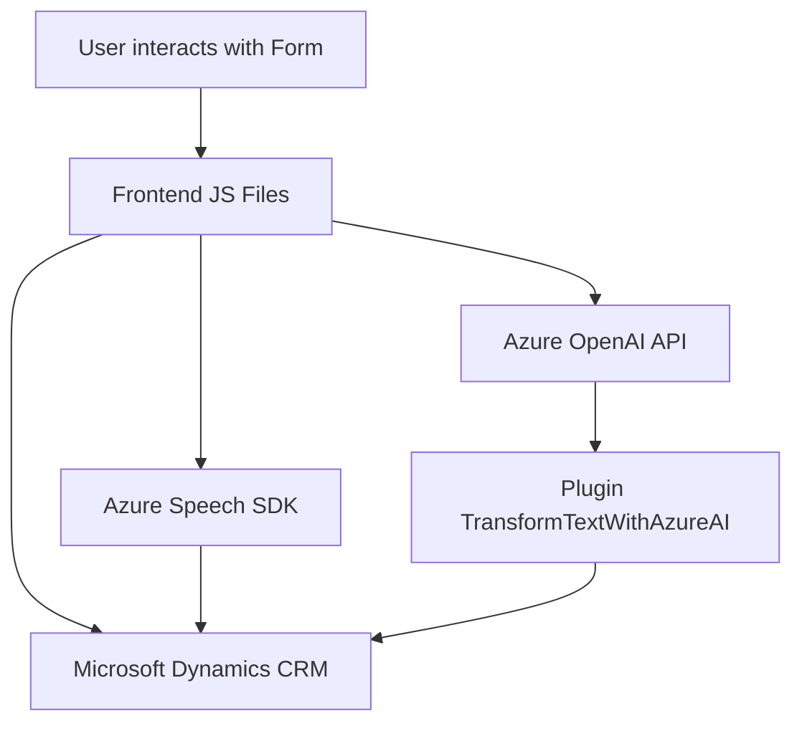

### Breve resumen técnico:
Se trata de una solución basada en **gestión de formularios interactivos**, que conecta entrada y salida de datos (voz y texto) con servicios de inteligencia artificial externos utilizando APIs específicas de Azure. Está diseñada para facilitar la interacción entre usuarios y formularios, utilizando voz como mecanismo de entrada y salida. Posee elementos propios de aplicaciones **modulares** y dependencias basadas en servicios en la nube.

### Descripción de arquitectura:
La arquitectura general de la solución parece seguir un estilo híbrido de **arquitectura n-capas** (dividida en frontend, plugins y servicios), complementada por patrones de integración con servicios externos. Los archivos en el frontend gestionan los flujos de entrada/salida mediante Azure Speech SDK, mientras los archivos en el backend (como el plugin en C#) procesan texto con Azure OpenAI y lo integran con Dynamics CRM.

### Tecnologías y patrones utilizados:
1. **Tecnologías**:
   - **Frontend:** JavaScript, Azure Speech SDK.
   - **Backend:** C# (.NET Framework), Microsoft Dynamics SDK, Azure OpenAI API.
   - **Servicios en la nube:** Microsoft Azure.
   
2. **Patrones de diseño**:
   - **SRP (Single Responsibility Principle):** Cada archivo y función tiene un propósito limitado y específico.
   - **Facade Pattern:** El plugin encapsula detalles de comunicación con Azure OpenAI.
   - **Microservicios:** Interacciones externas con servicios como Azure Speech y OpenAI.
   - **Cliente API (SDK):** Uso del SDK de Azure Speech para interacción con servicios.
   - **UI Binding & Data Mapping:** Mapeo dinámico entre datos de formulario (etiquetas y valores) y su representación lógicamente estructurada.

### Dependencias o componentes externos:
1. **Azure Speech SDK**:
   - Proporciona capacidad de síntesis y reconocimiento de voz.
2. **Microsoft Dynamics SDK**:
   - Elementos para integración y extensión del sistema CRM.
3. **Azure OpenAI API**:
   - Servicio de procesamiento de texto basado en IA.
4. **Personalizadas:** APIs como `trial_TransformTextWithAzureAI` que generan acciones específicas en Dynamics.

---

### Diagrama **Mermaid** válido para GitHub:

---

### Conclusión final:
La solución presentada tiene una lógica orientada a la gestión dinámica de datos mediante voz y texto, integrándose estrechamente con servicios basados en la nube como Azure. Su arquitectura de **n-capas** y uso modular de funciones permite ampliaciones futuras sin comprometer la base funcional. El diagrama y los elementos analizados muestran una ejecución sólida, caracterizada por la integración de SDKs con patrones estándar de diseño en la industria.