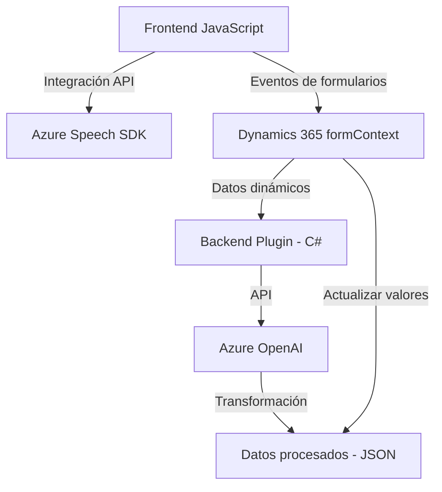

### Breve resumen técnico
El repositorio describe una solución compuesta por múltiples módulos (JavaScript y Plugin .NET) que integran reconocimiento de formularios y entrada/salida de voz con tecnologías de Azure y servicios de Dynamics 365. El enfoque está en mejorar la interacción del usuario con la plataforma Dynamics, integrando la conversión de texto-voz, el reconocimiento de voz y una estructuración automatizada de texto a través de IA.

---

### Descripción de arquitectura
La solución arquitectónica exhibe un diseño híbrido:
- **Frontend Modular**: Archivos JavaScript como `readForm.js` y `speechForm.js` organizados como módulos independientes interactúan en un sistema cliente.
- **Backend basado en Plugins**: Plugins como `TransformTextWithAzureAI.cs` se integran directamente en Dynamics 365, encapsulando operaciones entre la plataforma y APIs externas.
- **Servicios Externos Integrados**:
  - Azure Speech SDK para operaciones de voz.
  - Azure OpenAI para procesamiento de texto avanzado.

La arquitectura global combina una **orientación a eventos** en el frontend con una **arquitectura de extensión en Dynamics 365** en el backend, mientras se apoya en componentes externos de Azure.

---

### Tecnologías usadas
1. **Frontend**:
   - JavaScript ES6.
   - Azure Speech SDK.
   - Dynamics 365 API (formContext y Xrm.WebApi).
2. **Backend**:
   - C# (.NET Framework/Standard).
   - Dynamics 365 SDK.
   - Azure OpenAI integrada vía HTTP.
3. **Patrones**:
   - Modularidad en funciones.
   - Integración de servicios externos (Plug-and-Play para SDKs y APIs).
   - Event-driven en el frontend.
   - Plugin design en Dynamics 365 del backend.

---

### Diagrama **Mermaid** válido para GitHub

---

### Conclusión final
Esta solución es una integración avanzada entre un cliente (JavaScript) con servicios externos (Azure Speech SDK y OpenAI), utilizando el backend de Dynamics 365 como intermediario para procesamiento y actualización dinámica de datos. Su arquitectura modular y orientada a servicios permite un diseño extensible, permitiendo el uso de distintos componentes bajo un enfoque global bien definido.

Las áreas que podrían mejorarse incluyen:
1. **Gestión de errores**: Fortalecer la validación en puntos críticos como conexiones API y el uso del SDK dinámico.
2. **Configuración dinámica**: Permitir una personalización más flexible para regiones, idiomas y normas de IA.
