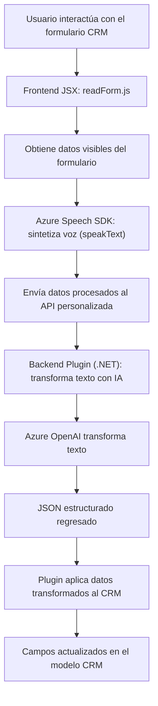

### Breve resumen técnico:
La solución presentada tiene componentes para una integración con Microsoft Dynamics CRM, aprovechando APIs externas como el **Azure Speech SDK** y Azure OpenAI para funcionalidades de reconocimiento de voz y transformación de textos. Tiene una organización modular mediante scripts en el frontend y clases en el backend que trabajan en conjunto.

---

### Descripción de arquitectura:
La solución parece ser una mezcla de **arquitectura de n-capas** y **microservicios**, con componentes frontend que llaman servicios externos directamente (por ejemplo, Azure Speech SDK y APIs personalizadas para procesamiento de IA) y un plugin backend que realiza operaciones específicas en el contexto del CRM. No sigue una arquitectura estrictamente hexagonal ni completamente basada en microservicios, ya que existe una fuerte dependencia del entorno CRM.

- **Frontend:** Gestiona reconocimiento de voz, síntesis de audio, e interacción con el formulario del CRM usando Dynamics SDK y APIs externas.
- **Backend:** Tiene un plugin implementado en C# que actúa como un middleware entre la API personalizada de IA y el modelo de datos del CRM.

---

### Tecnologías usadas:
- **Backend:**
  - Lenguaje: C#.
  - Framework: Dynamics CRM SDK.
  - Servicio externo: Azure OpenAI API (GPT-4).

- **Frontend:**
  - Lenguaje: JavaScript.
  - SDK externo: Azure Speech SDK (para síntesis y reconocimiento de voz).
  - Integración: Dynamics CRM (Xrm.WebApi).

- **Servicios externos:**
  - Azure Speech SDK para audio.
  - Azure OpenAI (GPT-4) para transformación de texto.

- **Patrones identificados:**
  - **Dependency Injection:** Uso de `executionContext`, `serviceProvider` y modularidad en funciones.
  - **Facade Pattern:** Simplificación de acceso mediante funciones principales (`startVoiceInput`, `Execute`).
  - **DTO Pattern:** Utilización de objetos JSON estructurados para intercambio entre los servicios externos y el sistema CRM.

---

### Diagrama Mermaid para la solución:

---

### Conclusión final:
La solución es una integración avanzada orientada a mejorar la interacción y automatización en un sistema CRM mediante tecnologías modernas como Azure Speech SDK y OpenAI GPT-4. La arquitectura es suficientemente flexible para escalar en entornos de procesamientos de voz y texto, aunque depende de servicios externos que no serían óptimos para casos offline. Además, combina paradigmas de programación funcional en el frontend con dinámicas basadas en plugins en el backend.