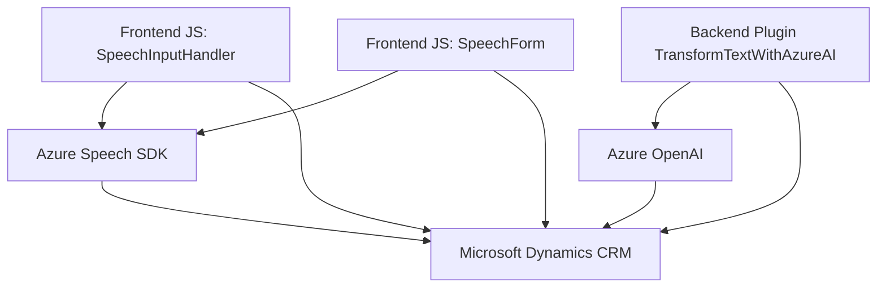

### Resumen técnico
El repositorio presenta una solución con diversas partes que interactúan entre sí para ofrecer funcionalidades avanzadas basadas en voz y procesamiento inteligente de texto en Microsoft Dynamics CRM. Los archivos analizados implican el uso de SDKs de Azure para síntesis de voz, reconocimiento de voz y generación de texto estructurado con modelos GPT. También de Dynamics CRM como sistema organizativo para la gestión de datos.

---

### Descripción de arquitectura
1. **Tipo de solución**:  
   - **Híbrida**, con componentes de frontend para interacción de usuario (JavaScript), backend plugins (.NET) y servicios cloud (Azure Speech/AI).
   - Principales aplicaciones:
     - Integración de voz para formularios en Dynamics CRM.
     - Procesamiento e interpretación de texto mediante servicios de inteligencia artificial.
   
2. **Tipo de arquitectura**:  
   - **n capas**, ya que los componentes están organizados claramente por roles:
     - **Frontend**: Ofrece interacción del usuario mediante voz y datos visuales en los formularios (JavaScript en Dynamics 365).
     - **Backend**: Procesos centrados en el procesamiento y estructura del texto (Plug-in de Dynamics en .NET).
     - **Servicios externos**: Azure Speech SDK para voz y Azure OpenAI para IA.
   - Adicionalmente, emplea integración con **microservicios externos** (Azure OpenAI API y Azure Speech SDK).

3. **Patrones utilizados**:
   - Modularización: En los archivos de JavaScript, cada función está claramente definida con un rol específico.
   - Callback Pattern: Para operaciones asíncronas como la carga del SDK en `ensureSpeechSDKLoaded`.
   - Event-Driven: Uso del reconocimiento de voz como evento disparador para la lógica del formulario.
   - API Gateway (parcial): El `callCustomApi` en `speechForm.js` y el servicio OpenAI conectado a Dynamics CRM usan un enfoque de integración remota con APIs.
   - Plugin Dynamics CRM: Extensión directa sobre la plataforma de CRM.
   - Microservicios: Uso de Azure Speech SDK y OpenAI API como servicios externos desacoplados.

---

### Tecnologías y dependencias utilizadas
#### Frontend:
- **Lenguaje**: JavaScript (ES6+).
- **Framework Dynamics CRM**: Utiliza Dynamics 365 Form Context.
- **Azure Speech SDK**: Sintetización de voz y reconocimiento de voz.
- **API**: Comunicación con Azure OpenAI para procesamiento de texto.

#### Backend:
- **Lenguaje**: C# (.NET).
- **Framework Dynamics CRM SDK**: Para interactuar con el contexto de entidad.
- **Azure OpenAI API**: Procesamiento inteligente de texto.
- **Librerías comunes**:
  - `Newtonsoft.Json.Linq` y `System.Text.Json` para JSON.
  - `System.Net.Http` para conexión API.
 
#### Componentes/Servicios Externos:
- Azure Speech SDK.
- Azure OpenAI API para GPT-integración.
- Dynamics CRM API.

---

### Diagrama Mermaid

---

### Conclusión final
La solución utiliza una arquitectura híbrida de **n capas** con servicios **AZURE cloud** externalizados y una integración profunda de Dynamics CRM para el procesamiento de datos desde formularios. Se implementan patrones modernos para modularidad, integración de APIs y eventos. Es una solución sólida para entornos organizativos que buscan automatización basada en voz e IA. Sin embargo, ciertas prácticas, como el manejo de las configuraciones sensibles (e.g. claves), deben mejorar por seguridad.