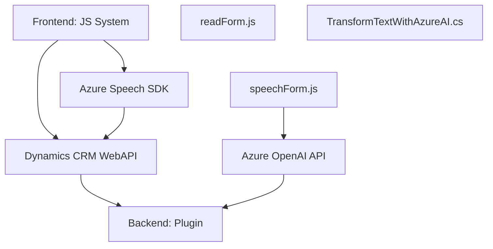

### Breve resumen técnico
El repositorio incluye tres componentes principales:
1. **Frontend (JavaScript)**: Dos archivos (`readForm.js`, `speechForm.js`) implementan funcionalidades para interacción entre usuario y sistemas CRM y Azure Speech SDK.
2. **Backend Plugin (C#)**: Un archivo (`TransformTextWithAzureAI.cs`) implementa una integración con sistemas Microsoft Dataverse y Azure OpenAI.

El sistema tiene como objetivo principal realizar reconocimiento y síntesis de voz, procesamiento de entradas mediante IA, y transformar contenido textual en estructuras JSON dentro de un ecosistema Dynamics CRM.

---

### Descripción de arquitectura
La arquitectura prevista es **modular y orientada a servicios**, donde las siguientes capas y componentes interactúan:
- **Frontend**: Interfaz de usuario para formularios CRM.
- **SDK/API externas**: Servicios provistos por Azure Speech y Azure OpenAI.
- **Backend Plugins**: Integración con Dynamics Dataverse mediante extensiones basadas en la interfaz IPlugin.
- **Orquestación** entre frontend y API externas con ejecución de lógica en módulos desacoplados.

Aunque la solución no es distribuida en microservicios, las distintas responsabilidades se organizan en varios niveles lógicos:
- Capa de presentación (Frontend y CRM).
- Capa de negocio (Transformación de texto mediante plugins dentro de Dataverse).
- Capa de integración (Conexión con APIs externas de Azure).

El diseño aproxima patrones como **Hexagonal** (integración flexible con servicios externos) y prácticas de **componentización**.

---

### Tecnologías usadas
**Frontend (JS)**
- **Azure Speech SDK**: Para reconocimiento y síntesis de voz.
- **JavaScript**: Lenguaje principal del frontend.
- **Dynamics CRM WebAPI (Xrm)**: Interacción con formularios y entidades del CRM.

**Backend (C# Plugin)**
- **Microsoft Dataverse SDK (`Microsoft.Xrm.Sdk`)**: Permite integrar plugins con el sistema Dataverse.
- **ASP.NET Framework**: Enfoque de desarrollo backend de alto nivel.
- **Azure OpenAI API**: Modelo GPT-4 para transformación de texto en estructuras predefinidas (JSON).
- **Newtonsoft.Json**: Librería para manejar JSON en C#.

**General**
- Modularización y desacoplamiento mediante funciones y clases independientes.
- Dynamic loading: El frontend realiza la carga dinámica de SDKs únicamente cuando es necesario.
- API-driven architecture: Para comunicación con Azure SDKs y servicios CRM.

---

### Diagrama **Mermaid** 100% compatible con **GitHub Markdown**

---

### Conclusión final
Este repositorio implementa una solución híbrida para interacción con Dynamics CRM, utilizando reconocimiento y síntesis de voz por Azure Speech SDK, así como inteligencia artificial de OpenAI para transformar contenido textual. La arquitectura modular y conectada a servicios cloud (Azure SDK, OpenAI) muestra un diseño adaptado a integraciones externas con Microsoft ecosistemas.

Aunque es una solución monolítica en términos de despliegue (Frontend+Plugin funcionalizados separadamente), el diseño ya sugiere fragmentación funcional orientada a una arquitectura hexagonal o basada en componentes desacoplados mediante APIs. Esto facilita su extensión a arquitecturas más distribuidas (e.g., microservicios).