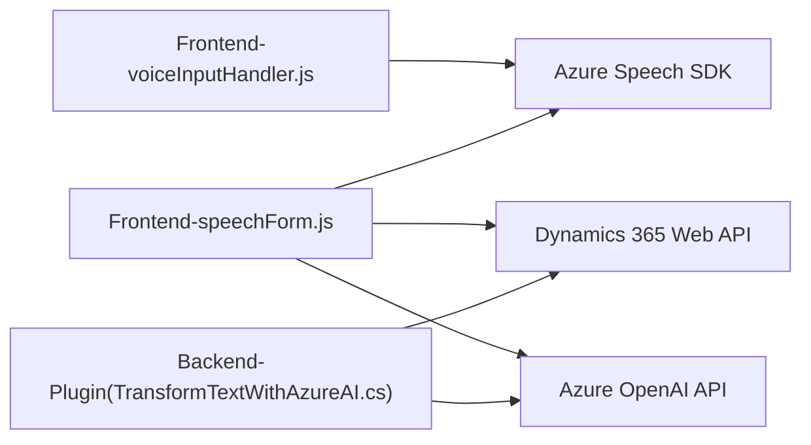

### Breve resumen técnico

El repositorio está enfocado en una solución integral que mejora la interacción entre sistemas empresariales (Dynamics 365) y capacidades avanzadas de inteligencia artificial (Azure Speech y Azure OpenAI). Se divide claramente en tres tipos de artefactos: 
1. **Frontend para Dynamics 365**: Integración con formularios y funcionalidades de reconocimiento de voz.
2. **Backend**: Plugins extendiendo funcionalidades mediante servicios externos como Azure OpenAI.
3. **Servicios externos**: Uso del SDK y APIs de Azure para agregar capacidades de inteligencia artificial.

### Descripción de arquitectura

La arquitectura de la solución sigue un enfoque **Arquitectura de capas en un ecosistema de microservicios**:
1. **Frontend**: Encapsula funcionalidades específicas en módulos independientes usando JavaScript. El diseño es altamente modular, basado en responsabilidades individuales como captura de voz, síntesis en texto y asignación de datos al formulario.
2. **Backend**: La arquitectura de plugin facilita interacciones específicas con Dynamics 365 a través de eventos CRM que desencadenan la integración con Azure OpenAI para transformar textos en JSON estructurados.
3. **Servicios Externos**: Los SDK y servicios de Azure son consumidos dinámicamente, reforzando la interoperabilidad entre los sistemas locales de Dynamics y las capacidades en la nube.

### Tecnologías y patrones usados:
1. **Frontend:**
   - **Lenguaje principal**: JavaScript.
   - **SDK usado**: Azure Speech SDK, integrado mediante dinámico script loader.
   - **Framework de desarrollo Frontend**: Dynamics 365 Context en formularios.
   - **Patrones**:
     - Modularidad: Separación de responsabilidades por función.
     - Asincronismo y callbacks: Mecanismos para manejar la carga de SDK y las operaciones de síntesis/reconocimiento.
     - Adaptador de datos: Conversión estandarizada de datos del formulario.

2. **Backend:**
   - **Lenguaje principal**: C# (.NET Framework).
   - **Librerías usadas**: Microsoft Dynamics SDK, NewtonSoft.Json, System.Net.Http.
   - **Servicio Externo**: Azure OpenAI API.
   - **Patrones**:
     - Plugin Architecture: Extensibilidad basada en eventos del contexto CRM.
     - API Integration: Consumo de API externa para transformación de texto.

### Dependencias o componentes externos presentes:
1. **Frontend**:
   - Azure Speech SDK desde un endpoint oficial.
   - Posible integración con otros servicios o APIs relacionadas con Dynamics 365.

2. **Backend (Plugin)**:
   - Azure OpenAI API para procesamiento de texto con GPT.
   - Dynamics 365 Web API para interactuar y actualizar los datos de los formularios CRM.
   - Librerías de manejo de JSON (`System.Text.Json` y `Newtonsoft.Json.Linq`).
   - `System.Net.Http` para solicitudes HTTP al servicio externo.

---

### Diagrama mermaid

---

### Conclusión final:

La solución integra **tecnologías frontend (JavaScript)** con los servicios de **Azure Speech SDK**, proporcionados dinámicamente, y un **backend mediante plugins** que explotan las capacidades de transformación inteligente de Azure OpenAI con Dynamics 365 Web API. Esto ofrece una **arquitectura n-capas**, con integración de servicios externos orientados al reconocimiento/síntesis de voz y manipulación de datos. 

La modularidad y separación de responsabilidades en el diseño hacen que la solución sea mantenible, escalable y fácil de extender a funcionalidades futuras. Esto resulta ideal para sistemas corporativos que requieren mecanismos avanzados de interacción y automatización.