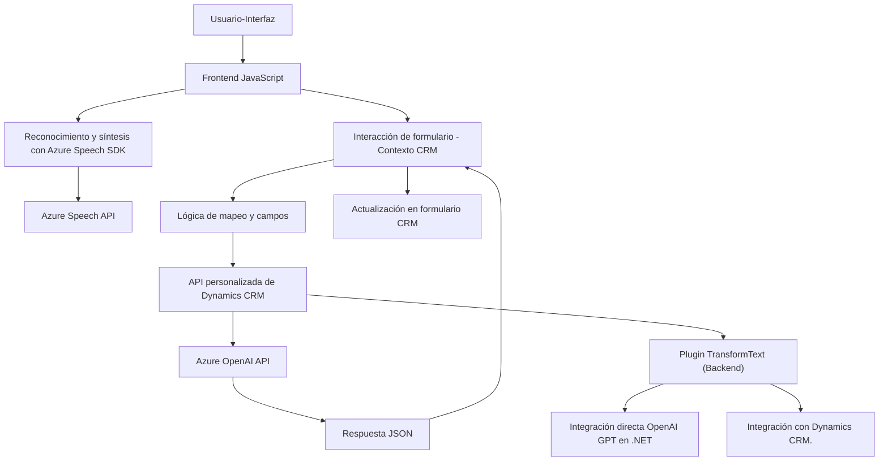

### Breve resumen técnico
El repositorio describe un sistema compuesto principalmente por una interfaz frontend en **JavaScript** que interactúa con Dynamics CRM y Azure SDK para tareas relacionadas con voz, texto y APIs inteligentes utilizando **Azure Speech SDK** y **Azure OpenAI**. También incluye un **plugin** en C# para Dynamics CRM que centraliza el procesamiento avanzado de texto con Azure OpenAI.

---

### Descripción de arquitectura
La solución general utiliza un patrón **modular** en el frontend, donde las funcionalidades de reconocimiento y síntesis de voz, así como la lectura y aplicación de datos en formularios, están desacopladas y tienen responsabilidades individuales. En el backend, el plugin basado en **Dynamics CRM** actúa como un microservicio encargado de integrar lógica avanzada de procesamiento utilizando Azure OpenAI. Este enfoque refleja una **arquitectura de n capas**:

1. **Capa de Presentación (Frontend):**
   - Comprensión de voz y síntesis textual usando JavaScript y Azure Speech SDK.
   - Interacción directa con los usuarios para tareas específicas como formularios dinámicos.

2. **Capa de Lógica:** 
   - Procesamiento de datos en el frontend y transformación de texto a campos en formularios.
   - Uso de patrones para mapeo de datos y transformación semántica mediante IA.

3. **Capa de Integración/API:**
   - Llamadas externas desde el frontend a Azure API y OpenAI para tareas externas.
   - Plugin de C# encargado de implementar lógica avanzada en el backend.

4. **Capa de Datos:** 
   - DynamoDB o un sistema CRM como Microsoft Dynamics para almacenamiento y consulta.

La solución está parcialmente **orientada a microservicios**, con el plugin actuando como un servicio independiente que interactúa con Azure OpenAI.

---

### Tecnologías usadas
1. **Frontend:**
   - **JavaScript**: Para la interacción directa con el cliente.
   - **Azure Speech SDK**: Para operaciones de síntesis y comprensión de voz.
   - **Callbacks y Promesas**: Para manejo de asincronismo.

2. **Backend:**
   - **C# (.NET Framework)**: Framework para la implementación del plugin en Dynamics CRM.
   - **Microsoft Dynamics CRM**: Sistema central para el procesamiento y almacenamiento de datos.
   - **Azure OpenAI**: API integrada para procesamiento de texto utilizando IA (GPT).

3. **Dependencias destacadas en el backend:**
   - `Newtonsoft.Json.Linq`: Manejo JSON.
   - `System.Net.Http`: Realización de llamadas HTTP a servicios externos.
   - **Microsoft Dynamics SDK**: Interfaces de interacción con el entorno de ejecución.

---

### Diagrama Mermaid

---

### Conclusión final
Esta solución presenta características bien estructuradas de **procesamiento con IA**, **sistemas distribuidos** y **integración modular**. El frontend implementa una lógica ligera para interacción de usuario que delega tareas avanzadas al backend y a servicios externos, permitiendo escalabilidad y extensibilidad.

La arquitectura híbrida de **n capas con microservicios** en el backend, junto con el uso de **APIs externas**, permite procesar tareas complejas de voz y texto con una alta separación de responsabilidades entre cada componente. Esto la hace adecuada para sistemas como CRM extendidos que requieran integración con Azure y OpenAI.