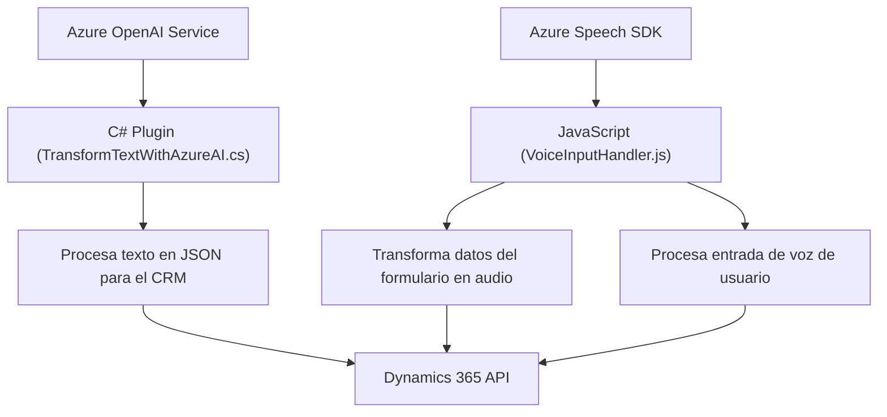

### Breve Resumen Técnico
El repositorio contiene archivos que integran funcionalidades orientadas a la conversión de texto en audio (TTS, Text-to-Speech) y reconocimiento de voz (Speech-to-Text) utilizando **Azure Speech SDK** y **Azure OpenAI services**, junto con una integración con Dynamics CRM para procesar formularios. Se implementan módulos en **JavaScript** para el frontend y un archivo **C#** como plugin para trabajar con Dynamics CRM, destacando la integración de los servicios de Azure.

---

### Descripción de Arquitectura
La arquitectura del repositorio es una solución híbrida con las siguientes características:
- **N-capas**: Se observa una división lógica entre una capa de presentación (frontend en JavaScript) y una capa de lógica de negocio (plugin en C# para Dynamics CRM).
- **Integración de servicios externos**: Utiliza Azure Speech SDK y Azure OpenAI Service para el procesamiento de voz y texto.
- **Modularización**: Los módulos están estructurados con responsabilidades claramente definidas y con funciones específicas, proporcionando una arquitectura modular.
- **Single Responsibility Principle (SRP)**: Cada archivo y función se asocia específicamente con una tarea concreta (procesamiento de formularios, síntesis de voz, plugins para CRM, etc.) dentro de la solución.
- **Plugin Architecture**: La funcionalidad de procesamiento de texto usa el patrón de plugins de Dynamics CRM, donde la lógica de negocio se ejecuta en respuesta a eventos en el servidor CRM.

---

### Tecnologías Usadas
1. **Frontend (JavaScript)**:
   - **Azure Speech SDK:** Para sintetizar texto en voz y reconocimiento de voz.
   - **Web API de Dynamics 365**: Para la manipulación de datos del CRM.
   - **Programación asincrónica y con callbacks:** Para manejar la carga dinámica del SDK y realizar operaciones asincrónicas en la plataforma.
2. **Backend (C# plugin)**:
   - **Microsoft.Xrm.Sdk:** Para interactuar con Dynamics CRM.
   - **Azure OpenAI API:** Procesamiento de texto con inteligencia artificial.
   - **Newtonsoft.Json**: Para la manipulación del JSON.
   - **Rest API (HTTP requests)**: Con ayuda de `System.Net.Http` para invocar servicios externos.

---

### Diagrama Mermaid

---

### Conclusión Final
El repositorio representa una solución híbrida con arquitectura de **n-capas** que implementa un sistema de manipulación de formularios en Dynamics CRM, combinando un frontend basado en **JavaScript** y un backend desarrollado como un plugin en **C#**. En términos de funcionalidad, esta solución destaca por integrar servicios externos como **Azure Speech SDK** y **Azure OpenAI**, lo que permite una experiencia rica y dinámica basada en el reconocimiento y la síntesis de voz. La arquitectura modular y la adopción de principios como **SRP** y **plugin integration** contribuyen a la mantenibilidad y escalabilidad del sistema. Además, el uso de servicios externos eleva el uso de IA y capacidades avanzadas para usuarios de Dynamics CRM, lo que puede mejorar la interacción en próximas aplicaciones empresariales similares.