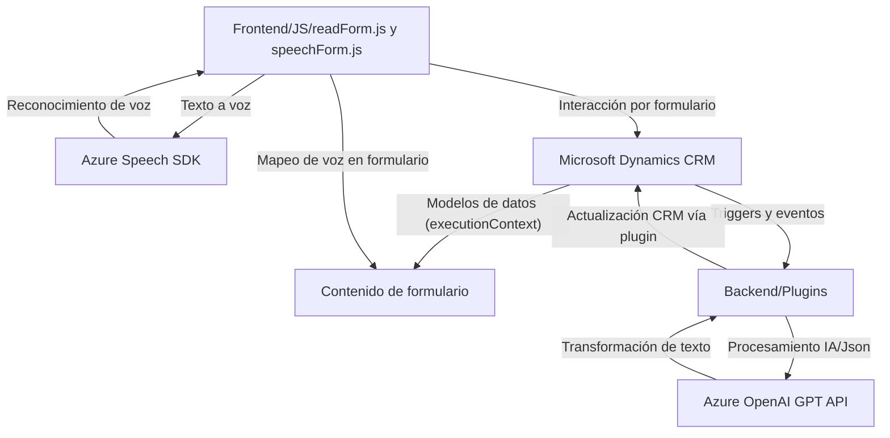

### Breve resumen técnico:
El repositorio describe una solución que integra funcionalidades avanzadas de reconocimiento de voz y texto mediante **Azure Speech SDK** y capacidades de transformación de texto con **Azure OpenAI**. Está orientado a aplicaciones CRM como Microsoft Dynamics y se basa en plugins y scripts de frontend para complementar la experiencia del usuario con servicios cognitivos.

---

### Descripción de arquitectura:
La solución tiene una arquitectura basada en **n-capas**:
1. **Frontend**: Scripts JavaScript gestionan interacciones con formularios (Dynamics CRM), incluyendo integración de servicios externos como Speech SDK.
2. **Backend/Plugins**: Plugins en C# integrados en Dynamics CRM gestionan la interacción con Azure OpenAI para transformar y estructurar datos desde el CRM.
3. **Servicios externos**: Azure Speech SDK y OpenAI procesan voz y texto respectivamente, extendiendo las capacidades nativas de Dynamics.

Esta es una arquitectura de *cliente-servidor* con componentes externos (Speech SDK y Azure OpenAI), que se adapta bien a sistemas como CRM al implementar plugins personalizados y módulos frontend ligados al modelo de datos.

---

### Tecnologías usadas:
1. **Frontend:**
   - **JavaScript**:
     - Usuarios interactúan con formularios en Dynamics.
     - Scripts emplean el SDK de Dynamics (`executionContext`, `Xrm.WebApi`).
     - **Azure Speech SDK** para sintetización de texto a voz y reconocimiento de voz.
2. **Backend:**
   - **C#**:
     - Plugins implementados mediante `Microsoft.Xrm.Sdk` (extensión nativa de Dynamics CRM).
     - Gestión de transacciones CRM con `IPlugin`.
     - Azure OpenAI (`gpt-4o`) consumido vía HTTP API para transformación avanzada de texto.
     - Uso de JSON parsers (`Newtonsoft.Json.Linq`) para estructuración y manipulación de datos.
3. **Servicios**:
   - Azure Speech SDK.
   - Azure OpenAI GPT API.

---

### Diagram Mermaid

---

### Conclusión final:
La solución está orientada a extender las capacidades de Microsoft Dynamics CRM con servicios de Microsoft Azure para mejorar la interacción usuario-sistema. Utiliza una arquitectura n-capas apoyada por tecnologías como JavaScript para el frontend, C# para actividades en el backend, y el consumo de servicios cognitivos en Azure.

La integración de servicios como Speech SDK y OpenAI permite crear una experiencia enriquecida con inteligencia artificial, mientras que el diseño modular de las funcionalidades facilita su mantenimiento y escalabilidad en el tiempo.